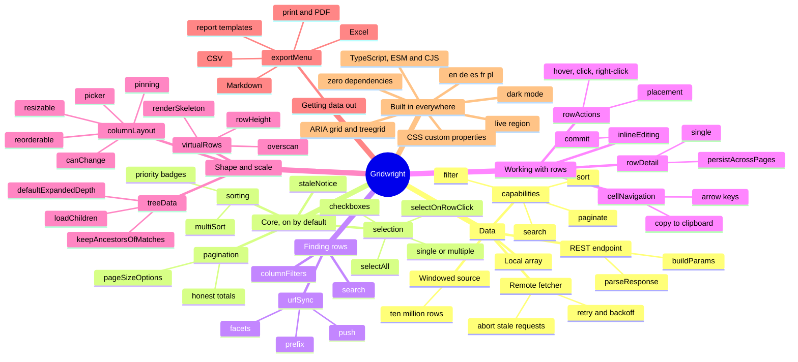
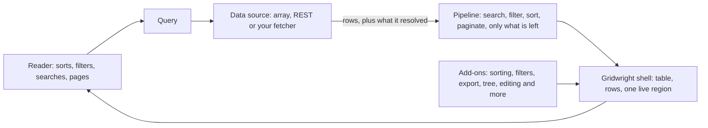

# apsw-gridwright

[](https://www.npmjs.com/package/apsw-gridwright)
[](https://github.com/yaotzin1/apsw-gridwright/actions/workflows/ci.yml)
[](https://github.com/yaotzin1/apsw-gridwright/blob/main/LICENSE)

**The React data grid that does not care where your rows live.** Hand it an array today and a
paginating API tomorrow: the columns, the add-ons and every prop but one stay exactly as they were.
Sorting, filtering, search, paging, selection, export, a tree, inline editing, column layout and ten
million rows, accessible by default, translated into five languages, typed end to end, with zero
runtime dependencies. MIT.

```bash
npm install apsw-gridwright
```

```tsx
import { Gridwright, columnFilters, exportMenu, search } from 'apsw-gridwright/react';
import 'apsw-gridwright/styles.css';

<Gridwright
    columns={[{ id: 'name', header: 'Name' }, { id: 'salary', header: 'Salary', align: 'end' }]}
    data={people} // or dataSource={createRestDataSource({ url: '/api/people' })}
    addons={[search(), columnFilters(), exportMenu({ formats: ['csv', 'excel', 'print'] })]}
/>;
```

React 18 or 19 is an optional peer dependency, needed only for `apsw-gridwright/react`. The
component is called **Gridwright**.

## Everything in the box

Every branch below is an add-on you list in `addons={[...]}`, or something every grid already has.
The leaves are its options.



## How it works

One pipeline serves local and remote data. A data source says which parts of the query it already
resolved; the pipeline does whatever is left. Nothing above the pipeline knows where the rows came
from, which is why switching sources is a one-line change.



## Why Gridwright

- **React is the supported surface.** `apsw-gridwright/react` is what you build with. The engine
  underneath it is headless and separately importable, with no DOM and no runtime dependencies,
  which is why the component is small and why the pipeline is testable without a renderer. It is
  the engine of this package, not a second way to build a grid.
- **Accessible by default.** A real `<table>` with `role="grid"`, sort state on the header cell,
  row positions that count across pages rather than within one, and a live region that says what
  changed. A tree is a `treegrid`, with the depth and the expanded state on the row.
- **Unstyled.** Structural CSS driven entirely by custom properties.
- **One component, and every feature is an add-on.** `<Gridwright />` is a shell: a table, its rows,
  its status rows and one live region. Search, column filters, export, row actions, inline editing,
  a tree and windowing are add-ons listed in `addons={[...]}`, so they compose instead of competing,
  and an add-on of your own has exactly the reach the built-in ones have.
- **Extensible below the renderer too.** Sorting, filtering, search and pagination are engine
  plugins with no privileged access, so yours reaches exactly as far.
- **It never invents a number.** When a paginating API sends no total, the grid says "of many"
  rather than a count computed from one page.

## Try it

New here? [**docs/getting-started.md**](docs/getting-started.md) walks from an empty React project to
a grid over a paginating API in six steps, each one a component you can paste. Already have a
requirement? [**docs/react-playbook.md**](docs/react-playbook.md) is indexed by the job rather than
the feature, and [**docs/agent-playbook.md**](docs/agent-playbook.md) is the same rules condensed for
a coding agent. There is a runnable app beside them:

```bash
git clone https://github.com/yaotzin1/apsw-gridwright && cd apsw-gridwright
npm install
npm run example:react     # the six steps, as a real React app on :5174
npm run example           # the playground: every add-on, switchable, on :5173
```

The playground runs the built package against a mock API. Uncheck `sort` under "the server
resolves" and watch the work move from the server to the in-memory pipeline without the component
above it changing. See [examples/playground](examples/playground/README.md) and
[examples/react-quickstart](examples/react-quickstart/README.md).

## Local data

```tsx
import { Gridwright, search } from 'apsw-gridwright/react';
import 'apsw-gridwright/styles.css';

const columns = [
    { id: 'name', header: 'Name' },
    { id: 'department', header: 'Department' },
    { id: 'salary', header: 'Salary', align: 'end' as const },
];

export function People({ people }: { people: Person[] }) {
    return <Gridwright columns={columns} data={people} pageSize={25} addons={[search()]} aria-label="People" />;
}
```

Sorting, pagination, selection and the empty state are already there, because those are the core
add-ons every grid starts with. `search()` adds the search box; add `columnFilters()` to the same
list for a filter button in every header. The grid renders its first page on the first paint, with
no loading flash, because an array resolves synchronously and the engine notices.

## Remote data

```tsx
import { createRestDataSource } from 'apsw-gridwright';
import { Gridwright, search } from 'apsw-gridwright/react';

const source = createRestDataSource<Person>({ url: '/api/people' });

export function People() {
    return <Gridwright columns={columns} dataSource={source} pageSize={25} addons={[search()]} />;
}
```

The columns, the add-ons and every prop but one are unchanged. You now get request cancellation,
out-of-order response rejection, backoff on retryable failures, the server's own error message, and
a total the grid refuses to invent.

Your endpoint receives:

```
GET /api/people?page=1&pageSize=25&sort=salary%3Adesc&search=ada&filters=[...]
```

`page` is one-based. Answer with an array, `{ data, total }`, `{ items, count }`, a nested
`meta.total`, or an `X-Total-Count` header. All of them are read. Pass `buildParams` or
`parseResponse` for anything else.

## The one idea worth knowing

A data source declares what it resolved for itself:

```ts
interface DataSourceCapabilities {
    sort: boolean;
    filter: boolean;
    search: boolean;
    paginate: boolean;
}
```

Every facet left `false` is applied in memory by the pipeline.

| Your source | Declares | The pipeline does |
| :--- | :--- | :--- |
| An array | nothing | filter, search, sort, paginate |
| A full query API | everything | nothing |
| An endpoint that only pages | `paginate` | filter, search, sort, on the page received |

That last row is the common real case, and it is why this is a declaration rather than a boolean.
Nothing above the pipeline branches on any of it, add-ons included.

```ts
import { createRemoteDataSource } from 'apsw-gridwright';

const source = createRemoteDataSource<Person>({
    capabilities: { sort: false, filter: false, search: false, paginate: true },
    fetcher: async ({ query, signal }) => {
        const page = await api.people({ page: query.pagination.pageIndex + 1, signal });
        return { rows: page.items, totalRows: page.total };
    },
});
```

## Add-ons

`<Gridwright />` renders a table and nothing a reader did not ask for. Every feature is an add-on,
listed once:

```tsx
import { Gridwright, columnFilters, exportMenu, rowActions, search } from 'apsw-gridwright/react';

<Gridwright
    columns={columns}
    dataSource={source}
    addons={[
        search(),
        columnFilters(),
        exportMenu({ formats: ['csv', 'print'] }),
        rowActions({ items: [{ id: 'open', label: 'Open', onSelect: open }] }),
    ]}
/>;
```

| Add-on | Turns on |
| :--- | :--- |
| `sorting()` | the sort button in each sortable header, `aria-sort`, the sort announcement, and Shift-click multi-column sorting with priority badges |
| `selection()` | the checkbox column when `selectionMode` is set, and the selected count |
| `pagination({ pageSizeOptions })` | page controls and the row range below the table |
| `staleNotice()` | the banner when a refresh failed over rows still on screen |
| `search()` | the search box, first in the toolbar |
| `columnFilters()` | a filter button per filterable header, one dialog, "Clear filters" |
| `exportMenu(options)` | a toolbar menu writing CSV, Excel, Markdown or a printable document |
| `rowActions({ items, trigger, placement })` | a floating menu on the row, opened by hover, click or right-click |
| `inlineEditing({ commit })` | editing in place, on the columns that declare `edit` |
| `columnLayout(options)` | resize handles, reordering by drag or keyboard, sticky pinned columns, and the column picker |
| `cellNavigation()` | one Tab stop into the grid, spreadsheet-style arrow-key movement across cells, and copy to the clipboard with the platform's own shortcut |
| `treeData(options)` | nested rows, expansion, lazy children, optimistic mutation |
| `rowDetail({ render })` | an expandable panel under a row: a nested grid, a form, a chart, the fields that did not earn a column |
| `virtualRows({ rowHeight, overscan, height, renderSkeleton })` | rendering only the rows on screen, with the page controls replaced |
| `urlSync({ prefix, facets, push, adapter })` | search, sort, filters and page in the URL: reloads keep the view, links share it, Back steps through pages |

The first four are `coreAddons()`, which every grid starts with unless told otherwise. Change the
set through the `coreAddons` prop:

```tsx
// The core set, with different page sizes.
<Gridwright
    columns={columns}
    data={people}
    coreAddons={[
        ...coreAddons<Person>().filter((addon) => addon.name !== 'gridwright:pagination'),
        pagination<Person>({ pageSizeOptions: [25, 50] }),
    ]}
/>;

// A bare table: no sort buttons, no checkboxes, no page controls.
<Gridwright columns={columns} data={people} coreAddons={false} />;
```

`coreAddons={false}` removes the controls, not the engine's behaviour: the core pipeline plugins
still sort, filter and page, so an `initialQuery` still applies. Pass `corePlugins={false}` to
remove those as well.

They compose. A virtualized tree with a row menu and two editable columns is four entries in one
list:

```tsx
<Gridwright
    columns={columns}
    data={folders}
    addons={[
        treeData({ getRowId: (row) => row.id, getChildren: (row) => row.children }),
        virtualRows({ rowHeight: 40, height: 480 }),
        rowActions({ items: [{ id: 'open', label: 'Open', onSelect: open }] }),
        inlineEditing({ commit: (rowId, columnId, value) => save(rowId, columnId, value) }),
    ]}
/>
```

Order in the list is mostly irrelevant: an add-on that has to sit relative to another says so
itself. Inline editing places itself before the tree, so the editor lands inside the tree cell
whichever you wrote first.

**The list of names is the grid's identity.** Each add-on may call hooks, so a grid whose add-ons
change is a different grid, and `<Gridwright />` remounts when the names change. Switching an add-on
on or off therefore resets the grid's own state: the page, the selection, an open dialog. The add-on
objects themselves may be new on every render, so writing the list inline is fine; only the names
matter.

[docs/addons.md](docs/addons.md) is the full reference: every add-on, the contribution each slot
accepts, ordering, failure, and strings.

## Add-ons of your own

An add-on of yours uses the same contract, through the same exports, with the same reach. There is
no internal API the built-in add-ons use and yours cannot. This one tints salaries above a
threshold, puts a legend under the table, and translates itself:

```tsx
import { useAddonMessages } from 'apsw-gridwright/react';
import type { GridAddon } from 'apsw-gridwright/react';

const messages = {
    en: { legend: 'Highlighted: salaries above {threshold}' },
    pl: { legend: 'Wyróżnione: pensje powyżej {threshold}' },
};

function Legend({ threshold }: { threshold: number }) {
    const t = useAddonMessages('acme:pay-band', messages);
    return <p>{t('legend', { threshold })}</p>;
}

export function payBand(threshold: number): GridAddon<Employee> {
    return {
        name: 'acme:pay-band',
        setup: () => ({
            messages,
            cellAttributes: (row, column) =>
                column.id === 'salary' && row.data.salary > threshold ? { className: 'pay-band--high' } : {},
            belowTable: () => <Legend threshold={threshold} />,
        }),
    };
}

<Gridwright columns={columns} data={employees} addons={[payBand(100_000)]} />;
```

An add-on is a namespaced `name` and a `setup` that returns a contribution: toolbar items, content
above or below the table, overlays, header and cell attributes, extra columns, a body or a row of
its own kind, status rows, engine plugins, a sentence for the live region, and its own strings.
`setup` runs on every render and may call hooks; the slot functions it returns may not.

**Attributes are an allowlist.** An add-on may contribute event handlers, `aria-*` and `data-*`
values, `className`, `style` and a short list of plain attributes such as `role`, `id` and
`title`. No children, no markup, no URL attribute and no handler written as a string pass, whatever
the types said, so an add-on can never hand the grid a sink the package does not have.

A slot that throws renders nothing and reports the add-on's name to the console; the grid keeps
going, which is the same rule a pipeline plugin follows. See [docs/addons.md](docs/addons.md).

## The engine underneath

`apsw-gridwright/react` is the supported surface, and the engine it is built on is exported
separately because it has no adapter dependency. Import it to drive the pipeline in a Node script,
a worker or a test, or to write a plugin or a data source against the same contracts the built-in
ones use. It is the engine of this package rather than a second way to build a grid: the markup,
the labels, the accessibility and the packaging audit all live in the adapter.

```ts
import { createGridEngine, createLocalDataSource } from 'apsw-gridwright';

const api = createGridEngine({ columns, dataSource: createLocalDataSource(people) });

api.subscribe((state) => render(state.rows));
api.toggleSort('salary');
api.setFilter('department', { operator: 'eq', value: 'Research' });
api.nextPage();
api.destroy();
```

## Composition

`<Gridwright />` is a default arrangement of parts. When it does not fit, place them yourself. The
parts render the add-ons' contributions from context, so a layout of your own keeps every add-on:

```tsx
import {
    GridwrightProvider, GridRoot, GridToolbar, GridSlot, GridTable, GridHeader, GridBody,
    GridPagination, columnFilters, search, selection, sorting, staleNotice, useGridwright,
} from 'apsw-gridwright/react';

function PeopleGrid() {
    const grid = useGridwright({
        columns,
        data: people,
        pageSize: 25,
        // Pagination is left out of the core set, because this layout places the controls itself.
        coreAddons: [sorting(), selection(), staleNotice()],
        addons: [search(), columnFilters()],
    });

    return (
        <GridwrightProvider instance={grid} onRowClick={(row) => open(row.data)}>
            <GridRoot>
                <PageHeader>
                    <GridToolbar />
                    <GridPagination pageSizeOptions={[25, 50]} />
                </PageHeader>
                <GridSlot name="aboveTable" />
                <GridTable aria-label="People">
                    <GridHeader />
                    <GridBody />
                </GridTable>
                <GridSlot name="belowTable" />
            </GridRoot>
        </GridwrightProvider>
    );
}
```

`GridRoot` is not optional. It holds the live region, the providers the add-ons wrap the grid in and
the overlays they float above it; without it the filter dialog, the tree context and the windowed
scroll have nowhere to live. `GridSlot` renders one slot's contributions (`aboveTable`,
`belowTable`, `overlay` or `tableFooter`) wherever it belongs on your page.

`useGridwright` calls each add-on's hooks, so the list of names must stay fixed for the life of the
component that calls it. When it has to change, key that component on `addonNamesOf(options)`. A
changed list throws a `GridwrightError` that says so, rather than an unrelated-looking hook error.

The instance also carries `contributions`, every add-on's contribution resolved and in order, and
`announce(sentence)`, which says one sentence through the grid's live region for something that is
not grid state, such as a row copied to the clipboard.

## Cells

```tsx
const columns = [
    { id: 'name', header: 'Name' },
    {
        id: 'salary',
        header: 'Salary',
        align: 'end' as const,
        formatValue: (value: number) => currency.format(value),
        cell: ({ value }) => <strong>{currency.format(value)}</strong>,
    },
    {
        id: 'status',
        header: 'Status',
        accessor: (row) => (row.active ? 'Active' : 'Inactive'),
        cell: ({ value }) => <Badge tone={value === 'Active' ? 'green' : 'grey'}>{value}</Badge>,
    },
];
```

`formatValue` is what search matches against and what the default cell renders, so a reader
searching for what they can see finds it. `cell` controls only the rendering.

## Icons

A column's `icon` is a renderer like `cell` is, so it is decided per row rather than per column:

```tsx
{
    id: 'name',
    header: 'Name',
    icon: ({ row }) => (row.kind === 'folder' ? <FolderIcon /> : <FileIcon />),
}
```

The grid puts it before the cell's text and marks it `aria-hidden`, since the text already says
what it says. On a tree column it lands between the toggle and the label rather than before the
indentation. Size it with `--gw-icon` and the surrounding font size; nothing is bundled.

## Theming

The stylesheet is structural. Everything visible is a custom property:

```css
.my-page {
    --gw-accent: #7c3aed;
    --gw-row-height: 44px;
    --gw-border: #e5e7eb;
    --gw-radius: 12px;
}
```

Dark mode follows `prefers-color-scheme` and can be forced either way with
`data-gw-theme="dark"` or `"light"` on the grid root. Reduced motion is respected. Add your own
classes through `classNames`, or skip the stylesheet entirely and style the `gw-*` classes
yourself.

## Translation

```tsx
import { pl } from 'apsw-gridwright/locales';

<Gridwright columns={columns} data={people} locale={pl} addons={[search(), columnFilters()]} />
```

That switches the text, the plural rules, the number formatting and the text direction together,
for the shell and for every built-in add-on. Bundled packs: `en`, `de`, `es`, `fr`, `pl`, behind
their own entry point so a bundler drops the ones you do not import.

The strings are split the way the features are. The core catalog holds only what the shell renders:
the loading and empty rows, the error row and its retry, and the live region's row count. Each
add-on owns its strings under its own name, and a locale pack carries them in an `addons` section:

```ts
export const pl: LocaleCatalog = {
    // ...the shell's keys, then:
    addons: {
        'gridwright:selection': {
            count: {
                zero: 'Nie zaznaczono wierszy',
                one: 'zaznaczono {count} wiersz',
                few: 'zaznaczono {count} wiersze',      // 2-4, 22-24, ...
                many: 'zaznaczono {count} wierszy',     // 5-21, 25-31, ...
                other: 'zaznaczono {count} wiersza',
            },
        },
        // 'gridwright:sorting', 'gridwright:filters', 'gridwright:export', ...
    },
};
```

Messages use ICU-style `{placeholders}` and CLDR plural categories, which is what i18next,
FormatJS, Lingui, Weblate and Crowdin already consume. Plurals come from `Intl.PluralRules`, so
Polish gets its four forms and Arabic its six without this package shipping a plural table.

Already using an i18n library? Hand it the function it already gives you. The shell's strings are
asked for under their own keys, and an add-on's under `<add-on name>.<key>`, such as
`gridwright:filters.apply`:

```tsx
const { t } = useTranslation('grid');
<Gridwright columns={columns} data={people} translate={t} />
```

Or override single strings without a catalog, the shell's and any add-on's alike:

```tsx
<Gridwright
    locale={pl}
    messages={{ 'status.empty': 'Nie znaleziono pracowników', 'gridwright:filters.apply': 'Filtruj' }}
/>
```

A key a catalog omits falls back to English, never to the key itself. `auditCatalog` fails a test
when the shell catalog drifts from the key set, and `auditAddonMessages` does the same for an
add-on's catalogs, reporting per language the keys missing and the keys invented. Full detail in
[docs/i18n.md](docs/i18n.md).

## Plugins

The four built-in stages are ordinary engine plugins, installed by default. Yours has the same
reach, and passing it adds it to them:

```ts
import { createGridEngine, STAGE_ORDER } from 'apsw-gridwright';
import type { GridPlugin } from 'apsw-gridwright';

const activeOnly = <TRow extends { active: boolean }>(): GridPlugin<TRow> => ({
    name: 'acme:active-only',
    setup: (context) =>
        context.registerStage({
            id: 'acme:active-only',
            order: STAGE_ORDER.FILTER + 1,
            capability: 'filter',          // skipped when the server already filters
            run: (rows) => {
                const kept = rows.filter((row) => row.active);
                return { rows: kept, totalRows: kept.length };
            },
        }),
});

createGridEngine({ columns, dataSource, plugins: [activeOnly()] });
```

The same list goes to the component as `plugins={[activeOnly()]}`. A plugin with a core plugin's
name replaces that one, which is how a built-in is swapped for your own. `corePlugins: false`
installs none of them, and `[...corePlugins(), activeOnly()]` spells the whole set out when you want
one left out or reordered.

Add one at runtime with `api.use(plugin)`, which returns an unsubscribe that removes it cleanly, or
remove any installed plugin by name with `api.removePlugin(name)`. A stage that throws loses its own
effect and nothing else: a broken plugin never empties the grid.

A stage whose relevance is not one of the four capabilities can decide per pass with
`skip(context)`. A plugin that does a built-in's job differently can switch the built-in's stage off
while it is installed with `context.suppressStage(id)`, which is how the tree filters, searches and
sorts a hierarchy without asking you to list the core plugins without it.

Stage slots, in order: `PRE`, `FILTER`, `SEARCH`, `SORT`, `TRANSFORM`, `PAGINATE`, `POST`.

[docs/plugins.md](docs/plugins.md) has the rules and worked recipes for grouping, aggregation,
query persistence and telemetry. [docs/extensibility.md](docs/extensibility.md) maps every seam and,
more usefully, says what is deliberately closed and what to do instead.

## Tree data

Rows with children, to any depth, and a row can sit under more than one parent:

```tsx
import { Gridwright, treeData } from 'apsw-gridwright/react';

<Gridwright
    columns={columns}
    data={folders}
    addons={[
        treeData({
            getRowId: (row) => row.id,
            getChildren: (row) => row.children,
            defaultExpandedDepth: 1,
        }),
    ]}
/>
```

Swap `getChildren` for `getParentIds` and one row can sit under several parents, producing one node
per placement. The structure is a nested set, so ancestry is two comparisons, subtree size is
arithmetic, and the interval order is already the render order. Filtering keeps the ancestors of a
match, sorting orders siblings within each parent, and the total counts visible nodes.

Children can arrive lazily, keyed on the row so a second placement reuses the first fetch:

```tsx
treeData({
    getRowId: (row) => row.id,
    hasChildren: (row) => row.type === 'folder',
    loadChildren: async ({ row, signal }) => api.children(row.id, { signal }),
})
```

Editing, adding and moving are optimistic with rollback. A refused change restores the tree exactly
and reports on the row:

```tsx
treeData({ getRowId, getChildren, onCommit: async (change) => api.save(change) })
```

Every change is a shape a database can take: `update` carries the row, `insert` carries the parent
and the index, `move` carries both parents, `remove` carries the scope. Store the adjacency list and
each one is a single statement; the nested set the grid works with is derived and should not be
stored. See [docs/persistence.md](docs/persistence.md).

Insertion, movement and removal live on the tree controller, which the add-on hands back:

```tsx
const [controller, setController] = useState<TreeController<Folder> | null>(null);

treeData({ getRowId, getChildren, controllerRef: setController })
```

```ts
await controller.insertRow(row, { referenceNodeId: 'docs', position: 'child' });
await controller.moveNode('docs/cv', { referenceNodeId: 'photos', position: 'child' });
```

The remaining options are `maxDepth`, `treeColumnId` (which column carries the toggle and the
indentation), `keepAncestorsOfMatches` and `onExpandedChange`. A row menu on a tree receives
placements rather than rows; `rowDataOf(row)` returns the row either way, so one menu works on a
flat grid and a tree.

Full detail in [docs/tree.md](docs/tree.md).

## Ten million rows

`virtualRows()` renders only the rows on screen. The rest are two spacer rows, so the element stays
a real `<table>` and keeps its column alignment and its grid semantics:

```tsx
<Gridwright columns={columns} data={rows} addons={[virtualRows({ rowHeight: 40, height: 480 })]} />
```

The reader moves by scrolling, so the add-on replaces the page controls, and the live region says
the total rather than a range.

That alone handles a large array. It does not handle ten million rows, because holding ten million
objects is the problem rather than rendering them. For that, the source holds a window instead of a
table:

```tsx
import { createWindowedDataSource } from 'apsw-gridwright';

const source = createWindowedDataSource({
    blockSize: 200,
    maxBlocks: 12,
    fetchRange: ({ offset, limit, signal }) => api.people({ offset, limit, signal }),
});

<Gridwright
    columns={columns}
    dataSource={source}
    pageSize={200}
    addons={[virtualRows({ rowHeight: 40, height: 480, renderSkeleton: (index) => <Placeholder index={index} /> })]}
/>;
```

The browser then holds `blockSize * maxBlocks` rows, whatever the total is. Rows whose block has
not arrived render as skeletons, and `renderSkeleton` replaces them. The two solve different
problems and are switched on separately: the source decides what is held, the add-on what is
rendered.

Above roughly 400,000 rows the scrolling area would be taller than a browser will render, so past
that the scroll position becomes a ratio over the whole result set rather than a pixel offset. The
visible consequence is that one pixel of scrollbar covers several rows. `aria-rowcount` and
`aria-rowindex` carry the true numbers throughout.

Full detail in [docs/virtualization.md](docs/virtualization.md).

## The view in the URL

```tsx
<Gridwright columns={columns} dataSource={tickets} addons={[search(), columnFilters(), urlSync()]} />
// /tickets?q=printer&sort=priority:desc&f=status:in:open:pending&page=3
```

A reload keeps the view, a link opens on the same rows with a single fetch, and Back steps through
the pages the reader visited. Every parameter is checked against the columns before it is applied,
and anything the grid cannot use is dropped. A router plugs in through a two-function adapter. See
[the view in the URL](docs/url-sync.md).

## Filtering by column

```tsx
<Gridwright columns={columns} data={people} addons={[columnFilters()]} />
```

A filter button in every header. The reader chooses a condition, enters a value and applies it; the
column's button turns to the accent colour and says "filtered", and "Clear filters" appears in the
toolbar. Each column says what it holds, which decides the conditions it offers:

```tsx
{ id: 'salary', header: 'Salary', filter: { type: 'number' } }          // greater than, between, …
{ id: 'startedOn', header: 'Started', filter: { type: 'date' } }        // on, after, before, between
{ id: 'status', header: 'Status', filter: { type: 'select', choices } } // is any of, is none of
```

The dialog calls `api.setFilter`, so the filter goes where every filter goes: the pipeline applies it
to an array, and a source declaring `filter: true` receives it in `query.filters` instead. Nothing is
applied until Apply, so a server is asked once per decision rather than once per keystroke.
[docs/filtering.md](docs/filtering.md) has the conditions per type, the wire format, composing the
parts by hand, and the accessibility contract.

## Column layout

```tsx
<Gridwright columns={columns} data={people} addons={[columnLayout()]} />
```

Resize handles on every header, headers you can drag into a new order, a "Columns" picker in the
toolbar, and columns that can be frozen to either edge while the rest scroll past. Each column says
what it allows:

```tsx
{ id: 'name', header: 'Name', width: 240, layout: { pinned: 'left', hideable: false } }
{ id: 'salary', header: 'Salary', width: 170, layout: { maxWidth: 260 } }
{ id: 'status', header: 'Status', width: 150, layout: { pinned: 'right', resizable: false } }
{ id: 'id', header: 'ID', width: 80, layout: { movable: false } }
```

Dragging a column edge re-renders nothing: widths are CSS custom properties on the table, so a drag
writes one property and the browser repaints one column, with the width committed to state on
release. The handle is a focusable `role="separator"`, so arrow keys resize, `Home` snaps to the
minimum and `Enter` fits the content. Reordering is a drag, or `Ctrl`/`Cmd` + an arrow on a focused
header — no drag-and-drop library, and no extra Tab stop.

Those per-column options cannot say anything about *more than one* column, and none of them locks
pinning. `canChange` is for both, and it is asked before every change the add-on commits:

```tsx
columnLayout({
    // At most three pinned: the fourth starts pushing the scrolling region off screen.
    canChange: (change, layout, resolved) =>
        change.type !== 'pin' || change.side === null || resolved.order.filter((id) => resolved.pinOf(id)).length < 3,
});
```

It narrows and never widens — a `movable: false` column stays locked whatever it returns — and every
control that can tell in advance disables itself, so a reader is not left pressing something that
does nothing. Ask `useColumnLayout().allows(change)` and a control of your own gets the same answer
the built-in ones do.

The third argument is the one to reach for: `layout` is what the reader changed and what gets saved,
so a column pinned by its own `layout: { pinned }` is not in it. `resolved` answers what is actually
painted.

Hiding writes `hidden` onto the column through the engine, and so does the order, so an export
covers what the reader can actually see, arranged the way they arranged it. `columnLayout({ initial, onChange })` is the whole persistence surface, and what it
hands you is plain JSON. [docs/column-layout.md](docs/column-layout.md) has the controller for
pinning from a toolbar of your own, and the one CSS rule a wide grid needs from its container.

## Exporting

```tsx
<Gridwright columns={columns} data={people} addons={[exportMenu()]} />
```

A menu in the toolbar writing comma-separated text, Markdown, an Excel spreadsheet or a printable
document, with no dependency added to do it. The reader chooses the rows in the same menu: every row
matching the query (filters, search and sort apply, pagination does not), this page, or the rows
they selected. Pass `scope` to decide for them and hide the choice.

```tsx
exportMenu({ formats: ['csv', 'excel', 'markdown', 'print'], filename: 'people', scope: 'selected' })
```

Against a source that pages for itself, only one page is in memory, and exporting everything is a
question only the server can answer. Give the source a `fetchAll` and the grid asks it. Without
one, "All matching rows" is off in the menu and says why, rather than saving page one under a name
that claims to be all of it, which is the same rule the grid applies to totals it cannot know.

The serializers are headless, so a report can be written in Node with no renderer:

```ts
import { buildExportTable, formatCsv, resolveColumns } from 'apsw-gridwright';

await writeFile('people.csv', formatCsv(buildExportTable({ rows, columns: resolveColumns(columns) })));
```

### A Markdown template is a report, and a report prints as a PDF

The Markdown export is a template, not only a table dump. One block per row, a header and a footer
around them, and placeholders resolved through the same text every other format writes:

```ts
const markdown = formatMarkdownTemplate({
    rows,
    columns,
    header: (covered) => `# Monthly report, ${covered.length} people`,
    template: ['## {name}', '', '- Department: {department}', '- Salary: {salary}'].join('\n'),
    separator: '\n\n',
});
```

`printMarkdownDocument(markdown)` renders it and opens the print dialog, where the reader saves a
PDF. No Markdown parser and no PDF engine enter the bundle: the renderer covers what a report is
made of, and the browser already writes PDFs. When the output has to look identical on every
machine, send the same Markdown to a service and hand the bytes back instead.

### One template, as a Markdown file and as a PDF

```tsx
const employeeCards = markdownReportFormats<Employee>({
    id: 'acme:employee-cards',
    label: 'Employee cards',
    header: (rows) => `# Employee cards\n\n${rows.length} people`,
    template: '## {name}\n\n- Department: {department}\n- Salary: {salary}',
});

<Gridwright columns={columns} data={rows} addons={[exportMenu({ formats: ['csv', ...employeeCards] })]} />
```

The menu gains "Employee cards (Markdown)" and "Employee cards (PDF)", both rendered from the same
rows through the same column text. The playground has a template editor that prints this call.

### The menu takes formats of your own

```tsx
const monthlyReport: CustomExportFormat<Person> = {
    id: 'acme:monthly',
    label: 'Monthly report',
    serialize: ({ rows, columns }) => printMarkdownDocument(buildReport(rows, columns)),
};

<Gridwright columns={columns} data={people} addons={[exportMenu({ formats: ['csv', monthlyReport] })]} />
```

It sits in the menu beside the built-in formats with nothing privileged about them, which is the
same rule pipeline plugins and add-ons follow. Return a file and the grid saves it, a `Blob`
included, so a service answering with a PDF or a real workbook needs no download code of its own.
Return nothing and the grid assumes you delivered it.

[docs/export.md](docs/export.md) covers the scopes, the per-column `exportValue` and `exportable`,
why a cell beginning with `=` is prefixed, the Markdown subset the renderer understands, and how to
plug in a serializer of your own.

## Selection

Off by default. A checkbox column nobody asked for is a column the reader has to account for.

```tsx
<Gridwright
    columns={columns}
    data={people}
    selectionMode="multiple"
    onSelectionChange={(ids, rows) => setChosen(rows)}
/>
```

The `selection()` core add-on renders the checkboxes and the count once `selectionMode` asks for
them. Selected ids survive paging. `getSelectedRows()` returns only the rows currently loaded,
because rows on another page cannot be resolved to objects.

Select by clicking rows instead, the way a mail client does, and keep it keyboard-operable with
`cellNavigation()` (`Space` on a cell toggles its row):

```tsx
<Gridwright
    columns={columns}
    data={people}
    selectionMode="multiple"
    coreAddons={coreAddons({ selection: { checkboxes: false, selectOnRowClick: true } })}
    addons={[cellNavigation()]}
/>
```

`selection({ selectAll: false })` keeps the row checkboxes and drops the select-page checkbox, which
on a paginated remote grid reads as "everything" and selects one page.

Give rows a stable identity when they have no `id` property:

```tsx
<Gridwright columns={columns} data={people} getRowId={(row) => row.employeeNumber} />
```

## Totals the grid will not invent

When a paginating source answers without a total, `state.isTotalExact` is `false`, `totalRows` and
`pageCount` become lower bounds, and the range reads "1-25 of many". The grid knows another page
exists and says exactly that, rather than computing a number from one page that the reader would
then act on.

## Errors

The loading, empty and error rows belong to the shell, and an add-on can render them its own way by
contributing `status`:

```tsx
import type { GridAddon } from 'apsw-gridwright/react';

const houseErrors: GridAddon<Person> = {
    name: 'acme:errors',
    setup: () => ({
        status: {
            error: (error, retry, grid) => (
                <Callout tone="critical">
                    {error.message}
                    {error.retryable && <Button onClick={retry}>{grid.labels.retry}</Button>}
                </Callout>
            ),
        },
    }),
};

<Gridwright columns={columns} dataSource={source} addons={[houseErrors]} />;
```

`status` accepts `loading`, `empty` and `error`; the last add-on to contribute one wins.
`error.message` carries the server's own sentence when it sent one. `error.retryable` is false for
a 404 or a 422, so you are not offering a retry that cannot help.

## API

Every prop, option and column field with its type and default is in [docs/api.md](docs/api.md). This
section lists what each entry point exports.

### Core

| Export | What it does |
| :--- | :--- |
| `createGridEngine(options)` | the engine: state, fetching, plugins, selection |
| `createLocalDataSource(rows)` | an array as a source, with `setRows` to replace it |
| `createRemoteDataSource({ fetcher })` | any async function, with abort handling and backoff |
| `createRestDataSource({ url })` | a REST endpoint, with parameters and envelopes handled |
| `createWindowedDataSource({ fetchRange })` | holds a window of blocks rather than the whole table |
| `corePlugins()` | the four built-in stages, installed by default |
| `createTranslator({ catalog })` | the message catalog, outside React |
| `createTreeController(options)` | expansion, lazy children, optimistic mutations |
| `createTreeDataSource(source, controller)` | turns any source into one that answers with nodes |
| `treePlugins({ controller })` | the tree stage, which switches off the flat filter, search and sort stages while installed |
| `buildTreeIndex(rows, shape)` | the nested set on its own, with no grid attached |
| `auditCatalog(messages)` | the keys the shell catalog is missing, for a test |
| `auditAddonMessages(catalogs)` | the keys an add-on's catalogs are missing or invented, per language |
| `STAGE_ORDER` | the stage slots |
| `WINDOW_OFFSET_META` | the meta key carrying where the held rows start |
| `computeVirtualWindow(input)` | which rows a scroll position is asking for, with no framework |
| `scrollOffsetForIndex(input)` | the offset that brings a row into view, its inverse |
| `GridwrightError` | throw this from a source to control the message and retry advice |
| `buildExportTable({ rows, columns })` | resolves rows and columns into the text every format writes |
| `formatCsv(table, options)` | RFC 4180 text, with a byte order mark and formula escaping |
| `formatExcelXml(table, options)` | XML Spreadsheet 2003, with typed cells |
| `formatMarkdownTable(table)` | a GitHub Flavored table |
| `formatMarkdownTemplate({ rows, columns, template })` | a report: one block per row, with a header and a footer |
| `markdownToHtml(markdown)` | the Markdown subset a report is made of, rendered and escaped |
| `formatMarkdownDocument(markdown, options)` | that report, in a printable document |
| `formatPrintHtml(table, options)` | a standalone printable document |
| `formatPrintDocument(body, options)` | the document wrapper, around markup of your own |

### Engine

`getState`, `subscribe`, `on`, `getColumns`, `setColumns`, `setDataSource`, `setQuery`, `setSort`,
`toggleSort`, `getSort`, `setFilters`, `setFilter`, `getFilter`, `setSearch`, `setPage`,
`nextPage`, `previousPage`, `setPageSize`, `setSelectionMode`, `getSelectionMode`,
`toggleRowSelection`, `setSelectedIds`, `selectPage`, `clearSelection`, `isSelected`,
`getSelectedRows`, `getMatchingRows`, `fetchAllRows`, `canFetchAllRows`, `use`, `removePlugin`,
`invalidatePipeline`, `refresh`, `destroy`.

A plugin's context adds `registerStage`, `suppressStage`, `on` and `setMeta`; a stage may declare
`capability` and `skip`.

### Events

`state:change`, `query:change`, `fetch:start`, `fetch:success`, `fetch:error`, `fetch:settled`,
`selection:change`, `plugin:error`.

### React

`Gridwright`, `useGridwright`, `addonNamesOf`, `columnSignature`, `GridwrightProvider`,
`useGridwrightContext`, `useTranslator`, `defaultLabels`, `labelsFrom`, `mergeLabels`.

`<Gridwright />` takes the engine options (`columns`, `data` or `dataSource`, `getRowId`,
`initialQuery`, `pageSize`, `selectionMode`, `keepPreviousData`, `queryDebounceMs`, `plugins`,
`corePlugins`, and the `onQueryChange`, `onSelectionChange` and `onError` callbacks), the
translation props (`locale`, `messages`, `translate`, `labels`), `addons`, `coreAddons`, `instance`,
`className`, `classNames`, `toolbar`, `footer`, `caption`, `onRowClick` and `aria-label`. `labels`
covers the shell's own strings only: `loading`, `empty`, `errorTitle`, `retry`, `rowsShown` and
`rowsTotal`.

Parts, for a layout composed by hand: `GridRoot`, `GridToolbar`, `GridSlot`, `GridTable`,
`GridHeader`, `GridBody`, `GridCell`, `GridRowOrCustom`, `GridRowView`, `GridStatusBody`,
`GridPagination`, `GridStaleNotice`, `GridSearch`, `headerContentOf`.

Core add-ons: `coreAddons`, `sorting`, `selection`, `pagination`, `staleNotice`.

Add-ons: `search`, `columnFilters`, `exportMenu`, `rowActions`, `inlineEditing`, `columnLayout`,
`treeData`, `rowDetail`, `virtualRows`, `urlSync`.

The URL codec, usable without the add-on: `serializeGridQuery`, `parseGridQuery`,
`formatSearchParams`.

Writing an add-on: the `GridAddon`, `AddonContribution` and `GridContext` types,
`useAddonMessages`, `addonMessages`, `useGridContributions`, `mergeAttributes`, `orderAddons`,
`resolveContributions`, `rendersSomething`.

Windowing: `GridVirtualBody`, `useVirtualRows`, `useVirtualScroll`.

Tree: `TreeProvider`, `useTreeContext`, `useOptionalTreeContext`, `useNodeState`, `TreeCell`,
`reactTreeColumns`, `rowDataOf`.

Row actions and editing: `BubbleMenu`, `InlineEditProvider`, `editableColumns`, `useInlineEdit`,
`useInlineEditContext`, `rowElement`.

Column filters: `ColumnFilterProvider`, `ColumnFilterTrigger`, `GridFilterClear`,
`useColumnFilters`, `useOptionalColumnFilters`, `operatorLabel`, `COLUMN_FILTER_OPERATORS`.

Column layout: `ColumnLayoutChange`, `GridColumnPicker`, `GridResizeHandle`, `useColumnLayout`,
`useOptionalColumnLayout`, `stickyOffsets`, `columnWidthProperty`, `columnWidthVar`, `clampWidth`,
`autoFitWidth`, `pixelWidth`, `orderedColumns`, `moveInOrder`.

Exporting: `GridExportMenu`, `useGridExport`, `markdownReportFormats`, `downloadFile`,
`printHtmlDocument`, `printMarkdownDocument`.

Every built-in add-on also exports its name as a constant (`SORTING_ADDON`, `FILTERS_ADDON`,
`TREE_ADDON` and so on) and its English strings (`sortingMessages`, `filterMessages`,
`treeMessages` and so on).

### Locales

`apsw-gridwright/locales` exports `en`, `de`, `es`, `fr`, `pl`. Each carries the shell's strings
and, under `addons`, every built-in add-on's.

## Accessibility

The grid is a real `<table>` with `role="grid"`, or `role="treegrid"` when `treeData()` is listed,
so the row and column relationships a screen reader announces come from the markup rather than
from ARIA attributes kept in sync by hand.

| The reader needs to know | How the grid says it |
| :--- | :--- |
| where this row is | `aria-rowindex`, counted across the whole result set, not within the page |
| how many rows there are | `aria-rowcount`, header row included, and `-1` when the total is not exact |
| how to sort, and what the sort is | a real `<button>` in the `<th>`, `aria-sort` on the cell, and the new state announced |
| how to filter a column, and which are filtered | a second `<button>` in the `<th>` named for the column and its state, a modal dialog that returns focus, and the change announced |
| that several rows may be selected | `aria-multiselectable` |
| how deep this row is | `aria-level`, `aria-posinset`, `aria-setsize`, and `aria-expanded` on the row |
| that something is loading | `aria-busy`, and the loading label in the live region |
| that something failed | `role="alert"`, in the table when no rows are left and in a banner above it when they are |

The sort button, the checkboxes and the stale-rows banner come from the core add-ons. A grid built
with `coreAddons={false}` has none of them, which is the point of asking for a bare table; put back
the ones your readers need.

**One live region, one sentence.** A visually hidden `role="status"` region carries a single
sentence describing the settled state: loading while a fetch is in flight, nothing on an error
(the alert already speaks), and otherwise the highest-priority sentence an add-on offers, such as
the sort that just changed, falling back to the row range and total. It never announces the rows
themselves. A change that leaves the sentence identical announces nothing, so selecting a row stays
quiet. An add-on of your own joins the same priority order rather than adding a second region.

The announcement exists because `aria-sort` lives on a header cell the reader has already left by
the time the sort applies, and because paging replaces every row with no navigation event of any
kind. Both are silent without it.

**Focus is kept.** Loading, empty and error states render inside the table, so the header and the
column widths hold still. Activating a page control that disables itself moves focus to its
sibling rather than dropping it to `<body>`, which is what ejects a keyboard user from the grid at
the moment they reach the last page.

**Every announced string is in a catalogue**, the shell's or its add-on's, so it is translated with
everything else. See [Accessibility](docs/accessibility.md) for the whole contract, and what is
deliberately absent.

## Security

Rows come from somewhere else — a server, an upload, another user — so the grid treats every value as
hostile wherever it leaves the page. Cells render as React text, never as markup. Every file an
export writes escapes at its boundary, and the print document runs in a sandbox without scripts.
The package has no runtime dependencies and no install scripts. A commit that adds an HTML or script
sink anywhere in the repository is blocked by `scripts/security-audit.mjs`. To report a
vulnerability, see [SECURITY.md](SECURITY.md).

### Copying to the clipboard

With [`cellNavigation()`](docs/api.md#cellnavigationoptions) listed, the reader's copy shortcut puts
rows on the clipboard, and from there they are pasted into Excel, Google Sheets, Word or a chat by
someone who never saw where the rows came from. So a copy gets the same treatment as a file:

| Risk | What the grid does |
| :--- | :--- |
| **Formula injection.** A cell holding `=HYPERLINK(...)` or `=cmd\|...` runs when a spreadsheet pastes it | Any cell beginning `=`, `+`, `-`, `@`, a tab or a carriage return gets a leading apostrophe, **in both formats**. A spreadsheet given both pastes the HTML one, so guarding only the text would guard nothing |
| **Markup injection.** A cell holding `` pasted into a rich-text editor | Every cell and header in the HTML format is escaped, and control characters are stripped. Nothing from the data becomes a tag |
| **Mojibake that changes meaning.** Excel for Mac reads undeclared HTML as Mac Roman | The HTML declares UTF-8 |
| **Reading the reader's clipboard** | Never. There is no paste handler, no `navigator.clipboard.read`, and no permission is ever requested |
| **Writing when the reader did not ask** | The grid never starts a copy. It writes only inside a browser `copy` event aimed at its own table — the reader's shortcut or Edit menu — and never through `navigator.clipboard`, `execCommand` or a hidden textarea. A copy aimed at a form control inside a cell is left to that control, and text the reader selected is copied as that text |

What the grid cannot decide for you:

- **The clipboard leaves your application.** Clipboard managers keep a history, and Windows cloud
  clipboard and Apple's Universal Clipboard sync it to other devices. A copy includes the visible
  columns only, minus any marked `exportable: false`, so mark a column you would not put in a CSV
  export. For a grid that should not copy at all, pass `cellNavigation({ copy: false })`.
- **The formula guard cannot be switched off for a copy**, unlike `escapeFormulas` on a CSV export,
  and it applies to negative numbers too: `-5` is copied as `'-5`, which a spreadsheet keeps as
  text rather than a number. That is the price of guarding by the first character, and the CSV
  export pays it as well. A grid that needs raw values on the clipboard passes `copy: false` and
  writes its own `copy` handler, taking the formula risk on knowingly.
- **What a column copies is what it exports:** `exportValue` if it has one, and otherwise the
  column's text from `formatValue`. A secret masked only in a `cell` renderer is still in the data
  and will be copied. Mask it in `formatValue`, or mark the column `exportable: false`.

## Not in this release

Variable row heights under virtualization, grouping and aggregation, drag-and-drop reparenting, and
cascading selection down a subtree.

Adapters for frameworks other than React are not planned. The core stays headless because that is
what makes the pipeline testable without a renderer and keeps the plugin and data-source contracts
honest, not because a second adapter is coming.

## Documentation

| Page | Covers |
| :--- | :--- |
| [API reference](docs/api.md) | Every prop, column field and add-on option, with its type and default |
| [Add-ons](docs/addons.md) | Every built-in add-on, writing your own, slots, ordering, the attribute allowlist, strings |
| [Tree data](docs/tree.md) | Nested rows, several parents, lazy children, inline editing, the bubble menu |
| [Virtualization and windowing](docs/virtualization.md) | Rendering a window, holding a window, and ten million rows |
| [Storing what the reader changes](docs/persistence.md) | Inline edits and tree mutations, and the table behind them |
| [The view in the URL](docs/url-sync.md) | Reloads, shared links, Back and Forward, routers, several grids on one page |
| [Data sources](docs/data-sources.md) | Capabilities, totals, aborts, retries, writing your own |
| [Extensibility](docs/extensibility.md) | Every seam, and what is closed on purpose |
| [Writing a plugin](docs/plugins.md) | The rules, plus grouping, aggregation, persistence, telemetry |
| [Filtering by column](docs/filtering.md) | Column types and their conditions, where the filter runs, the wire format, composing the parts |
| [Column layout](docs/column-layout.md) | Resizing, reordering, pinning to an edge, the column picker, and saving the reader's layout |
| [Accessibility](docs/accessibility.md) | The keyboard and screen-reader contract, including cell navigation |
| [Exporting](docs/export.md) | Scopes, formats, Markdown reports and PDFs, the server case, the injection rules |
| [Accessibility](docs/accessibility.md) | What the grid tells assistive technology, and what is deliberately absent |
| [Translation](docs/i18n.md) | Catalogs, plurals, direction, add-on strings, wiring an existing i18n library |
| [Spec-driven development](docs/spec-driven-development.md) | How this repository is built |

## Contributing

See [CONTRIBUTING.md](CONTRIBUTING.md).

Changes here move through a written process, with the rules in `workflow.ai.yml` and sixteen skill
documents under `.agents/`. A change picks a track (feature, fix, chore or release) that decides
which of eight stages it goes through. `AGENTS.md`, `GEMINI.md` and `.claude/skills/` are generated
from that one file, CI fails when they drift, and it fails when the file claims something about the
repository that is not true. The file separates what is enforced from what is guidance, and says
which is which.

`npm run verify` is the gate everything passes through: typecheck, lint, both test suites, the
build, a smoke suite against `dist/`, and a packaging audit. See
[docs/spec-driven-development.md](docs/spec-driven-development.md) for why.

## Support the project

If this saved you the week it takes to build a grid that handles remote data properly, you can
[buy me a coffee](https://ko-fi.com/yaotzin1).

The package stays MIT and zero-dependency either way. Bug reports and locale contributions are
worth more than coffee.

## License

MIT © [yaotzin1](https://github.com/yaotzin1)
