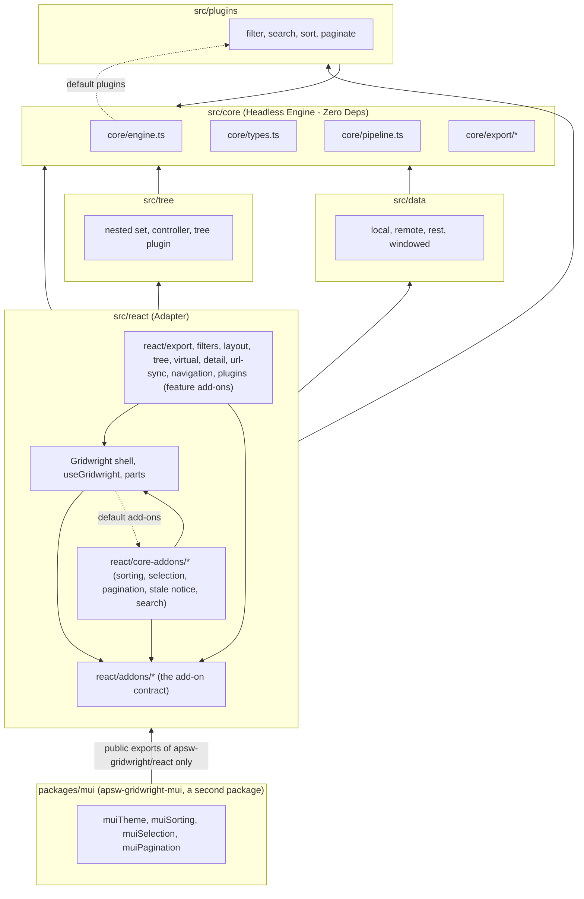
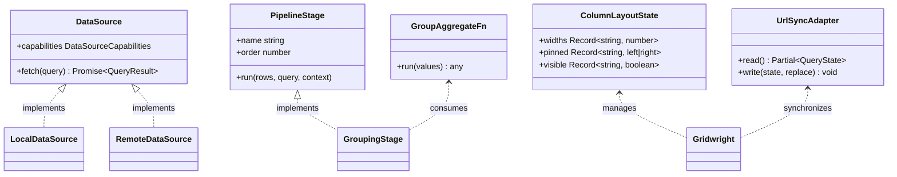

# Dependency map

How the modules depend on each other, and what breaks what. Updated at stage 8 of every feature.

## Import direction

Feature add-ons import the shell's parts and the contract; the shell imports no feature add-on, and
the core add-ons only as the default list. `tests/smoke/tree-shaking.test.ts` holds that line.

Planned and not built, so not drawn: `plugins/grouping`. It is specified to arrive as a plugin; see
its spec's "Delivery as a plugin" section.

Imports point one way, upward into `src/core`. The single arrow back is `engine.ts` importing
`corePlugins` for its default plugin set; the plugins depend only on core types, so there is no
cycle at the type level.

## Module responsibilities and blast radius

| Module | Depends on | Changing it affects |
| :--- | :--- | :--- |
| `core/types.ts` | nothing | **everything**, and the published type surface. Every change here is a semver event. |
| `core/values.ts` | `types` | sorting order, filter semantics, search matching, default cell text |
| `core/columns.ts` | `types`, `values` | every consumer of a resolved column: engine, stages, adapter |
| `core/query.ts` | `types` | when a refetch happens, and when the page resets |
| `core/errors.ts` | `types` | what a failed grid displays, and what gets retried |
| `core/emitter.ts` | `types` | every listener and plugin |
| `i18n/messages.ts` | nothing | the translation contract. A key change is a semver event for every catalog, including third-party ones. |
| `i18n/translator.ts` | `i18n/messages` | every rendered string, plural selection, number formatting, direction, and how an add-on's string is resolved |
| `locales/*` | `i18n/messages` | the bundled translations only |
| `tree/nested-set.ts` | `core/types` | the interval arithmetic every tree operation rests on |
| `tree/controller.ts` | `tree/nested-set`, `core/errors` | expansion, lazy children, every mutation |
| `tree/plugin.ts` | `tree/controller`, `core/pipeline`, the core stage ids | what a tree grid renders; it suppresses the core filter, search and sort stages rather than replacing the plugin list |
| `tree/columns.ts` | `core/types` | how a column written for a row reads a node |
| `react/tree/*` | `tree/*`, `react/addons`, `react/context`, `react/a11y/tree` | the `treeData()` add-on: the controller, the wrapped source and columns, the cell, the toggle, the row hierarchy attributes |
| `react/plugins/*` | `react/context`, `react/addons`, `core/*` | the `rowActions()` and `inlineEditing()` add-ons, the bubble menu and the editors |
| `react/export/*` | `core/export`, `react/context`, `react/addons` | the `exportMenu()` add-on, the export menu and its scope choice, `markdownReportFormats`, the download and the print frame. The only place an export touches the browser |
| `data/capabilities.ts` | core types | how every built-in source reads a declared `capabilities` object, and what it warns about |
| `react/filters/*` | `react/context`, `react/addons`, `core/types` | the `columnFilters()` add-on: the header filter buttons, the one filter dialog, the clear-all button, and which conditions each column type offers. Writes only through `api.setFilter`, so `core:filter`, the tree stage and every data source see nothing new |
| `core/export/*` | `core/types`, `core/values` | every exported file, and every Markdown report rendered from one. Pure text assembly: no DOM, no engine, no state |
| `plugins/grouping/*` (planned) | `core/types`, `core/pipeline`, `core/values` | row grouping and aggregation in the TRANSFORM slot |
| `react/layout/*` | `react/context`, `react/addons`, `react/types` | the `columnLayout()` add-on: column widths as CSS custom properties on the table, sticky pinning offsets, the reader's column order, the column picker, and the controller a consumer's own pin control uses. Reordering is `configure` returning the columns in the reader's order, so the engine, global search and every export follow it; the drag is the browser's own, contributed as `draggable` and `on*` handlers the attribute allowlist already permits. Writes visibility through `configure` as `ColumnDef.hidden`, so the engine and every export agree with the reader; `layout.ts` is the pure arithmetic and holds no DOM |
| `react/navigation/*` | `react/context`, `react/addons`, `core/export`, `react/parts/slots`, `react/tree`, `react/virtual`, `core/types` | the `cellNavigation()` add-on: a roving `tabIndex` that makes the grid one Tab stop, and the keys that move it. `useCellNavigation.ts` is the pure part -- which columns a cursor may visit, clamping a stored cursor to cells that still exist, and where a move lands -- and holds no DOM. The add-on reads the tree and the windowed viewport through their own public contexts, from a component it renders into a slot, because `setup` runs before any provider exists. It takes **no** `tableWrapper` ref: `virtualRows()` holds that one and `GridTable` keeps only the last. `clipboard.ts` builds the copy from `core/export` (`buildExportTable`, `formatCsv`, `escapeMarkup`) and decides which keydown is a copy shortcut; the copy itself is written in the browser's `copy` event through a `tableAttributes` `onCopy`, never through `navigator.clipboard` |
| `react/url-sync/*` | `core/query`, `core/types`, `react/addons`, `react/context` | the `urlSync()` add-on: the codec between `GridQuery` and URL parameters (`codec.ts`, pure, no DOM), the browser adapter (the only code touching `location` and `history`), and the lifecycle component that writes query changes and applies Back and Forward. Holds no engine state; reads the query through `initialQuery`, `query:change` and `setQuery` like any consumer. A change to `codec.ts` changes every link a reader has already shared |
| `core/virtual.ts` | nothing | which rows a scroll position asks for. Used by the React virtual body and by any consumer with no framework |
| `core/pipeline.ts` | `types` | stage ordering and the capability skip rule |
| `core/engine.ts` | all of core, `plugins` | the whole runtime |
| `data/local.ts` | core types | array-backed grids |
| `data/remote.ts` | core types, `errors` | every async source, including `rest` |
| `data/rest.ts` | `data/remote`, `errors` | REST-backed grids and the wire format |
| `data/windowed.ts` | core types, `errors` | any grid whose result set is larger than memory. Owns the block cache and its eviction |
| `plugins/*` | core types, `pipeline`, `values`, `columns` | what the pipeline does in memory |
| `react/addons/types.ts` | `react/context` (types), `core/types`, `i18n/messages` | the add-on contract. A change to a slot is a semver event for every add-on, including third-party ones |
| `react/addons/resolve.ts` | `core/errors`, `addons/types` | add-on order, `requires`, `after`/`before`, suppression, one-owner slots, and the attribute allowlist every contributed attribute passes |
| `react/addons/context.ts` | `react/context`, `i18n/translator` | `useAddonMessages`, `addonMessages`, `useGridContributions` |
| `react/core-addons/*` | `react/addons`, `react/context`, `react/parts/*` | the add-ons every grid starts with: sorting, selection, pagination, the stale notice; and search |
| `react/core-addons/*-logic.ts` | `core/types`, `react/addons/types` (types), `react/navigation/cell-control` | what sorting, selection and pagination decide: `aria-sort`, titles, priority, the announcement, page selection, row attributes and the row click, `Space`, the range, page sizes, pager focus. **Exported**, and called by both the native views and `apsw-gridwright-mui`: a change here changes both, and is a semver event for a third-party view built on them |
| `packages/mui/*` | `apsw-gridwright/react` (public exports only, external at build), `@mui/material` | `apsw-gridwright-mui`. Changes to the helpers above, to `rootAttributes`, or to the core add-ons' names and messages reach it; its tests re-run the grid's accessibility and core add-on suites against its views, so they fail in the same commit |
| `react/useGridwright.ts` | `core/engine`, `data/local`, `plugins`, `react/addons`, `react/core-addons`, `a11y/announcer` | every React grid: add-on setup and `configure`, the engine, plugin reconciliation by name |
| `react/context.tsx` | `react/types`, `labels`, `i18n/translator` | every part and every slot function, which receive this value |
| `react/labels.ts` | `i18n/translator` | the shell's own strings |
| `react/parts/*` | context, core types, `react/a11y/*`, `react/addons/resolve` | the shell: root, toolbar, table, header, body, rows and cells, each rendering the add-ons' contributions. No part imports a feature |
| `react/parts/GridStaleNotice.tsx` | context | whether a failed refresh over surviving rows is visible at all |
| `react/a11y/rows.ts` | nothing | the ARIA row numbering both bodies and the table render. A change here is visible to every screen reader and to any test asserting on row positions. |
| `react/a11y/announcement.ts` | `a11y/types` | what the live region says, and therefore what a screen reader is told on every settled change |
| `react/a11y/useAnnouncement.ts` | `a11y/announcement`, `a11y/announcer`, `addons/context`, React | when an announcement is made, and which add-on contributor's sentence wins |
| `react/a11y/announcer.ts` | nothing | `instance.announce`, for sentences that are not grid state |
| `react/a11y/tree.ts` | `tree/controller`, `tree/types` | the hierarchy a tree row reports: level, position, set size, expanded |
| `react/detail/*` | `react/context`, `react/addons`, `react/parts/slots` (`columnCountOf`), `react/tree/rowData` (`rowDataOf`), `react/virtual/addon` (one constant) | the `rowDetail()` add-on: an expanded-id set, the toggle column, and the panel contributed through `rowAfter`. Holds no engine state -- expansion changes no query facet -- and unwraps the row so a tree node never reaches `render` or `hasDetail`. Reads `VIRTUAL_ADDON` only to refuse being listed beside it; the tree-shaking smoke test asserts that naming it does not bundle it |
| `react/virtual/useVirtualRows.ts` | `core/virtual`, React | reads the scroll position once per frame and hands it to the core arithmetic |
| `react/virtual/GridVirtualBody.tsx` | `useVirtualRows`, context, `parts/GridBody`, `data/windowed` (one constant) | what a virtualized grid renders, and when the data window moves |
| `react/virtual/addon.tsx` | `GridVirtualBody`, `core/virtual`, `react/addons` | the `virtualRows()` add-on and `useVirtualScroll` |
| `react/Gridwright.tsx` | `useGridwright`, context, `parts/*` | the assembled shell, keyed on the add-on names. It imports no feature |
| `styles/styles.css` | nothing | every consumer who imported it, including their overrides |

## The contracts that cross module boundaries

| Contract | Defined in | Implemented by | Consumed by |
| :--- | :--- | :--- | :--- |
| `DataSource` | `core/types.ts` | `data/*`, consumer sources | `core/engine.ts` |
| `DataSourceCapabilities` | `core/types.ts` | every data source | `core/pipeline.ts` |
| `PipelineStage` | `core/types.ts` | `plugins/*`, consumer plugins | `core/pipeline.ts` |
| `GridPlugin` | `core/types.ts` | `plugins/*`, consumer plugins | `core/engine.ts` |
| `GridState` | `core/types.ts` | `core/engine.ts` | `react/*`, consumers |
| `GridEventMap` | `core/types.ts` | `core/emitter.ts` | plugins, `react/useGridwright.ts` |
| `ResolvedColumn` | `core/types.ts` | `core/columns.ts` | stages, adapter |
| `MessageCatalog` | `i18n/messages.ts` | `locales/*`, consumer catalogs | `i18n/translator.ts` |
| `WINDOW_OFFSET_META` | `data/windowed.ts` | any source answering ranges | `react/virtual/GridVirtualBody.tsx` |
| `TranslateFn` | `i18n/translator.ts` | an external i18n library | `i18n/translator.ts` |
| `RowDetailController` | `react/detail/types.ts` | `react/detail/context.tsx` | `useRowDetail()`: the toggle, and a consumer's own expand-all control |
| `ColumnLayoutState` | `react/layout/types.ts` | `react/layout/*` | `columnLayout({ initial, onChange })`, consumers persisting a layout |
| `ColumnLayoutController` | `react/layout/types.ts` | `react/layout/context.tsx` | `useColumnLayout()`: the picker, the resize handles, a consumer's own controls |
| `ColumnLayoutChange` | `react/layout/types.ts` | `react/layout/context.tsx` | `columnLayout({ canChange })` and `controller.allows`: a consumer's rule about what the reader may rearrange |
| `GroupAggregateFn` | `core/types.ts` | `plugins/grouping/*` (planned) | pipeline stages, consumers |
| `UrlSyncAdapter` | `react/url-sync/types.ts` | `react/url-sync/adapter.ts`, a consumer's router bridge | `urlSync()` |
| `AddonContribution.rootAttributes` | `react/addons/types.ts` | any add-on; `muiTheme()` | `react/parts/GridRoot.tsx` |

A change to any row of that table is a change to the public API, because every one of them is
implementable by a consumer.

## Build graph

| Entry | Bundles | External |
| :--- | :--- | :--- |
| `dist/index.js` / `.cjs` | `src/index.ts` and everything under core, data, plugins, i18n | — |
| `dist/react/index.js` / `.cjs` | `src/react/index.ts` | `react`, `react-dom`, `react/jsx-runtime` |
| `dist/locales/index.js` / `.cjs` | the translation packs | — |
| shared chunk | the core, imported by every entry | — |
| `packages/mui/dist/index.js` / `.cjs` | `packages/mui/src` only | `apsw-gridwright`, `apsw-gridwright/react`, `@mui/*`, `@emotion/*`, React. A second package with its own version; its declarations import the grid's types rather than copying them |

The locales are a separate entry so a consumer pays only for the packs they import. Folding them
into the core entry would put five translations in every bundle that uses the grid in English.

The shared chunk is load-bearing. Without `splitting: true` each entry carries its own copy of the
engine, and `GridwrightError` becomes two classes: `instanceof` then fails for anyone who imports
it from one path and catches it from the other, while every test still passes.
`scripts/check-exports.mjs` compares module identity across the entries specifically to catch that.

## External dependencies

**Runtime: none.** `dependencies` is empty and the packaging audit fails the build if it is not.

**Peer, optional:** `react` and `react-dom`, `^18 || ^19`, needed only for `apsw-gridwright/react`.

**`apsw-gridwright-mui`:** no runtime dependencies either. Peers: `@mui/material` `^7 || ^9`, React,
and `apsw-gridwright` `^0.12.0` (optional in the manifest, so the workspace does not install the
published grid beside the source; its range is still enforced whenever the grid is installed).

**Development:** TypeScript, tsup, Vitest, Testing Library, ESLint, jsdom, and for the MUI package
`@mui/material` 9 with `@emotion/react` and `@emotion/styled`. None reaches either published
tarball.

## Repository tooling

| Script | Reads | Writes | Enforced by |
| :--- | :--- | :--- | :--- |
| `validate-skills.mjs` | `.agents/skills/**` | — | pre-commit, CI |
| `sync-claude-skills.mjs` | `.agents/skills/**`, `workflow.ai.yml` | `.claude/skills/**` | pre-commit, CI |
| `sync-agent-docs.mjs` | `workflow.ai.yml` | `AGENTS.md` block, `GEMINI.md` | pre-commit, CI |
| `install-hooks.mjs` | `.githooks/` | git config | run once per clone |
| `check-exports.mjs` | `package.json`, `dist/**` | — | `npm run verify`, CI |
| `serve-example.mjs` | `dist/**`, `examples/**` | — | run by hand: `npm run example` |

`workflow.ai.yml` is upstream of `AGENTS.md`, `GEMINI.md` and `.claude/skills/`. Editing any of
those three directly is a defect: the next sync overwrites it, and CI fails first.
