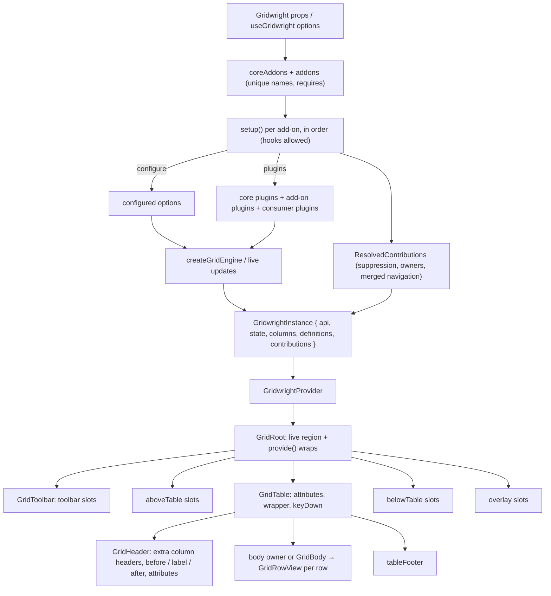

# Plan: add-on architecture

## 1. Modules touched

| File | Change |
| :--- | :--- |
| `src/core/types.ts` | `corePlugins`, additive `plugins`, `PluginContext.suppressStage`, `PipelineStage.skip` |
| `src/core/engine.ts`, `src/core/pipeline.ts` | suppression counts, `skip`, additive plugin install |
| `src/i18n/messages.ts`, `src/i18n/translator.ts`, `src/locales/*` | shell keys only; `TranslateFn` on `string`; `formatMessage`; `auditAddonMessages` |
| `src/react/addons/types.ts` | New. The contract in `data-model.md` |
| `src/react/addons/resolve.ts` | New. Ordering, `requires`, suppression, one-owner checks, attribute merging |
| `src/react/addons/context.tsx` | New. Contributions context, `useGridContributions`, `useAddonMessages` |
| `src/react/addons/messages.ts` | New. Add-on message resolution on top of the translator |
| `src/react/useGridwright.ts` | Runs add-on setups and `configure`, reconciles plugins, returns `contributions` |
| `src/react/Gridwright.tsx` | Shell only: no feature import, no feature prop |
| `src/react/parts/*` | Render contributions: toolbar, header (before, label, after, attributes), extra columns, `GridRowView`, status, table attributes, wrapper, keyboard, footer, above, below, overlays |
| `src/react/a11y/*` | Announcement contributors replace the sort and filter special cases |
| `src/react/labels.ts`, `src/react/types.ts` | Shell labels and props only |
| `src/react/core-addons/*` | New. `sorting`, `selection`, `pagination`, `staleNotice`, `search`, `coreAddons` |
| `src/react/filters/*` | Becomes `columnFilters()` with its messages and column augmentation |
| `src/react/export/*` | Becomes `exportMenu()`; its live region is replaced by `announce` |
| `src/react/plugins/BubbleMenu.tsx`, `InlineEdit.tsx` | `rowActions()` through row attributes; `inlineEditing()` through `configure` and `provide` |
| `src/react/tree/*`, `src/tree/plugin.ts` | `treeData()`; `treePlugins` suppress core stages instead of replacing the list; `TreeGridwright` and `useTreeGridwright` removed |
| `src/react/virtual/*` | `virtualRows()`, `useVirtualScroll()`, rows through `GridRowView` |
| `src/react/index.ts`, `scripts/check-exports.mjs` | Exports |
| `tests/**` | Rewritten to add-ons; a third-party add-on test using every slot; tree-shaking test |
| `examples/**`, `docs/**`, `README.md` | Add-ons everywhere; `docs/addons.md` |
| `specs/*` | Every spec annotated with its plugin delivery; draft specs corrected |

## 2. Resolution and rendering

## 3. Where the behaviour lives

- **Engine seams** (`suppressStage`, `skip`, additive plugins) are core: they are about stage
  scheduling, not rendering, and the lint boundary keeps them DOM-free.
- **Resolution** is a pure function in `src/react/addons/resolve.ts`, unit-tested without React.
- **The shell** (`Gridwright`, `GridRoot`, the parts) renders a table, its rows, cells, default header
  text, default status rows, and the live region's loading, error and range rules. Nothing else.
- **Every feature** lives in its add-on's directory, reaches the grid only through the contribution and
  public exports, and ships its own messages in five languages.

## 4. Trade-offs taken

- **Render functions in slots, not components.** Stable identity for free, at the cost of a rule (no
  hooks in render functions) that is documented and caught by the React hooks lint rule in the
  built-ins.
- **Add-on setup on every render.** Allows hooks, costs a loop over a handful of add-ons per render.
  Measured at stage 7 against the current render count tests.
- **One-owner slots throw on conflict.** Silent last-wins would make the header or the body depend on
  list order invisibly; suppression makes the intent explicit.
- **Suppression is view-only.** A suppressed add-on keeps its `configure` and `plugins`, so hiding
  pagination under virtualization does not change what the engine fetches.
- **Selection state stays in the engine.** Moving it into a plugin would add a second source of truth
  for `GridRow.selected`; the UI moves, the state does not.

## 5. Milestones

1. Engine seams, with tests.
2. The contract, resolution, contributions context, add-on messages, with tests.
3. The shell and parts rendering contributions; `GridRowView` shared by both bodies.
4. Core add-ons (`sorting`, `selection`, `pagination`, `staleNotice`, `search`) and the core catalog
   trimmed; the full React suite green on core add-ons.
5. Feature add-ons, one at a time, each with its tests green before the next: `columnFilters`,
   `exportMenu`, `inlineEditing`, `rowActions`, `virtualRows`, `treeData`.
6. The third-party add-on test, the tree-shaking test, the security and accessibility checks.
7. Examples, playground, docs, specs, CHANGELOG, DEPENDENCY_MAP; `npm run verify`; Chrome.

## 6. Risks and mitigation

| Risk | Mitigation |
| :--- | :--- |
| A hook-order violation when the add-on list changes | Key the grid on the add-on names; a test switches add-ons on and off |
| Render-count regressions from per-render setup | Existing render-count tests; resolution memoised on add-on identity and names |
| Attribute merges clobbering accessibility attributes | Contract says later wins; built-in add-ons never set the same ARIA attribute; tests assert the merged row |
| Tree-shaking silently defeated by a part importing an add-on | A test bundles an entry importing only `Gridwright` and asserts add-on markers are absent |
| A slot becoming an HTML sink | Types omit `dangerouslySetInnerHTML`; the security audit forbids it in source |
| Documentation drift across 13 specs | Each spec gains a "Delivery as a plugin" section in this change, checked in review |
