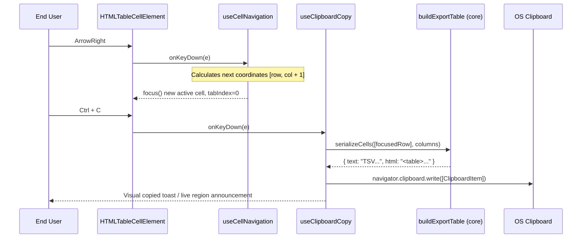

# Plan: 2D cell navigation and clipboard copy

## 1. Modules touched

| File | Change |
| :--- | :--- |
| `src/react/navigation/useCellNavigation.ts` | 2D roving tabindex hook tracking `[activeRow, activeCol]` |
| `src/react/navigation/useClipboardCopy.ts` | Keyboard event listener for `Ctrl+C` converting selected cells to TSV/HTML |
| `src/react/parts/GridBody.tsx` | Attach roving `tabIndex={isFocused ? 0 : -1}` to cells |
| `src/react/Gridwright.tsx` | Prop options `cellNavigation?: boolean`, `clipboardCopy?: boolean` |
| `src/styles/styles.css` | Focus ring styling for `.gw-cell--focused` |
| `src/i18n/messages.ts` | Add live region announcement for cell clipboard copy |

## 2. Architecture and Data Flow

## 3. Where the behaviour lives

- **2D Roving TabIndex**: Lives in `src/react/navigation/useCellNavigation.ts`.
- **Clipboard assembly**: Headless table extraction reused from `src/core/export/`, browser clipboard API called in `src/react/navigation/useClipboardCopy.ts`.
- **Cell focus styles**: Clean non-layout-shifting CSS outline via `--gw-focus-ring` in `src/styles/styles.css`.

## 4. Trade-offs taken

- **Asynchronous Clipboard API with fallback**: Uses `navigator.clipboard.write()` when available, falling back to hidden textarea execCommand for legacy environments without blocking UI threads.
- **Roving tabindex over active-descendant**: Roving tabindex (`tabIndex={isFocused ? 0 : -1}`) ensures screen readers natively announce cell coordinates, header associations, and content without synthetic aria-activedescendant complexity.

## 5. Risks & Mitigation

| Risk | Mitigation |
| :--- | :--- |
| Clipboard permission rejection in iframe/unfocused window | Wrap clipboard write in try/catch and emit error notice through standard grid notification channels. |
| Virtualized scrolling when moving focus past viewport boundary | Integrate with `useVirtualRows` via `scrollToIndex(rowIdx)` to ensure target cell DOM node is rendered before setting DOM focus. |

