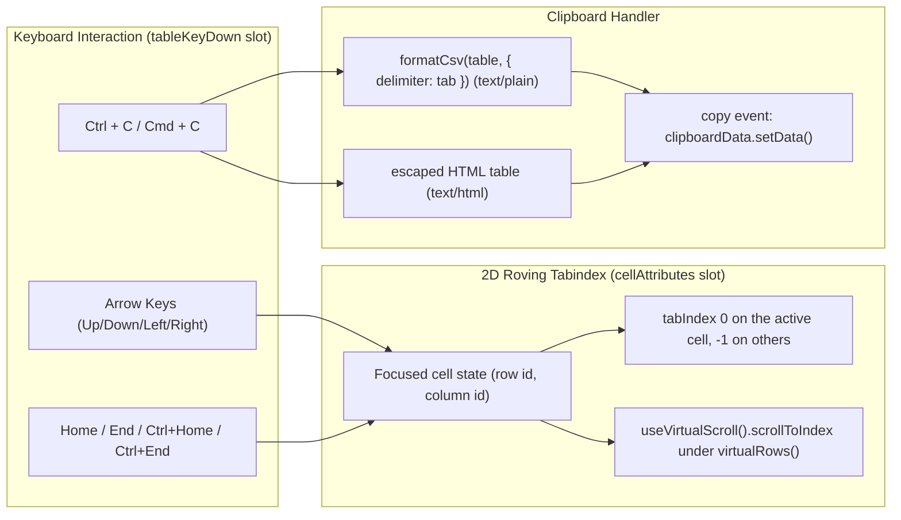

# Specification: 2D cell navigation and clipboard copy

> **Status**: Navigation implemented and verified (2026-09-21); clipboard copy implemented (2026-09-22, C-4). Stage 5 audit sent AC-03 back to Plan; the contract in
> `api-surface.md` supersedes it where they differ, and the changes are recorded in §8.
> **Stage entry**: 1 & 2
> **Semver impact**: minor (a new `cellNavigation()` add-on; nothing on `<Gridwright />`; to be
> confirmed in api-surface.md)

---

## 1. The consumer problem

Standard HTML tables require pressing `Tab` repeatedly to move between interactive elements. In a grid
with 100 rows and 10 columns, keyboard users must press `Tab` hundreds of times to traverse the data.
1. **Missing 2D WAI-ARIA Navigation**:
   - The W3C WAI-ARIA Grid Design Pattern requires a single `Tab` stop to enter the table, followed by
     two-dimensional navigation using Arrow keys (`Up`, `Down`, `Left`, `Right`) via a roving `tabindex`.
   - Power users, keyboard-only operators, and screen reader users expect spreadsheet-style cursor
     movement across cells.
2. **Missing Clipboard Integration (`Ctrl + C`)**:
   - Analysts routinely select rows or cells and expect `Ctrl + C` (or `Cmd + C`) to copy the tabular data
     to the clipboard as tab-separated values (TSV) and HTML, allowing instant pasting into Microsoft Excel,
     Google Sheets, Notion, or text editors.
   - Without grid clipboard support, selecting text with the mouse copies misaligned fragments,
     column headers are lost, and offscreen rows under `virtualRows()` cannot be captured.

A first-class navigation and clipboard add-on will implement WAI-ARIA 2D roving tabindex cell focus
and multi-format clipboard copying (`text/plain` TSV and `text/html`), in the paged and the windowed
body alike.

---

## 2. User stories

- **US-01.** As a keyboard user, pressing `Tab` enters the grid on the last-focused cell, and `Arrow` keys
  move focus cell by cell (Up, Down, Left, Right).
- **US-02.** As a keyboard user, pressing `Home` jumps to the first cell of the current row, and `End`
  jumps to the last cell.
- **US-03.** As a keyboard user, pressing `Ctrl + Home` jumps to the top-left cell (row 1, col 1), and
  `Ctrl + End` jumps to the bottom-right cell.
- **US-04.** As an end user on a windowed grid (`virtualRows()`), navigating past the visible edge
  scrolls the container to keep the focused cell in view.
- **US-05.** As an end user, pressing `Ctrl + C` on a focused cell copies that cell's formatted value to
  the clipboard.
- **US-06.** As an end user with rows selected, pressing `Ctrl + C` copies all selected loaded rows
  (including column headers) as TSV and HTML table to the clipboard.
- **US-07.** As a person using a screen reader, navigating to a cell announces its column header, row number,
  and formatted text value.

---

## 3. Acceptance criteria

- [ ] **AC-01** Roving `tabindex`: exactly one data cell holds `tabIndex={0}` at any time; all other data
      cells hold `tabIndex={-1}`, contributed through `cellAttributes`.
- [ ] **AC-02** 2D Arrow navigation, handled in `tableKeyDown`:
      - `ArrowUp` / `ArrowDown`: moves focus between rows within the same column.
      - `ArrowLeft` / `ArrowRight`: moves focus between columns within the same row, in reading
        direction (reversed under `dir="rtl"`).
- [ ] **AC-03** Jump keys:
      - `Home` / `End`: first / last column in the current row.
      - `PageUp` / `PageDown`: by one page of rows within what is loaded, clamped at both ends.
        **They do not cross a page boundary** (C-2).
      - `Ctrl + Home` / `Ctrl + End`: first cell of the first loaded row / last cell of the last
        **loaded** row, scrolling as needed. `Ctrl + Home` also returns to page one when the total
        is exact. **Neither pages forward** (C-2).
- [ ] **AC-04** Focused cell styling: the active cell receives `gw-cell--focused` through
      `cellAttributes`, with an accessible focus ring (`outline: var(--gw-focus-ring)`).
- [ ] **AC-05** Windowed alignment: under `virtualRows()`, navigating to a row outside the mounted window
      calls `useVirtualScroll().scrollToIndex(index)` and focuses the cell once it is rendered. Without
      `virtualRows()`, `useVirtualScroll()` is `null` and nothing scrolls programmatically.
- [ ] **AC-06** Clipboard copy with the platform's own shortcut (`Ctrl + C`, `Cmd + C`,
      `Ctrl + Insert`), identically on Windows, macOS, Linux and ChromeOS (C-4):
      - If loaded rows are selected: copies them as TSV and as an HTML table, built from
        `buildExportTable` so cell text matches every export.
      - If no rows are selected: copies the active cell's formatted text.
      - Written in the browser's `copy` event, not through `navigator.clipboard` (C-4).
      - Every cell is escaped in the HTML flavour; nothing from data becomes markup.
- [ ] **AC-07** Live region: a copy is announced through `grid.announce`: "Copied 5 rows to the
      clipboard" / "Copied the cell to the clipboard". No failure message (C-4).
- [ ] **AC-08** Interactive child protection: when focus is inside a form control or editor (e.g. an
      inline edit `<input>`), `tableKeyDown` returns `false` for arrow keys, so the control keeps them;
      `Escape` returns focus to the cell. Add-ons listed before `cellNavigation()` see keys first.
- [ ] **AC-09** Every string is in the `gridwright:cell-navigation` add-on's messages, in five languages.
- [ ] **AC-10** Zero runtime dependencies: React keydown handlers and standard clipboard Web APIs.

---

## 4. Non-goals

- **Clipboard paste-to-edit across multiple cells.** Pasting spreadsheet blocks to edit dozens of cells
  at once requires bulk validation and rollback, which is a dedicated editing capability.
- **Navigating into extra columns contributed by other add-ons** (the selection checkbox column). Those
  cells hold their own focusable control and stay in the Tab order; see clarification C-1.
- **A `cellNavigation` prop on `<Gridwright />`.**

---

## 5. Behaviour across the capability seam

An adapter and presentation capability:
- Operates identically across local arrays and remote endpoints; copying selected rows copies the
  selected rows that are loaded, the same honest limit as `getSelectedRows()`.
- Tree grids: `ArrowLeft` on an expanded node collapses it and `ArrowRight` on a collapsed node expands
  it, through the public tree context (`useOptionalTreeContext()`), when `treeData()` is listed.
- Windowed bodies: AC-05.

---

## 6. Accessibility and interface copy

- **Cell markup** (the shell renders the `<td>`; the add-on contributes attributes):
  `<td tabindex="0" class="gw-cell gw-cell--focused">`
- **Messages** under `gridwright:cell-navigation`:
  - `copiedRows`: "Copied {count} rows to the clipboard" (plural)
  - `copiedCell`: "Copied the cell to the clipboard"

---

## 7. Delivery as a plugin

**Engine.** None. Focus position is view state. Row data for copying comes from public
`GridApi.getSelectedRows()` and `state.rows`, resolved with the core `buildExportTable` and `formatCsv`.

**React add-on.** `cellNavigation(options)`, named `gridwright:cell-navigation`. Not in `coreAddons()`.

| Slot | Use |
| :--- | :--- |
| `setup` (hooks) | the active cell (row id and column id), kept valid when rows or columns change |
| `cellAttributes` | `tabIndex`, `gw-cell--focused`, `onFocus` to follow pointer focus |
| `tableKeyDown` | arrows, jump keys, `Ctrl + C`; returns `true` only for keys it handled |
| `provide` | a context exposing the active cell to other add-ons (e.g. `selection()` handling `Space`) |
| `announce` / `grid.announce` | copy results |
| `messages` | the strings in §6 |

Scrolling reuses `virtualRows()`'s public `useVirtualScroll()`; tree expansion reuses `treeData()`'s
public context. Neither is a dependency: both are optional and detected at render.

**What cannot be an add-on.** Nothing, with one note. Extra columns are reachable through
`extraCellAttributes`, so whether they join the roving model is a design choice (C-1), not a gap. Focus must move to a DOM node after a render,
which the add-on does from a component it renders (not from a slot function, which may not use hooks).

---

## 8. Clarifications

- **C-1. Extra columns — resolved at stage 3: they join the roving model.** The `selection()`
  checkbox and the `rowDetail()` toggle are reachable with `ArrowLeft` from the first data column,
  through `extraCellAttributes`, which the contract already exposes for exactly this. A reader moving
  along a row reads the whole row, and the leftmost thing in it being unreachable by arrow keys would
  be a hole the Tab key has to patch. `cellNavigation({ includeExtraColumns: false })` confines the
  cursor to data columns for a grid that wants the old behaviour.
- **C-2. `Ctrl+End` and `PageDown` never page — found at stage 5 and sent back to stage 3.** AC-03
  asked for "the last row of the result set". When a paginating source sends no total,
  `state.isTotalExact` is false and the grid knows only that another page exists, so there is no last
  row to go to: honouring it would mean either inventing one or issuing an unbounded number of
  requests from a single keypress. Both are refused elsewhere in this package for the same reason, so
  the cursor stops at the last **loaded** row. Crossing a page edge with `PageDown` has the milder
  version of the same problem — `api.nextPage()` is a fetch, and focus would have to land after it —
  so paging keys stay inside what is loaded. `Ctrl+Home` returns to page one only when the total is
  exact, where the destination is known. Written out in `api-surface.md`.
- **C-3. `Tab` leaves the grid**, as the ARIA grid pattern says. The roving `tabIndex` is what makes
  the grid one Tab stop; a focusable child inside a cell keeps its own stop while it is mounted,
  which is today's behaviour and is not changed here.
- **Why roving tabindex rather than `aria-activedescendant`?** Screen readers announce the real focused
  cell's header associations and content natively, without synthetic focus management.
- **C-4. Copy is OS-independent, so it runs in the `copy` event, not `navigator.clipboard` —
  resolved at stage 3 of change 2 (2026-09-22).** The maintainer asked for copying that behaves the
  same on every operating system. `navigator.clipboard.write()` does not: it is `undefined` on a
  plain-HTTP page (a LAN dev server, an intranet), refused in a cross-origin iframe without
  `allow="clipboard-write"`, `ClipboardItem` arrived in Firefox only in 127, and being asynchronous
  it fails after the keypress is over. The browser's own `copy` event has none of those limits: it
  is synchronous, needs no permission and fires for whatever the platform calls copy — `Cmd+C`,
  `Ctrl+C`, `Ctrl+Insert`, the Edit menu. Its one catch is that Firefox and Safari fire it only
  with something selected, so the shortcut's keydown selects the focused cell's text and the `copy`
  handler replaces what the browser was about to copy and clears the selection. No focus is stolen
  and no deprecated `execCommand` is used, which is what the plan's "no legacy fallback" refused.

  Which keydown is copy is decided without sniffing the platform: `Ctrl` or `Cmd`, the letter read
  from `key` (the layout) and from `code` only on a non-Latin layout, `Alt` refused because Windows
  reports `AltGr` as `Ctrl+Alt`, `Shift` refused because `Ctrl+Shift+C` is the developer tools.
  The text flavour uses LF and no byte order mark; the HTML flavour declares UTF-8, because Excel
  for Mac reads an undeclared HTML clipboard as Mac Roman.

  This removes the failure message and the `onError` option the spec had: the `copy` event cannot
  be refused, and a browser that never fires one tells nobody, so there is no failure to report.
  Announcing a failure the add-on cannot observe would be the invented status this package refuses.
