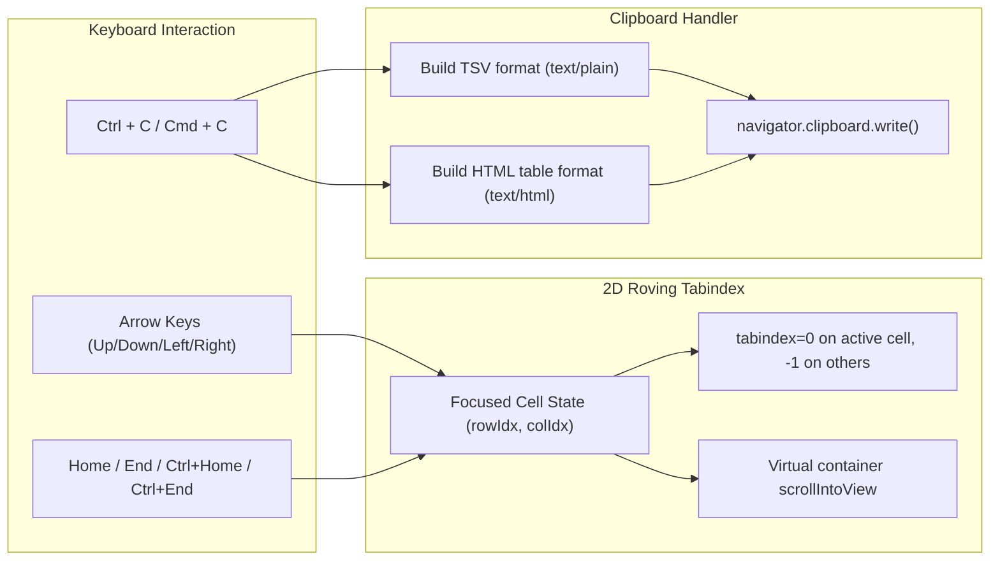

# Specification: 2D cell navigation and clipboard copy

> **Status**: Draft
> **Stage entry**: 1 & 2
> **Semver impact**: minor (new optional props on Gridwright and table parts; confirmed in api-surface.md)

---

## 1. The consumer problem

Standard HTML tables require pressing `Tab` repeatedly to move between interactive elements. In a grid
with 100 rows and 10 columns, keyboard users must press `Tab` hundreds of times to traverse the data.
1. **Missing 2D WAI-ARIA Navigation**:
   - The W3C WAI-ARIA Grid Design Pattern requires a single `Tab` stop to enter the table, followed by
     two-dimensional navigation using Arrow keys (`Up`, `Down`, `Left`, `Right`) via a roving `tabindex`.
   - Power users, keyboard-only operators, and screen reader readers expect spreadsheet-style cursor
     movement across cells.
2. **Missing Clipboard Integration (`Ctrl + C`)**:
   - Analysts routinely select rows or cells and expect `Ctrl + C` (or `Cmd + C`) to copy the tabular data
     to the clipboard as tab-separated values (TSV) and HTML, allowing instant pasting into Microsoft Excel,
     Google Sheets, Notion, or text editors.
   - Without native grid clipboard support, selecting text with the mouse copies misaligned fragments,
     column headers are lost, and hidden or offscreen cells cannot be captured.

A first-class navigation and clipboard capability will implement full WAI-ARIA 2D roving tabindex cell
focus and multi-format clipboard copying (`text/plain` TSV and `text/html`).

---

## 2. User stories

- **US-01.** As a keyboard user, pressing `Tab` enters the grid on the last-focused cell, and `Arrow` keys
  move focus cell by cell (Up, Down, Left, Right).
- **US-02.** As a keyboard user, pressing `Home` jumps to the first cell of the current row, and `End`
  jumps to the last cell.
- **US-03.** As a keyboard user, pressing `Ctrl + Home` jumps to the top-left cell (row 1, col 1), and
  `Ctrl + End` jumps to the bottom-right cell.
- **US-04.** As an end user on a virtualized grid, navigating past the visible edge automatically scrolls
  the container to keep the focused cell in view.
- **US-05.** As an end user, pressing `Ctrl + C` on a focused cell copies that cell's formatted value to
  the clipboard.
- **US-06.** As an end user with rows selected, pressing `Ctrl + C` copies all selected rows (including
  column headers) as TSV and HTML table to the clipboard.
- **US-07.** As a person using a screen reader, navigating to a cell announces its column header, row number,
  and formatted text value cleanly.

---

## 3. Acceptance criteria

- [ ] **AC-01** Roving `tabindex`: Exactly one cell in the grid holds `tabIndex={0}` at any time; all
      other cells hold `tabIndex={-1}`.
- [ ] **AC-02** 2D Arrow navigation:
      - `ArrowUp` / `ArrowDown`: Moves focus between rows within the same column.
      - `ArrowLeft` / `ArrowRight`: Moves focus between columns within the same row.
- [ ] **AC-03** Jump keys:
      - `Home` / `End`: First / last column in current row.
      - `PageUp` / `PageDown`: Jumps by visible row page viewport.
      - `Ctrl + Home` / `Ctrl + End`: Top-left and bottom-right grid boundaries.
- [ ] **AC-04** Focused cell styling: Active cell receives `.gw-cell--focused` with an accessible focus
      ring (`outline: var(--gw-focus-ring)`).
- [ ] **AC-05** Virtualized scroll alignment: Navigating to a cell that is outside the visible viewport
      calls `scrollOffsetForIndex` and brings the target row into the viewport smoothly.
- [ ] **AC-06** Clipboard copy (`Ctrl + C` / `Cmd + C`):
      - If rows are selected: copies selected rows as TSV (for spreadsheets) and HTML table.
      - If no rows are selected: copies the active cell's formatted text.
      - Uses `navigator.clipboard.write()` with fallback to `document.execCommand('copy')`.
- [ ] **AC-07** Live region copy announcement:
      - Copies trigger a brief announcement in the live region: `"Copied 5 rows to clipboard"`.
- [ ] **AC-08** Interactive child element protection:
      - When focus is inside a form control or editor (e.g. inline edit `<input>`), arrow key events are
        not captured by cell navigation unless `Escape` is pressed.
- [ ] **AC-09** Zero runtime dependencies:
      - Pure React keydown handlers and standard clipboard Web APIs.

---

## 4. Non-goals

- **Clipboard paste-to-edit across multiple cells:**
  Pasting spreadsheet blocks to edit dozens of cells at once requires complex bulk validation and
  transaction rollback, which is a dedicated editing engine capability.

---

## 5. Behaviour across the capability seam

Purely an **adapter and presentation layer** capability:
- Operates identically across local arrays and remote endpoints.
- Tree grids: navigating left on an expanded node collapses it; navigating right on a collapsed node expands it.

---

## 6. Accessibility and interface copy

- **Cell markup**:
  `<td role="gridcell" tabindex="0" class="gw-cell gw-cell--focused">`
- **Labels in Message Catalog**:
  - `clipboard.copiedRows`: "Copied {count} rows to clipboard"
  - `clipboard.copiedCell`: "Copied cell value to clipboard"
