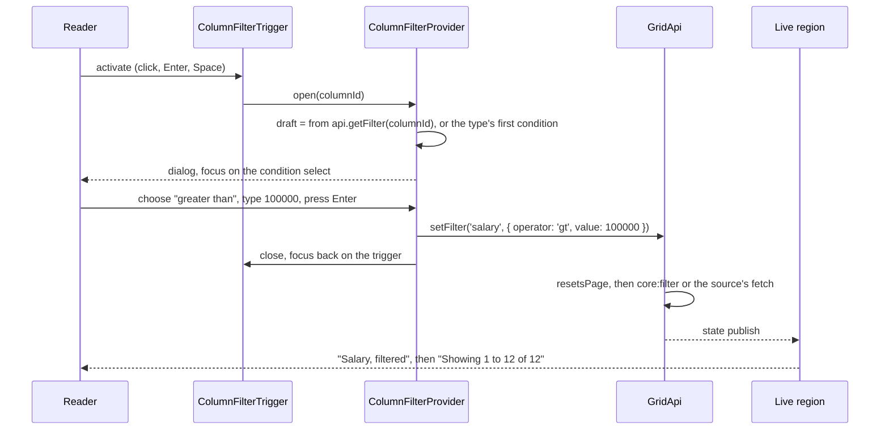

# Plan: column filtering

## 1. Modules touched

| File | Change |
| :--- | :--- |
| `src/react/filters/types.ts` | New. `ColumnFilterType`, `ColumnFilterChoice`, `ColumnFilterOptions`, part props |
| `src/react/filters/operators.ts` | New. `COLUMN_FILTER_OPERATORS`, which conditions each type offers; draft completeness and parsing |
| `src/react/filters/ColumnFilterProvider.tsx` | New. Open column, trigger registry, the one dialog, focus and outside-click handling |
| `src/react/filters/ColumnFilterTrigger.tsx` | New. The header button |
| `src/react/filters/GridFilterClear.tsx` | New. The toolbar button |
| `src/react/filters/index.ts` | New. Barrel |
| `src/react/types.ts` | `GridwrightColumn.filter`, `GridwrightProps.columnFilters`, 11 labels, two class name slots |
| `src/react/labels.ts` | The 11 labels from 30 keys |
| `src/react/parts/GridHeader.tsx` | Renders the trigger when a provider is present; `data-filtered` on the cell |
| `src/react/Gridwright.tsx` | Wraps the view in the provider when `columnFilters`; toolbar shows the clear button |
| `src/react/a11y/*` | The filter change joins the sort change in the live region |
| `src/react/index.ts` | Exports |
| `src/i18n/messages.ts`, `src/locales/*.ts` | 30 keys, five locales |
| `src/styles/styles.css` | `.gw-filter-*` rules |
| `scripts/check-exports.mjs` | The new React export names |
| `scripts/serve-example.mjs` | The mock endpoint implements every operator |
| `examples/playground/js/*.js`, `examples/playground/README.md` | The switch, typed columns, `filters` sent |

Nothing under `src/core`, `src/data`, `src/plugins` or `src/tree` changes.

## 2. Architecture and data flow

## 3. Where the behaviour lives

- **Matching**: already in the core (`matchesFilter`, `core:filter`, the tree stage). Untouched.
- **Which conditions a type offers, and turning a draft into a `FilterSpec`**: pure functions in
  `src/react/filters/operators.ts`. They are adapter-owned because a column's filter *type* is a
  rendering decision, like `edit.inputType`; the core never needs to know whether a text box or a
  date picker produced the value.
- **Open state, focus and positioning**: the provider. One dialog per grid.
- **The announcement**: `useGridAnnouncement`, which already derives a sort change by comparing the
  last query with this one; the filter change is derived the same way, from `query.filters`.

## 4. Trade-offs taken

- **One dialog, positioned `fixed`.** Escapes the scrolling wrapper and stays out of header names.
  Costs a measurement on open and on scroll or resize while open, and breaks inside a transformed
  ancestor (recorded as a known gap).
- **Apply rather than live filtering.** One query per decision and a real Cancel. Costs one click
  or Enter.
- **Types declared, not inferred.** Costs the consumer one field per non-text column; avoids a guess
  from one page.
- **No filter row.** Deferred as a non-goal; the provider's draft model would serve it unchanged.

## 5. Risks and mitigation

| Risk | Mitigation |
| :--- | :--- |
| Focus lost to `<body>` when the dialog or the clear button unmounts | Focus returned explicitly to the registered trigger; clear-all focuses the first trigger |
| A later sticky header cell painting over the dialog | The dialog is outside the table, `position: fixed`, with its own z-index |
| The server and the pipeline disagreeing on an operator | The dialog emits only the core `FilterOperator` vocabulary; the mock server implements all of it and is exercised with the capability both on and off |
| A number input producing `NaN` or a string | Parsed on apply; an incomplete or unparseable draft leaves Apply disabled |
| Date-time columns never matching "on" | Documented in the spec; `between` offered for dates |
