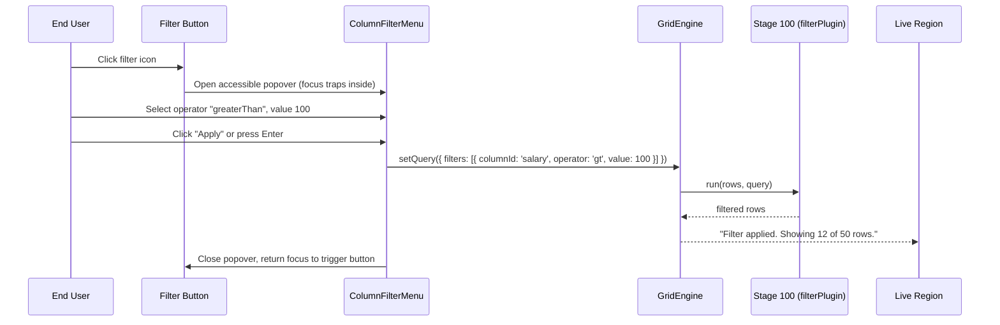

# Plan: column filtering plugin

## 1. Modules touched

| File | Change |
| :--- | :--- |
| `src/core/values.ts` | Extend `matchesFilter` with type-aware operators (`between`, `in`, `isEmpty`, `isNotEmpty`) |
| `src/react/parts/GridHeaderCell.tsx` | Render filter menu trigger button with active filter badge |
| `src/react/plugins/ColumnFilterMenu.tsx` | Accessible popover dialog with operator selector and input fields |
| `src/react/Gridwright.tsx` | Prop option `columnFilters?: boolean` |
| `src/styles/styles.css` | Styling for filter trigger button, active dot indicator, and popover dialog |
| `src/i18n/messages.ts` | Translation keys for all filter operators and aria-labels |
| `examples/playground/` | Interactive example demonstrating date, number, and string column filters |

## 2. Architecture and Data Flow

## 3. Where the behaviour lives

- **Filter matching logic**: Pure evaluation in `src/core/values.ts` at `STAGE_ORDER.FILTER: 100`.
- **Query options**: `filters: ColumnFilter[]` lives in `GridQuery` under `src/core/types.ts`.
- **UI Popover**: Composable React part in `src/react/plugins/ColumnFilterMenu.tsx`.
- **Styles**: Zero-dependency CSS in `src/styles/styles.css`.

## 4. Trade-offs taken

- **Popover vs Filter Row**: Both modes supported. Popover is the default on `<Gridwright columnFilters />` because it saves vertical screen real estate, while `<GridFilterRow />` is exported as an alternative for dense data entry forms.
- **Escape key behavior**: Pressing `Escape` cancels pending input changes, closes the popover, and returns focus to the header trigger button.

## 5. Risks & Mitigation

| Risk | Mitigation |
| :--- | :--- |
| Date parsing inconsistencies across browser locales | Use ISO date strings internally and compare numeric timestamps (`Date.parse()`). |
| Screen reader focus loss when popover unmounts | Return focus to the trigger button explicitly in the cleanup ref. |

