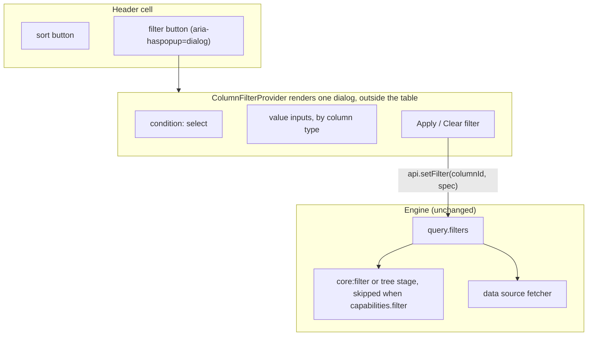

# Specification: column filtering (per-column filter controls in the header)

> **Status**: Implemented and verified (2026-09-12)
> **Stage entry**: 1 & 2
> **Semver impact**: minor (confirmed in api-surface.md)

---

## 1. The consumer problem

The engine has filtered since 0.1: `GridQuery.filters`, `api.setFilter()`, fifteen operators in
`matchesFilter`, the `core:filter` stage that steps aside when a source declares
`capabilities.filter`, and a tree stage that keeps the ancestors of a match. The React component
renders none of it. `<Gridwright />` offers a search box and sortable headers, and nothing else in
it can put a filter into the query.

That was found the way a consumer finds it: in the playground, ticking "the server resolves filter"
changed a badge and nothing else, because there was no control anywhere to set a filter with. The
README said "Sorting, filtering, search, pagination and the empty state are already there", which
was true of the engine and false of the component.

1. **Global search is not a filter.** It matches text in every searchable column at once. A reader
   cannot ask for `Salary > 100,000`, `Started before 2020`, or `Department is Research or
   Operations`; "Research" typed into a search box also matches a person named Research.
2. **Building it by hand is where the accessibility bugs are.** A consumer who wants per-column
   filtering today writes a popover, its focus handling, its outside-click and Escape behaviour, an
   active indicator, a clear action, and the call to `api.setFilter()`. Focus lost to `<body>` on
   close and a filter button with no name are the usual results.
3. **The filter has to reach a server exactly as it reaches the pipeline.** The same
   `{ columnId, operator, value }` travels to `matchesFilter` in memory and to a fetcher that
   declared `filter: true`. A control that produced anything else would split the one code path.
4. **The playground cannot show it.** The paging mock endpoint never received a `filters`
   parameter, so the "filter" capability switch was the one switch that demonstrated nothing, and
   the playground README described an "active only" switch the page does not have.



---

## 2. User stories

- **US-01.** As a developer, I want per-column filtering on `<Gridwright />` with one prop,
  `columnFilters`, so every filterable column gets a filter control without extra markup.
- **US-02.** As a developer, I want to say what kind of value a column holds (text, number, date, or
  one of a fixed set of choices) so the reader gets the right conditions and the right input.
- **US-03.** As a developer composing my own layout, I want the provider, the trigger and the
  clear button as parts, so a custom header or toolbar can use them.
- **US-04.** As a person reading a grid, I want to open a column's filter from its header, choose a
  condition, enter a value, and apply it.
- **US-05.** As a person reading a grid, I want to see which columns are filtered, clear one
  column's filter, and clear all of them at once.
- **US-06.** As a keyboard or screen reader user, I want the filter button named for its column and
  its state, focus moved into the dialog when it opens, kept there while it is open, and returned
  to the button when it closes, and I want the change announced.
- **US-07.** As a developer with a server that filters, I want exactly the `FilterSpec` the
  pipeline would have applied to arrive in `query.filters`.
- **US-08.** As a developer evaluating the package, I want to try it in the playground, over the
  paging endpoint with the filter capability both on and off.

---

## 3. Acceptance criteria

- [x] **AC-01** Parts exported from `apsw-gridwright/react`: `ColumnFilterProvider`,
      `ColumnFilterTrigger`, `GridFilterClear`, and the default operator table
      `COLUMN_FILTER_OPERATORS`. No new runtime dependency; no portal, so no `react-dom` import.
- [x] **AC-02** `<Gridwright columnFilters />` renders a filter trigger in every header whose column
      is `filterable` (the core default, true), and a "Clear filters" button in the toolbar while
      any filter is in the query. Off by default.
- [x] **AC-03** `GridwrightColumn.filter` chooses the type, and the type chooses the conditions:
      - `text` (default): contains, does not contain, equals, starts with, ends with, is empty, is
        not empty.
      - `number`: equals, does not equal, greater than, greater than or equal, less than, less than
        or equal, between, is empty, is not empty.
      - `date`: on, after, before, between, is empty, is not empty.
      - `select`: is any of, is none of, over the `choices` the column provides.
      `filter.operators` narrows or reorders the list. Every condition is a `FilterOperator` the
      core already defines; none is added.
- [x] **AC-04** A filtered column's header cell carries `data-filtered="true"`, the trigger is drawn
      in the accent colour, and its accessible name says the column is filtered.
- [x] **AC-05** Applying, changing or clearing a filter returns the grid to the first page (the
      engine's existing `resetsPage`; asserted, not reimplemented).
- [x] **AC-06** The dialog edits a draft. Nothing reaches the query until Apply, or Enter in a
      field. Escape and a click outside discard the draft.
- [x] **AC-07** Clear actions: "Clear filter" in the dialog, shown only when that column is filtered;
      "Clear filters" in the toolbar, naming the count, shown only while any filter is active.
      Clearing all moves focus to the first filter trigger, not to `<body>`.
- [x] **AC-08** Accessibility:
      - The trigger is a `<button>` inside the `<th>`, separate from the sort button, with
        `aria-haspopup="dialog"`, `aria-expanded`, and `aria-controls` while open.
      - The dialog is `role="dialog"`, `aria-modal="true"`, named "Filter {column}", rendered
        outside the table so it is never part of a column header's accessible name.
      - Opening moves focus to the condition select; Tab and Shift+Tab wrap inside the dialog;
        Escape, Apply and Clear return focus to the trigger.
      - The live region announces "{column}, filtered" or "{column}, filter removed" when a filter
        changes, then the settled row range as it already does.
      - `aria-sort` stays on the `<th>`.
- [x] **AC-09** Across the seam: a local source is filtered by `core:filter`; a source declaring
      `filter: true` receives the identical `FilterSpec` in `query.filters` and the stage is skipped;
      a tree is filtered by the tree stage with ancestors kept. No adapter code branches on which.
- [x] **AC-10** Every visible string is in the catalog: 30 message keys, in `en`, `de`, `es`, `fr`
      and `pl`. Choice labels are passed by the consumer already translated.
- [x] **AC-11** The playground: a "column filters" switch on the React page over the paging
      endpoint, which now receives `filters` and implements every operator; text, number, date and
      select columns; and the switch on the features page for in-memory data.
- [x] **AC-12** Zero runtime dependencies; the core, data and plugins directories are untouched
      except where a test proves existing behaviour.

---

## 4. Non-goals

- **Boolean trees of conditions (`(A OR B) AND C`).** Columns combine with AND, as the engine
  already does. A query builder is a different product.
- **More than one condition per column.** `api.setFilter` replaces a column's filter, and the
  dialog edits one. "Between" covers the common two-bound case.
- **A filter row under the header (`GridFilterRow`).** The draft offered it beside the popover.
  Deferred: it doubles the surface and the test matrix for a layout the popover already serves,
  and nothing in the query model stops it being added later as a minor.
- **Inferring a column's type from its values.** A type guessed from the first page is a guess the
  reader would act on. The consumer says what the column holds; the default is text.
- **Third-party popover or form libraries**, and **inventing a server filter protocol**: the source
  receives `FilterSpec[]` and maps it to SQL, OData or a query string itself.
- **Positioning inside a transformed ancestor.** The dialog is `position: fixed` against the
  viewport; a consumer who puts the grid inside a CSS `transform` gets a containing block the
  dialog cannot see past. Recorded in `review.md` as a known gap.

---

## 5. Behaviour across the capability seam

| Source resolves | Expected behaviour |
| :--- | :--- |
| **nothing (local array)** | `core:filter` applies every `FilterSpec` through `matchesFilter` (or the column's `filterFn`). The total becomes the match count. Page returns to 0. |
| **filter (server)** | `core:filter` is skipped. The fetcher receives the same `FilterSpec` objects in `query.filters`; the total is the server's. |
| **pagination only** | The server pages; the pipeline filters the page it received, as it already does for sort. The total then describes that page, which is the existing, documented behaviour of a source that only pages. |
| **tree** | The tree stage filters nodes and keeps the ancestors of a match (`keepAncestorsOfMatches`, default true). |
| **windowed** | The source's cache key includes `query.filters`, so a filter drops the blocks and asks from row 0. A windowed source that declares `filter: true` must really filter; the features page does not offer the switch over its ten-million-row range endpoint, which cannot. |

---

## 6. Accessibility and interface copy

- **Trigger**, inside the `<th>`, after the sort button:
  ```html
  <button type="button" class="gw-filter-trigger" aria-haspopup="dialog" aria-expanded="false"
          aria-label="Filter Salary">
    <svg aria-hidden="true">…</svg>
  </button>
  ```
  When filtered: `aria-label="Filter Salary, filtered"`, and the `<th>` has `data-filtered="true"`.
- **Dialog**, rendered by the provider after the table:
  ```html
  <div role="dialog" aria-modal="true" aria-label="Filter Salary" class="gw-filter-dialog">
    <form>
      <label>Condition <select>…</select></label>
      <label>Value <input type="number"></label>
      <button type="button">Clear filter</button>
      <button type="submit">Apply</button>
    </form>
  </div>
  ```
  A `select` column renders a `<fieldset>` with a `<legend>` ("Values") of checkboxes instead.
- **Message keys** (`src/i18n/messages.ts`), 30 in all:
  - `filter.open` "Filter {column}", `filter.openActive` "Filter {column}, filtered"
  - `filter.condition`, `filter.value`, `filter.from`, `filter.to`, `filter.values`
  - `filter.apply`, `filter.clear`, `filter.clearAll` (plural, with the count)
  - `filter.op.contains`, `.notContains`, `.eq`, `.ne`, `.startsWith`, `.endsWith`, `.gt`, `.gte`,
    `.lt`, `.lte`, `.between`, `.in`, `.notIn`, `.isEmpty`, `.isNotEmpty`, and for dates `.on`,
    `.after`, `.before`
  - `a11y.filterApplied` "{column}, filtered", `a11y.filterCleared` "{column}, filter removed"

---

## 7. Clarifications

Stage 2 resolved the draft against the code as it stands. Where the draft and the code disagreed,
the code's existing contract won, and the change to the draft is recorded here.

- **Does this need anything in the core?** No. `FilterOperator` already has all fifteen operators,
  `matchesFilter` already implements them, `api.setFilter` replaces one column's filter,
  `resetsPage` already returns to page 0 on a filter change, and `queriesEqual` already compares
  filter values structurally. The draft's plan to "extend `matchesFilter` with `between`, `in`,
  `isEmpty`" described work that was done. The feature is adapter-only.
- **Why a provider rather than a popover inside the header cell?** Two reasons found in the code.
  `.gw-table-wrapper` scrolls (`overflow-x: auto`, which forces the other axis to clip too), so a
  popover inside the table is cut off, worst of all on the empty result a filter can produce. And a
  dialog inside a `<th>` becomes part of that column header's accessible name, which a screen reader
  repeats on every cell of the column. The provider renders one dialog after the table, positioned
  from the trigger's rectangle, which is also how `BubbleMenu` escapes the same wrapper. The draft's
  `ColumnFilterProvider` survives under that name with this job; its `ColumnFilterMenu` is the
  dialog, internal to the provider.
- **Live filtering or an Apply button?** Apply. The draft asked for a 250 ms debounce *and* for
  Escape to cancel pending input, which cannot both hold: a debounced value has already been applied
  when Escape is pressed. An explicit Apply makes Escape mean cancel, sends one request per decision
  rather than one per pause in typing, and needs no timer. `queryDebounceMs` on the grid still
  applies to whatever is committed. AC-06 of the draft is replaced by the draft-and-apply rule.
- **`aria-modal` and a focus trap on a popover?** Kept. The dialog is small, holds a form, and is
  dismissed by a click outside. Tab wraps inside it so a keyboard reader cannot land on a sort
  button behind a dialog that is still open.
- **Why no conditions of its own for booleans?** A boolean column is a `select` with two choices:
  `{ value: true, label: 'Active' }`. `matchesFilter`'s `in` compares with the same loose equality
  the server contract documents, and the labels stay the consumer's own translated words.
- **What does a date filter compare?** The value as `matchesFilter` already reads it: an ISO date
  string or a `Date`, compared by timestamp. "On" is `eq`, so a column holding date-times rather
  than dates will match "on" only at midnight; such a column should offer `between`. Documented, not
  worked around, because rewriting "on" into a range would send the server an operator the reader
  did not choose.
- **What makes Apply available?** A complete condition: a non-blank value, both bounds of
  "between", at least one checked choice. "Is empty" and "is not empty" need no value. Apply is
  `disabled` until then; the reader's other ways out (Clear, Escape) stay available.
- **Where does "Clear filters" go when the toolbar is off?** The toolbar renders while
  `columnFilters` is on and a filter is active, even without `searchable` or `export`, because a
  filter the reader cannot see how to remove is a filter they believe is data.
- **Can a column opt out?** `filterable: false`, the existing core flag, which the pipeline also
  honours. There is no second switch.
- **What happens to a filter set by code for an operator the dialog does not offer?** The trigger
  still shows the column as filtered and Clear still removes it. Opening the dialog starts from the
  column's first condition, so the reader can replace it; it is never silently rewritten.
- **Where does the playground show it?** The React page gains a "column filters" switch over the
  paging endpoint, whose mock server now reads `filters` and implements every operator, so the
  "filter" capability switch finally changes where the work runs. The features page gains the same
  switch for its in-memory shapes, disabled over the ten-million-row range endpoint.

---

## 8. Delivery as a plugin

> **Superseded in part by `specs/addon-architecture`:** `<Gridwright columnFilters />` is now
> `addons={[columnFilters()]}`; the 30 `filter.*` and `a11y.filter*` keys left the core catalog and
> are the `gridwright:filters` add-on's own messages (`open`, `apply`, `op.contains`, ..., `applied`,
> `removed`), translated in each locale pack under `addons['gridwright:filters']`;
> `GridwrightColumn.filter` is declared by module augmentation through `'apsw-gridwright/react'`; and
> the "toolbar renders while `columnFilters` is on, even without `searchable` or `export`" rule is
> now the shell's general rule that the toolbar renders whenever any toolbar contribution renders
> something (`search()` replaced `searchable`, `exportMenu()` replaced `export`).

**Engine.** Nothing new. Filtering is the core `filteringPlugin` (stage `core:filter`, skipped by
`capabilities.filter`), and the add-on writes to it only through public `api.setFilter` and
`api.getFilter`. A tree's filtering is the tree plugin's stage, which suppresses `core:filter`.

**React add-on.** `columnFilters()`, named `gridwright:filters`. Not in `coreAddons()`: a grid does
not need per-column filters, and a consumer who never lists it does not bundle it.

| Slot | What it contributes |
| :--- | :--- |
| `provide` | `ColumnFilterProvider`, which owns the open column and renders the one dialog outside the table |
| `headerAfter` | `ColumnFilterTrigger` beside the label of every `filterable` column, outside the sort button |
| `headerAttributes` | `data-filtered="true"` on the `<th>` of a filtered column |
| `toolbar` | `GridFilterClear`, only while a filter is in the query |
| `announce` | "{column}, filtered" / "{column}, filter removed", priority 10 (below sorting's 20) |
| `messages` | every string above, in `en`, `de`, `es`, `fr`, `pl` |
| column option | `filter` (`type`, `choices`, `operators`) by augmentation of `GridwrightColumn` |

The parts stay exported for a layout composed by hand; under `GridwrightProvider` they find the
provider the add-on contributed.

**What cannot be an add-on.** Nothing. The feature was adapter-only from the start (§7), so moving it
out of `Gridwright.tsx` and `GridHeader.tsx` changed where it is wired, not what it does.
