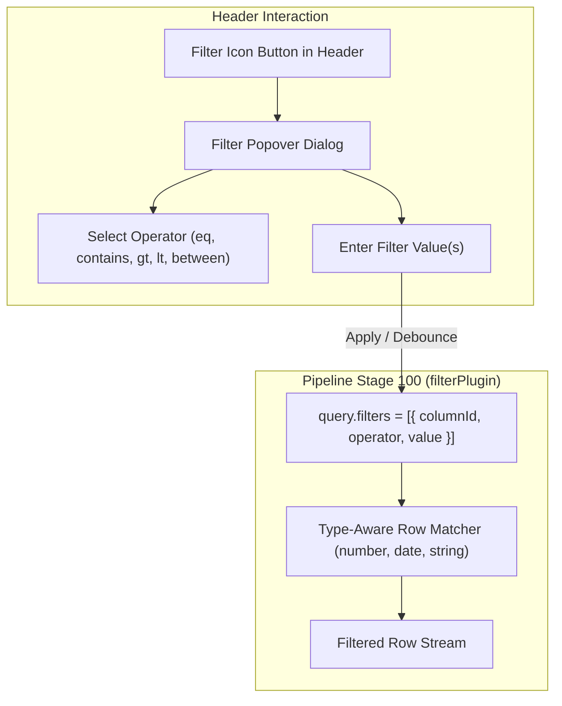

# Specification: column filtering (interactive per-column filter plugin)

> **Status**: Draft
> **Stage entry**: 1 & 2
> **Semver impact**: minor (confirmed in api-surface.md)

---

## 1. The consumer problem

Today, Gridwright provides global text search across columns via `searchable` ("filtering by match"),
and the core engine has internal support for `FilterSpec` through `filteringPlugin`. However:

1. **Global search is insufficient for structured data**:
   - A user cannot filter for `Price > 100` or `Created between 2026-01-01 and 2026-06-30` using a
     global search box that treats all values as plain text.
   - Searching "Alpha" in a global box matches names, notes, and categories simultaneously, whereas
     users frequently need to narrow down a specific column (e.g. `Status = "Active"` AND `Score >= 80`).
2. **No interactive UI exists in the adapter**:
   - Developers wanting per-column filtering must manually build custom popover dialogs, manage filter
     input state, sync with `api.setFilter()`, trap keyboard focus, manage active-filter badges, and
     handle debounce timing.
   - Building this from scratch in every application leads to accessibility bugs: focus loss on
     closing popovers, missing ARIA popup attributes, and silent failure to announce row count changes.
3. **Capability mismatch across local and remote sources**:
   - In-memory column filters must use typed comparison operators (`eq`, `ne`, `contains`, `gt`, `gte`,
     `lt`, `lte`, `between`, `in`, `isEmpty`), while remote sources need structured query objects passed
     through `GridQuery.filters`.
4. **Lack of interactive examples**:
   - Developers inspecting `examples/` have no demonstration of per-column filtering in action, leaving
     them to guess how column filters compose with sorting, pagination, tree data, and remote endpoints.

A first-class column filtering plugin must provide accessible, type-aware filtering controls (popover
filter menus and an optional filter row), plug directly into `<Gridwright />` as an option and as a
standalone composable part, maintain zero runtime dependencies, and be prominently demonstrated in
the playground examples.



---

## 2. User stories

- **US-01.** As a developer, I want to enable per-column filtering on `<Gridwright />` with one prop
  (`columnFilters`), giving users instant filtering on every filterable column without extra markup.
- **US-02.** As a developer, I want column filtering packaged as an adapter plugin/component
  (`<ColumnFilterMenu />` or `<GridFilterRow />`) so I can compose it in custom headers or table layouts.
- **US-03.** As an end user, I want to click a filter button on a column header to open a popover,
  choose an operator (e.g. `contains`, `equals`, `greater than`, `between`, `is empty`), and enter a
  value to narrow the grid.
- **US-04.** As an end user, I want visual feedback on which columns have active filters (e.g. an
  active badge or highlighted filter icon) and a one-click action to clear that column's filter.
- **US-05.** As an end user, I want a "Clear all filters" button in the toolbar to quickly return to
  the unfiltered dataset.
- **US-06.** As a keyboard reader or screen reader user, I want the filter button to declare
  `aria-haspopup="dialog"` and `aria-expanded`, trap focus inside the filter popover while open, and
  return focus cleanly to the header button upon Escape or commit without jumping to `<body>`.
- **US-07.** As a developer connecting a server-side REST or GraphQL endpoint, I want the active
  column filters passed in `query.filters` so my server can apply them directly when `capabilities.filter`
  is true.
- **US-08.** As a developer evaluating the package, I want to see per-column filtering in action in
  the playground (`examples/playground/`), with live examples of text, numeric, date, and select filters.

---

## 3. Acceptance criteria

- [ ] **AC-01** Adapter plugin & component: Export `ColumnFilterMenu` and `ColumnFilterProvider`
      under `apsw-gridwright/react`, with no external UI dependencies (pure HTML/CSS/React).
- [ ] **AC-02** Option prop: `<Gridwright columnFilters />` automatically injects accessible filter
      triggers into all headers where `column.filterable !== false`.
- [ ] **AC-03** Type-aware operators:
      - Text columns: `contains`, `notContains`, `equals`, `startsWith`, `endsWith`, `isEmpty`, `isNotEmpty`.
      - Numeric columns: `equals`, `ne`, `gt`, `gte`, `lt`, `lte`, `between`, `isEmpty`, `isNotEmpty`.
      - Date columns: `equals`, `gt` (after), `lt` (before), `between`, `isEmpty`, `isNotEmpty`.
      - Select / enum columns: `in` (multi-select checklist), `equals`, `ne`.
- [ ] **AC-04** Active filter indicator: Column headers with active filters render a distinct visual
      indicator (e.g. `.gw-th-filtered`, filled filter icon) and report `aria-label="{Header}, filtered"`.
- [ ] **AC-05** Page reset: Applying or updating a filter resets `query.pagination.pageIndex` to `0`
      (returning to the first page of matches).
- [ ] **AC-06** Debounced text input: Text filter inputs debounce by 250ms by default to prevent
      excessive pipeline recomputations or server requests on every keystroke.
- [ ] **AC-07** Clear actions:
      - Column popover provides a "Clear filter" button.
      - Toolbar provides an optional "Clear filters" button when any filter is active.
- [ ] **AC-08** Accessibility:
      - Trigger is a `<button>` inside `<th>` with `aria-haspopup="dialog"`, `aria-expanded`, and
        descriptive `aria-label`.
      - Popover container has `role="dialog"` and `aria-label="Filter {column}"`.
      - `Escape` closes the popover and restores focus to the header trigger button.
      - Settled filter results are announced via the existing `role="status"` live region.
- [ ] **AC-09** Capability negotiation:
      - Local source: `filteringPlugin` applies `matchesFilter` for all active `FilterSpec` entries.
      - Remote source declaring `capabilities.filter: true`: pipeline skips in-memory filtering and
        forwards `query.filters` to the fetcher.
- [ ] **AC-10** Localization: All operator names, placeholder strings, clear buttons, and screen reader
      announcements are registered in `defaultLabels` and translated in `en`, `de`, `es`, `fr`, and `pl`.
- [ ] **AC-11** Example demonstration:
      - Added to `examples/playground/`: interactive playground section showcasing column filtering
        across text, numeric, and enum columns alongside sorting, pagination, and tree data.
- [ ] **AC-12** Zero runtime dependencies: Uses native React state and CSS custom properties; no
      third-party popover or form libraries introduced.

---

## 4. Non-goals

- **Complex nested boolean logic builders (e.g. `(A OR B) AND (C OR (D AND E))`):**
  Column filtering operates on an implicit AND between columns. Full arbitrary boolean tree builders
  are a dedicated query-builder product and out of scope for a data grid header.
- **Third-party UI library dependencies (e.g. Radix, Popper.js, Floating UI):**
  To respect the zero runtime dependencies invariant, the filter popover is implemented using
  CSS anchor/absolute positioning within the grid root with standard React event boundaries.
- **Inventing server filter protocols:**
  Gridwright passes `query.filters: readonly FilterSpec[]` to the data source. Mapping this array into
  SQL, OData, or custom query strings belongs to the consumer's fetcher or `createRestDataSource`.

---

## 5. Behaviour across the capability seam

| Source resolves | Expected behaviour |
| :--- | :--- |
| **nothing (local array)** | `filteringPlugin` evaluates active column filters using `matchesFilter` in memory. Totals update to the filtered match count synchronously. Page index resets to 0. |
| **everything (server)** | When `capabilities.filter: true`, the engine skips local filtering. `query.filters` is forwarded to the server fetcher. Total rows and pages are reported by the server. |
| **tree data** | Ancestor rows of matching descendants are preserved and opened (`keepMatchingAncestors: true`), maintaining hierarchy integrity during column filtering. |
| **windowed source** | Query filters invalidate the window cache, re-querying the source for range starting at row 0. |

---

## 6. Accessibility and interface copy

- **Header button**:
  ```html
  <button type="button" aria-haspopup="dialog" aria-expanded="false" aria-label="Filter Score">
    <svg aria-hidden="true">...</svg>
  </button>
  ```
- **Popover container**:
  ```html
  <div role="dialog" aria-label="Filter Score" aria-modal="true" class="gw-filter-popover">
    ...
  </div>
  ```
- **Focus management**:
  - Opening the popover moves focus to the first interactive field (operator select or input).
  - Closing via Escape or clicking outside restores focus to the trigger button.
- **Labels added to `defaultLabels`**:
  - `filter`: "Filter"
  - `filterColumn`: "Filter {column}"
  - `filterClear`: "Clear filter"
  - `filterClearAll`: "Clear all filters"
  - `filterApply`: "Apply filter"
  - `filterOperator`: "Operator"
  - `filterValue`: "Value"
  - `filterValueTo`: "to"
  - Operators: `filterOpContains`, `filterOpEquals`, `filterOpStartsWith`, `filterOpEndsWith`,
    `filterOpGreaterThan`, `filterOpLessThan`, `filterOpBetween`, `filterOpIsEmpty`, `filterOpIn`.

---

## 7. Clarifications

- **Is the filter trigger inside or outside the sort button?**
  Inside the `<th>`, but as a separate `<button>` distinct from the sort header button. A sort button
  cannot contain a filter button (nested interactive controls violate HTML and ARIA standards).
- **How does a user know a column is filtered?**
  The header cell gains `.gw-th-filtered`, the filter icon changes to a filled state with accent color
  (`var(--gw-accent)`), and the screen reader label includes "filtered".
- **Does changing a filter reset the page?**
  Yes. Changing any filter resets the page index to 0, because the previous page index may no longer
  exist in the narrowed result set.
- **Can column filtering and global search be used together?**
  Yes. Both stages run in sequence (`FILTER` stage runs column filters, `SEARCH` stage runs global search).
  A row must pass both to remain visible.
- **Where will the playground example live?**
  In `examples/playground/` with live toggles in the controls panel to show:
  1. Header filter popovers on text, number, and status columns.
  2. Filter state synchronized with the mock API.
  3. Interactive "Clear all filters" badge in the toolbar.
