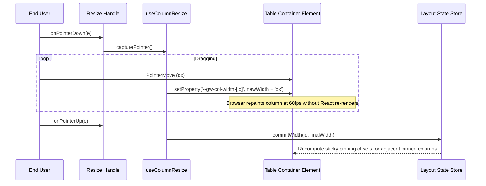

# Plan: column layout (resizing, pinning and visibility)

## 1. Modules touched

| File | Change |
| :--- | :--- |
| `src/core/types.ts` | Add `pinned?: 'left' | 'right'`, `minWidth`, `maxWidth` to `ColumnDef` and `ResolvedColumn` |
| `src/react/layout/useColumnLayout.ts` | Layout state hook managing widths, pinned offsets, and visibility |
| `src/react/layout/useColumnResize.ts` | Drag handler updating CSS variables on table container element |
| `src/react/parts/GridHeaderCell.tsx` | Render resize handle and apply sticky `position: sticky; left: ...` styles |
| `src/react/parts/GridBody.tsx` | Apply sticky styles to pinned body cells |
| `src/react/parts/GridColumnPicker.tsx` | Accessible popover checklist for column visibility |
| `src/styles/styles.css` | Resize handle, sticky shadow styling, and visibility popover |
| `src/i18n/messages.ts` | Add labels for resize handle and column picker |

## 2. Architecture and Data Flow

## 3. Where the behaviour lives

- **Column definition**: `pinned`, `minWidth`, `maxWidth` live on `ColumnDef` in `src/core/types.ts`.
- **Active resizing**: Pointer capture and CSS variable mutation live in `src/react/layout/useColumnResize.ts`.
- **Sticky offset math**: Pure helper in `src/react/layout/useColumnLayout.ts`.
- **Visibility popover**: Accessible dropdown in `src/react/parts/GridColumnPicker.tsx`.

## 4. Trade-offs taken

- **CSS Variables during resize drag**: Setting `--gw-col-width-[id]` directly on the table container during drag allows smooth 60fps resizing without triggering React renders for every pixel movement across thousands of cells. State commits only on pointer release.
- **Sticky CSS positioning over cloned headers/bodies**: Uses native browser `position: sticky; left: var(...)` rather than duplicating the entire table into frozen panes. Zero layout shifts and zero DOM duplication.

## 5. Risks & Mitigation

| Risk | Mitigation |
| :--- | :--- |
| Stacking context leaks when scrolling under sticky columns | Sticky cells receive explicit `z-index: 2` (headers `z-index: 3`) and an elevation drop shadow `--gw-pinned-shadow`. |
| Pointer capture loss on touch devices or iframe boundaries | Use `setPointerCapture` and attach global `pointerup` listener on `window`. |

