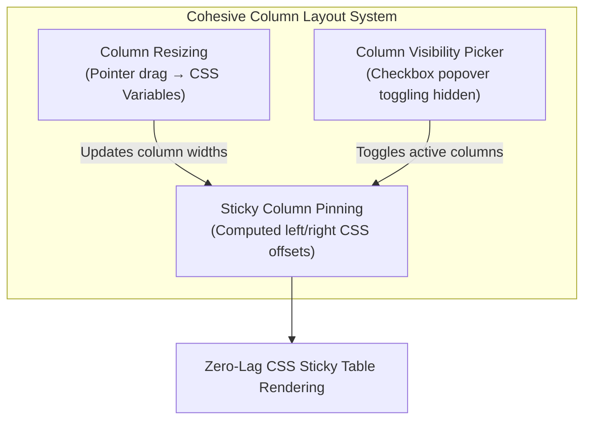

# Specification: column layout (resizing, pinning and visibility)

> **Status**: Draft
> **Stage entry**: 1 & 2
> **Semver impact**: minor (new optional props on Gridwright and ColumnDef; confirmed in api-surface.md)

---

## 1. The consumer problem

Real-world datasets frequently contain between 10 and 50 columns. In an unconfigured table:
1. **Columns truncate or wrap unpredictably**:
   - Without interactive resizing, columns with long strings (e.g. email, URL, description) get squeezed,
     while numeric or status columns occupy too much space. Users cannot widen columns to inspect data
     or narrow them to bring more content into view.
2. **Key identifiers are lost during horizontal scroll**:
   - As a user scrolls horizontally across a wide table, the row's primary identity (such as `ID`,
     `Customer Name`, or leading selection checkbox) scrolls out of view. The user loses context on
     which record they are examining.
   - Similarly, row actions pinned to the far right disappear or require endless horizontal scrolling.
3. **Information density cannot be customized**:
   - Different users have different workflows: a financial auditor needs `Transaction ID`, `Amount`,
     and `Status`, while a support agent needs `Customer Email`, `Phone`, and `Created At`. Without a
     column picker, tables are either permanently overloaded with columns or missing fields users need.
4. **These three features are architecturally coupled**:
   - A pinned column's sticky offset (`left: Xpx` or `right: Ypx`) depends directly on the rendered widths
     of preceding pinned columns.
   - When a pinned column is resized, all subsequent pinned columns must recalculate their sticky offsets
     instantly.
   - When a pinned column is hidden, the remaining pinned columns must smoothly collapse their offsets.

Implementing these three capabilities together as a cohesive layout system ensures that column widths,
sticky positions, and visibility compose cleanly with zero external runtime dependencies.



---

## 2. User stories

- **US-01 (Resizing).** As an end user, I want to drag the divider between column headers to resize a
  column to my desired width, with real-time visual feedback and respect for minimum/maximum limits.
- **US-02 (Auto-fit).** As an end user, I want to double-click a column resize handle to automatically
  snap the column width to fit the longest text currently visible in that column.
- **US-03 (Keyboard Resizing).** As a keyboard user, I want to focus a resize handle and use Arrow keys
  (`ArrowLeft` / `ArrowRight`) to resize columns, hearing the updated width announced to my screen reader.
- **US-04 (Pinning).** As a developer or user, I want to pin columns to the left or right (`pinned: 'left' | 'right'`),
  keeping identity columns and action buttons visible while scrolling wide datasets horizontally.
- **US-05 (Sticky Elevation).** As an end user, I want visual separation (a subtle drop shadow or border)
  on the edge of pinned columns when the table is scrolled, so the boundary between sticky and scrolling
  data is visually distinct.
- **US-06 (Visibility Picker).** As an end user, I want a column picker dropdown in the toolbar allowing me
  to show and hide columns with checkboxes, with essential columns locked (`hideable: false`).
- **US-07 (Layout Persistence).** As a developer, I want to capture layout changes (`onColumnLayoutChange`)
  and restore saved layouts (`initialColumnLayout`), so user adjustments survive page reloads.
- **US-08 (Accessibility).** As a person using assistive technology, I want hidden columns excluded from
  `aria-colcount`, visible columns accurately numbered via `aria-colindex`, and resize handles properly
  identified as separators.

---

## 3. Acceptance criteria

- [ ] **AC-01** Column resizing engine:
      - Enabled via `<Gridwright resizable />` or per column with `column.resizable !== false`.
      - Renders an accessible resize handle on the trailing edge of `<th>`:
        `<button type="button" className="gw-resize-handle" role="separator" aria-orientation="vertical" ...>`
      - Pointer drag uses native pointer capture (`setPointerCapture`) for smooth dragging even when the
        cursor leaves the header or window.
      - Widths update via CSS variables (e.g. `--gw-col-width-[id]`) on the table root, updating both `<th>`
        and `<td>` columns in a single layout pass without re-rendering cell components.
- [ ] **AC-02** Width constraints:
      - Respects `column.minWidth` (default: 50px) and `column.maxWidth` (default: none).
      - Double-clicking the resize handle calculates auto-fit width based on header text and visible cells.
- [ ] **AC-03** Keyboard resizing:
      - Resize handle is reachable via Tab / keyboard navigation.
      - `ArrowLeft` / `ArrowRight` adjusts width by 5px; `Shift + Arrow` adjusts by 20px.
      - `Home` snaps to `minWidth`; `Enter` triggers auto-fit.
- [ ] **AC-04** Column pinning (Sticky columns):
      - Supported via `column.pinned: 'left' | 'right'`.
      - Applies `position: sticky; left: [offset]` for left-pinned columns and `right: [offset]` for
        right-pinned columns.
      - Sticky offsets automatically sum preceding visible pinned columns' widths.
      - Boundary edge receives `.gw-cell--pinned-left-last` or `.gw-cell--pinned-right-first` with shadow
        styling when table is scrolled horizontally.
      - Checkbox selection column and row-action menu column participate in pinning cleanly.
- [ ] **AC-05** Column visibility & picker:
      - Component prop: `<Gridwright columnPicker />` adds `<GridColumnPicker />` to the toolbar.
      - Renders an accessible `role="menu"` with checkboxes for all toggleable columns.
      - Columns with `hideable: false` cannot be unchecked.
      - At least one column must remain visible at all times.
- [ ] **AC-06** Layout state & persistence:
      - `onColumnLayoutChange?: (layout: ColumnLayoutState) => void` emits:
        `{ widths: Record<string, number>, pinned: Record<string, 'left' | 'right' | undefined>, hidden: Record<string, boolean> }`.
      - `initialColumnLayout?: Partial<ColumnLayoutState>` initializes column widths, pinning, and visibility.
- [ ] **AC-07** Virtualization parity:
      - `GridVirtualBody` supports column widths, sticky pinning, and visibility with zero alignment jitter.
- [ ] **AC-08** Accessibility & ARIA:
      - Table reports `aria-colcount` equal to the number of *visible* columns.
      - Visible cells report `aria-colindex` corresponding to their 1-based visible position.
      - Resize handles report `aria-valuenow`, `aria-valuemin`, and `aria-label="Resize {column}"`.
- [ ] **AC-09** Zero runtime dependencies:
      - Implemented using native pointer events, CSS custom properties, and standard React state. No
        external resize or dragging libraries.

---

## 4. Non-goals

- **Third-party resize / drag-and-drop libraries (e.g. `interactjs`, `react-resizable`, `dnd-kit`):**
  These add substantial bundle size and transitive dependencies. Native pointer capture and CSS variables
  satisfy the entire requirement with zero dependencies.
- **Nested multi-tier header groups (e.g. grouped spanning headers):**
  Multi-level header hierarchies are a distinct architectural addition and belong in a future minor.
- **Fluid proportional flex resizing without horizontal scroll:**
  Tables with 20+ columns require horizontal scrolling; trying to fit 20 columns on a 1024px screen
  without scrolling creates illegible, broken layouts. Table layout uses `table-layout: fixed` for
  predictable column geometry.

---

## 5. Behaviour across the capability seam

Column layout is purely an **adapter and presentation layer** capability:
- It does not modify row data, query filters, sort rules, or pagination.
- It operates identically across:
  - Local in-memory arrays.
  - Remote paginating endpoints.
  - Tree grids (where indentation is placed inside the first visible non-pinned or pinned-left column).
  - Virtualized bodies (where spacer rows match the visible column count).

---

## 6. Accessibility and interface copy

- **Resize Handle**:
  ```html
  <button
    type="button"
    class="gw-resize-handle"
    role="separator"
    aria-orientation="vertical"
    aria-label="Resize Name column"
    aria-valuenow="180"
    aria-valuemin="50"
    tabindex="0"
  />
  ```
- **Live region announcements**:
  - Resizing announces: `"{Column} width: {width}px"` upon release or keyboard step.
  - Column toggle announces: `"{Column} hidden"` / `"{Column} shown"`.
- **Labels added to Message Catalog**:
  - `column.resize`: "Resize {column}"
  - `column.picker`: "Columns"
  - `column.showAll`: "Show all columns"
  - `column.resetLayout`: "Reset layout"
  - `column.pinnedLeft`: "Pinned to left"
  - `column.pinnedRight`: "Pinned to right"
  *(Translated across `en`, `de`, `es`, `fr`, `pl`)*.

---

## 7. Clarifications

- **How are column widths applied without re-rendering every cell?**
  Column widths are set as CSS variables on the table element (`--gw-col-width-[id]: 180px`). Column
  classes (`.gw-col-[id]`) on `<th>` and `<td>` read `width: var(--gw-col-width-[id])`. This allows drag
  updates to change a single DOM style attribute on the table without triggering React renders on
  thousands of table cells.
- **How is auto-fit measured?**
  Auto-fit samples visible cell text in that column, measures text width via an offscreen canvas context
  using the column's computed font, adds padding, and clamps to `[minWidth, maxWidth]`.
- **How do sticky columns stack?**
  Left-pinned columns stack with `z-index: 2` (header at `z-index: 4`). A CSS utility calculates:
  `--gw-pin-left-colB: calc(var(--gw-col-width-colA, 100px))`.
- **What is the default width if none is specified?**
  If a column has no explicit `width`, it receives an automatic min-content width or default of `150px`.
