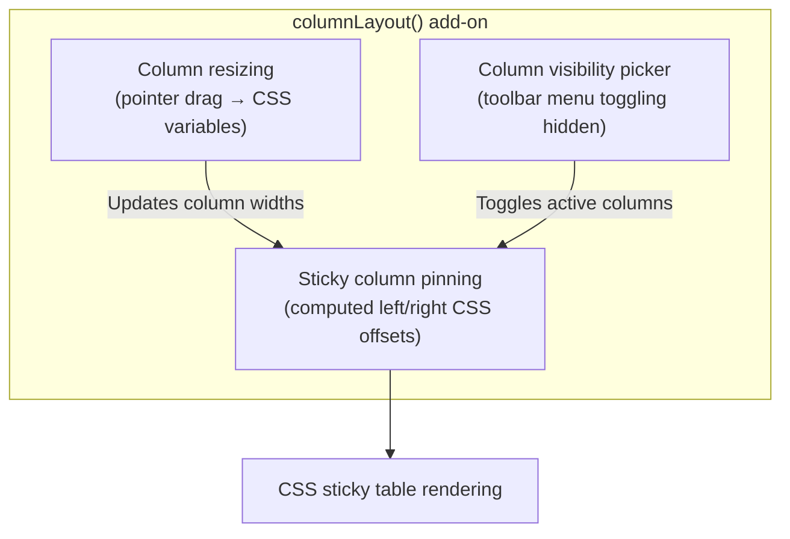

# Specification: column layout (resizing, pinning and visibility)

> **Status**: Implemented (all eight stages; corrected 2026-09-16 against the code)
> **Stage entry**: 1 & 2
> **Semver impact**: minor (a new `columnLayout()` add-on and a column option declared by augmentation;
> nothing on `<Gridwright />` or on the core `ColumnDef`; confirmed in api-surface.md)

---

## 1. The consumer problem

Real-world datasets frequently contain between 10 and 50 columns. In an unconfigured table:
1. **Columns truncate or wrap unpredictably**:
   - Without interactive resizing, columns with long strings (e.g. email, URL, description) get squeezed,
     while numeric or status columns occupy too much space. Users cannot widen columns to inspect data
     or narrow them to bring more content into view.
2. **Key identifiers are lost during horizontal scroll**:
   - As a user scrolls horizontally across a wide table, the row's primary identity (such as `ID`,
     `Customer Name`, or the leading selection checkbox) scrolls out of view. The user loses context on
     which record they are examining.
   - Similarly, a trailing column of per-row controls (a consumer's own actions column) disappears or
     requires endless horizontal scrolling.
3. **Information density cannot be customized**:
   - Different users have different workflows: a financial auditor needs `Transaction ID`, `Amount`,
     and `Status`, while a support agent needs `Customer Email`, `Phone`, and `Created At`. Without a
     column picker, tables are either permanently overloaded with columns or missing fields users need.
4. **These three features are architecturally coupled**:
   - A pinned column's sticky offset (`left: Xpx` or `right: Ypx`) depends directly on the rendered widths
     of preceding pinned columns.
   - When a pinned column is resized, all subsequent pinned columns must recalculate their sticky offsets
     instantly.
   - When a pinned column is hidden, the remaining pinned columns must smoothly collapse their offsets.

The core `ColumnDef` already carries `width`, `minWidth` and `hidden`, and `buildExportTable` already
leaves a hidden column out of every export. Implementing resizing, pinning and visibility together as one add-on ensures
that column widths, sticky positions and visibility compose cleanly with zero external runtime
dependencies.



---

## 2. User stories

- **US-01 (Resizing).** As an end user, I want to drag the divider between column headers to resize a
  column to my desired width, with real-time visual feedback and respect for minimum/maximum limits.
- **US-02 (Auto-fit).** As an end user, I want to double-click a column resize handle to automatically
  snap the column width to fit the longest text currently visible in that column.
- **US-03 (Keyboard Resizing).** As a keyboard user, I want to focus a resize handle and use Arrow keys
  (`ArrowLeft` / `ArrowRight`) to resize columns, hearing the updated width announced to my screen reader.
- **US-04 (Pinning).** As a developer or user, I want to pin columns to the start or end
  (`layout: { pinned: 'left' | 'right' }`), keeping identity columns and control columns visible while
  scrolling wide datasets horizontally.
- **US-05 (Sticky Elevation).** As an end user, I want visual separation (a subtle drop shadow or border)
  on the edge of pinned columns when the table is scrolled, so the boundary between sticky and scrolling
  data is visually distinct.
- **US-06 (Visibility Picker).** As an end user, I want a column picker in the toolbar allowing me to
  show and hide columns with checkboxes, with essential columns locked (`layout: { hideable: false }`).
- **US-07 (Layout Persistence).** As a developer, I want to capture layout changes
  (`columnLayout({ onChange })`) and restore saved layouts (`columnLayout({ initial })`), so user
  adjustments survive page reloads.
- **US-08 (Accessibility).** As a person using assistive technology, I want hidden columns excluded from
  the table, and resize handles properly identified as separators.

---

## 3. Acceptance criteria

- [x] **AC-01** Column resizing:
      - Enabled by listing `columnLayout()`; per column opt-out with `layout: { resizable: false }`
        (a `GridwrightColumn` option declared by module augmentation through `'apsw-gridwright/react'`).
      - Renders an accessible resize handle at the trailing edge of the `<th>`, through the
        `headerAfter` slot (beside the label, outside the sort button):
        `<div class="gw-resize-handle" role="separator" aria-orientation="vertical" tabindex="0" ...>`
      - Pointer drag uses native pointer capture (`setPointerCapture`) for smooth dragging even when the
        cursor leaves the header or window.
      - Widths are CSS variables (e.g. `--gw-col-w-<encoded id>`) contributed on the `<table>` through
        `tableAttributes.style`; `headerAttributes` and `cellAttributes` give each `<th>` and `<td>` a
        `style` reading the variable. A drag writes the variable on the table element directly and
        commits to state on release, so no cell re-renders while dragging.
      - A column id is encoded before it becomes part of a custom property name.
- [x] **AC-02** Width constraints:
      - Respects `ColumnDef.minWidth` (default: 50px) and `layout.maxWidth` (default: none).
      - Double-clicking the resize handle calculates an auto-fit width from the header text and the
        rendered cells.
- [x] **AC-03** Keyboard resizing:
      - The resize handle is reachable with Tab.
      - `ArrowLeft` / `ArrowRight` adjusts width by 5px; `Shift + Arrow` by 20px.
      - `Home` snaps to `minWidth`; `Enter` triggers auto-fit.
- [x] **AC-04** Column pinning (sticky columns):
      - Declared per column with `layout: { pinned: 'left' | 'right' }`, or changed at runtime through the
        add-on's controller.
      - Pinned `<th>` and `<td>` receive `position: sticky` and their offset through `headerAttributes` /
        `cellAttributes` `style`; offsets sum the widths of preceding visible pinned columns.
      - The boundary cell receives `gw-cell--pinned-left-last` or `gw-cell--pinned-right-first`, styled
        with a shadow. **Delivered always-on rather than only while scrolled**: knowing the scroll
        position means holding a ref to the scrolling wrapper, and `GridTable` keeps only the last
        `tableWrapper` ref it is handed, so taking one would break `virtualRows()` in any grid
        listing both. Recorded in review.md under "Known gaps".
      - Extra columns contributed by other add-ons (the `selection()` checkbox column) participate in
        left pinning; see clarification C-1 for how their cells are reached.
- [x] **AC-05** Column visibility and picker:
      - The add-on contributes a picker to the `toolbar` slot; `columnLayout({ picker: false })` omits it
        for a consumer placing the exported `GridColumnPicker` elsewhere.
      - Renders an accessible `role="menu"` of `menuitemcheckbox` items for the hideable columns.
      - Columns with `layout: { hideable: false }` cannot be unchecked.
      - At least one column stays visible.
      - Hiding sets `hidden: true` on the column through `configure`, so the engine and every export
        see the same visibility (clarification C-6 on what global search does instead). No
        `columnSignature` contribution is needed: `configure` runs before the grid builds its
        signature, and the grid's own signature already reads `column.hidden` (clarification C-2).
- [x] **AC-06** Layout state and persistence:
      - `columnLayout({ onChange })` receives
        `{ widths: Record<string, number>, pinned: Record<string, 'left' | 'right' | null>, hidden: Record<string, boolean> }`.
        `null` rather than `undefined` for an unpinned column, so the state survives `JSON.stringify`
        (clarification C-3).
      - `columnLayout({ initial })` initializes widths, pinning and visibility.
      - `onChange` is not called for the initial layout, so a handler that writes to storage does not
        overwrite a saved layout on every page load.
- [x] **AC-07** Virtualization parity: identical under `virtualRows()`, because both bodies render rows
      through `GridRowView` and read the same cell attributes.
- [x] **AC-08** Accessibility:
      - Hidden columns are not rendered, so the DOM order stays the column order and no
        `aria-colcount` / `aria-colindex` is needed (as `specs/react-only-accessible-state` §4 decided).
      - Resize handles report `aria-valuenow`, `aria-valuemin`, `aria-valuemax` when bounded, and
        `aria-label="Resize {column}"`.
      - A width change and a column shown or hidden are announced through the grid's live region.
- [x] **AC-09** Every string is in the `gridwright:column-layout` add-on's messages, in `en`, `de`, `es`,
      `fr`, `pl`.
- [x] **AC-10** Zero runtime dependencies: native pointer events, CSS custom properties and React state.

---

## 4. Non-goals

- **Third-party resize / drag-and-drop libraries (e.g. `interactjs`, `react-resizable`, `dnd-kit`).**
  Native pointer capture and CSS variables satisfy the requirement with zero dependencies.
- **Column reordering.** A separate interaction with its own keyboard model. Delivered
  afterwards into this same add-on; see `specs/column-reordering`.
- **Nested multi-tier header groups.** A distinct architectural addition.
- **Fluid proportional flex resizing without horizontal scroll.** Table layout uses
  `table-layout: fixed` for predictable column geometry.
- **Props on `<Gridwright />` (`resizable`, `columnPicker`, `initialColumnLayout`,
  `onColumnLayoutChange`) or `pinned` on the core `ColumnDef`.** Pinning is presentation, so it is an
  adapter column option, not engine vocabulary.

---

## 5. Behaviour across the capability seam

Column layout is an adapter and presentation capability:
- It does not modify row data, query filters, sort rules, or pagination. Hiding a column changes which
  columns the pipeline searches and exports, exactly as `ColumnDef.hidden` already does.
- It operates identically across local arrays, remote paginating endpoints, tree grids (indentation
  stays in the tree column wherever it is pinned) and windowed bodies.

---

## 6. Accessibility and interface copy

- **Resize handle**:
  ```html
  <div
    class="gw-resize-handle"
    role="separator"
    aria-orientation="vertical"
    aria-label="Resize Name"
    aria-valuenow="180"
    aria-valuemin="50"
    tabindex="0"
  ></div>
  ```
  A focusable `separator` rather than a `<button>`: a button role would override the separator
  semantics that carry the value.
- **Live region announcements** (through `announce` or `grid.announce`):
  - Resizing: "{column} width: {width} pixels", on release or keyboard step.
  - Column toggle: "{column} hidden" / "{column} shown".
- **Messages** under `gridwright:column-layout`:
  - `resize`: "Resize {column}"
  - `picker`: "Columns"
  - `showAll`: "Show all columns"
  - `resetLayout`: "Reset layout"
  - `pinnedLeft`: "Pinned to start"
  - `pinnedRight`: "Pinned to end"
  - `width`, `hidden`, `shown`: the announcements above

---

## 7. Delivery as a plugin

**Engine.** None. Widths and pinning are presentation; visibility reuses the existing
`ColumnDef.hidden`, set through the add-on's `configure`.

**React add-on.** `columnLayout(options)`, named `gridwright:column-layout`. Not in `coreAddons()`.

| Slot | Use |
| :--- | :--- |
| `setup` (hooks) | layout state (`initial`, `onChange`) and the drag controller; during a drag the table element is reached from the handle (`closest('table')`), because attribute contributions carry no `ref` |
| `configure` | `hidden` on columns from the layout state |
| `provide` | the layout context, so the handle, the picker and a consumer's own controls read one state |
| `tableAttributes` | the width CSS variables in `style`, and the `gw-table--fixed` class |
| `headerAfter` | the resize handle |
| `headerAttributes`, `cellAttributes` | width and sticky offset styles, pinned boundary classes |
| `extraHeaderAttributes`, `extraCellAttributes` | the same for another add-on's extra column |
| `toolbar` | the column picker |
| `announce` / `grid.announce` | width and visibility changes |
| `messages` | the strings in §6 |
| column option | `layout: { resizable, pinned, hideable, maxWidth }` by augmentation of `GridwrightColumn` |

**What cannot be an add-on.** Nothing. Another add-on's extra column cells (the selection checkbox
column) are reached through `extraCellAttributes` and `extraHeaderAttributes`, which the contract gained
for exactly this (C-1), so a pinned extra column gets its sticky offset the same way a data column does.

---

## 8. Clarifications

- **How are column widths applied without re-rendering every cell?**
  Column widths are CSS variables on the table element. Cells read `width: var(--gw-col-w-<id>)`
  through their contributed `style`. A drag updates a single style property on the table without React
  renders on thousands of cells, and commits to state on release.
- **How is auto-fit measured?**
  Auto-fit reads the rendered header and cell text widths in that column (the DOM, in the adapter),
  adds padding, and clamps to `[minWidth, maxWidth]`. Under `virtualRows()` only mounted rows are
  measured, which is documented.
- **How do sticky columns stack?**
  Left-pinned cells stack with `z-index: 2` (header at `z-index: 4`); offsets are computed from the
  committed widths and written as CSS variables.
- **What is the default width if none is specified?**
  The column's `width`, else an automatic min-content width with a `150px` fallback.
- **C-1. Extra columns and pinning.** Resolved: the add-on contract has `extraCellAttributes(row,
  columnId, grid)` and `extraHeaderAttributes(columnId, grid)`, available to every add-on, and
  `tests/react/third-party-addon.test.tsx` pins the selection column through them. A `start` extra
  column is pinned left whenever any data column is, unless the layout state names it: a checkbox
  that scrolls out from under the name it belongs to is worse than no pinning at all.
- **C-2. Why no `columnSignature` contribution.** The draft asked for one. It is not needed and has
  been removed: `useGridwright` applies every add-on's `configure` before it builds the signature,
  and the grid's own `columnSignature` already includes `column.hidden`. A contribution would
  restate a fact the signature already carries, and a second statement of one fact is the thing
  that later disagrees with the first.
- **C-3. Why an unpinned column is `null`.** `JSON.stringify` drops a key whose value is `undefined`.
  The layout exists to be saved and restored (US-07), so a state that said "this column is
  explicitly not pinned" would come back from storage saying nothing, and the column's own
  `layout: { pinned }` would pin it again on load.
- **C-4. A width this add-on cannot add up.** Sticky offsets are a sum of pixel widths. A column
  whose `width` is `'20%'` or `'auto'` has no pixel count to add, so under this add-on it renders at
  `defaultWidth` (150) until it is resized. Documented rather than guessed at: measuring the
  rendered width would make the layout depend on the order things mounted in.
- **C-5. What a consumer inherits by listing the add-on.** The table gets `table-layout: fixed` and
  cells truncate with an ellipsis instead of wrapping. Both are needed for a dragged edge to stay
  where it was dropped, and both arrive on the add-on's own class, so a grid that does not list it
  renders exactly what it rendered before.
- **C-6. A hidden column is still searched.** The draft assumed the core search stage honours
  `hidden`. It does not, and it should not: `hidden` says what is rendered and what an export
  covers, `searchable` says what global search reads, and they are two switches because they are two
  questions. A column a reader hides from view is not a column they want search to stop finding
  rows by. A consumer who wants both sets `searchable: false` as well, which
  `docs/column-layout.md` says. Changing the search stage would be a behaviour change for every
  consumer who sets `hidden` today, and it is not part of this feature.
