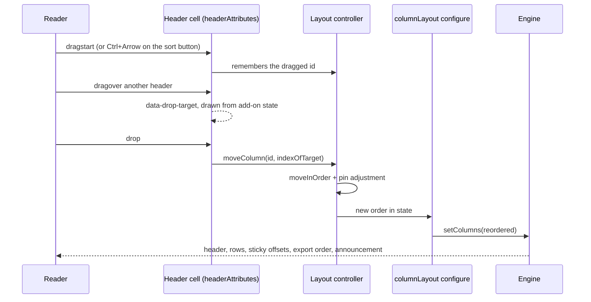

# Plan: column reordering

## 1. Modules touched

Every file already exists. The feature adds no module, which is the strongest evidence that it
belongs where it is going.

| File | Change |
| :--- | :--- |
| `src/react/layout/types.ts` | `order` on `ColumnLayoutState`; `reorderable` on `ColumnLayoutOptions`; `movable` on `ColumnLayoutColumnOptions`; `order`, `indexOf`, `canMove`, `moveColumn` on `ColumnLayoutController` |
| `src/react/layout/layout.ts` | New pure helpers `orderedColumns` and `moveInOrder`; `normalizeLayout` validates `order` |
| `src/react/layout/context.tsx` | The controller gains the four members; `moveColumn` adjusts `pinned` when a column lands in or leaves a pinned run |
| `src/react/layout/addon.tsx` | `configure` returns the reordered columns; `headerAttributes` contributes `draggable`, the four drag handlers, `aria-keyshortcuts` and `data-movable`; the announcement contributor gains the move sentence |
| `src/react/layout/GridColumnPicker.tsx` | Nothing. It already lists `grid.columns`, which arrives reordered |
| `src/react/layout/messages.ts` | `move`, `moved` |
| `src/react/core-addons/sorting.tsx` | **Not touched.** See §3 |
| `src/locales/{de,es,fr,pl}.ts` | The two new keys |
| `src/styles/styles.css` | The drag source and drop target states |

Not touched: `src/core/**` (the declared array is the order), `src/react/index.ts` beyond two new
helper exports, and the shell's parts, which already render header attributes from context.

## 2. Architecture and data flow

## 3. Where the behaviour lives

- **The order itself**: `ColumnLayoutState.order`, resolved by `orderedColumns` on every render, in
  the same pass that already computes widths and sticky offsets.
- **The pointer path**: `headerAttributes` on the layout add-on. No component is added, because
  nothing new is drawn — the header cell itself is the drag source and the drop target.
- **The keyboard path**: also `headerAttributes`, as an `onKeyDown` that acts only on
  `Ctrl`/`Meta` + arrow and returns otherwise. Contributed attributes merge rather than replace, so
  the handler runs alongside whatever the sorting add-on put on the cell; `src/react/core-addons/sorting.tsx`
  is not edited, and the two add-ons stay independent. This is the point of the contract and it
  should be checked early in stage 6: if a contributed `onKeyDown` did not compose, the plan is
  wrong and stage 3 gets it back.
- **The pin adjustment**: `moveColumn` in the controller, the single place where `order` and
  `pinned` are written together.
- **The announcement**: the existing contributor in `addon.tsx`, which already compares a signature
  across settled states for visibility; the order joins that signature.

## 4. Trade-offs taken

- **Native drag-and-drop over pointer events**: no dependency, no re-implementation of the drag
  image, the cancel gesture or the edge auto-scroll, and no fight with the resize handle over
  `pointerdown`. The cost is a weaker touch story, which the keyboard path covers and which
  `docs/column-layout.md` states.
- **`Ctrl`+arrow on an existing control over a new focusable one**: no third Tab stop per header.
  The cost is a shortcut a reader has to be told about, which is what the `aria-keyshortcuts` and
  the documentation are for.
- **Dropping into a pinned run pins the column**: the alternative leaves a column that scrolls away
  from between two that do not. Agrees with AG Grid, reached independently.
- **Extending `columnLayout()` rather than a new add-on**: one saved layout, one controller, one set
  of header gestures. The cost is that an application wanting only resizing ships the reorder code
  too, recorded in the spec's C-1.

## 5. Risks & mitigation

| Risk | Mitigation |
| :--- | :--- |
| A contributed `onKeyDown` does not compose with the sorting add-on's own handler | `mergeAttributes` chains `on*` handlers in add-on order, and `tests/react/third-party-addon.test.tsx` already relies on it. Asserted directly by a test in this feature: sort still works on a header that reorders. |
| A drag that begins on the resize handle reorders instead of resizing | The handle stops `pointerdown` propagation already; it also gets `draggable={false}` so the header's drag source does not claim the gesture. A test drives a drag from the handle and asserts the width changed and the order did not. |
| `draggable` on every header changes what click-and-hold does, for grids that never reorder | `reorderable: false` restores the previous markup exactly, and the attribute is only contributed for columns that are actually movable. Recorded in api-surface.md as an inherited behaviour. |
| A saved order drifts from the columns | `orderedColumns` ignores unknown ids and appends unnamed columns; unit-tested in both directions, and stated in the documentation rather than engineered around (spec C-5). |
| `order` and `pinned` disagree, leaving an unpinned column between two frozen ones | They are written together in exactly one function, `moveColumn`. A test moves a column into a pinned run and asserts it came out pinned. |
| jsdom does not implement the native drag-and-drop data transfer | The tests fire `dragstart`/`dragover`/`drop` directly and assert the resulting order, the way the resize tests drive a `MouseEvent` because jsdom has no `PointerEvent`. The gesture is verified in a real browser at stage 7. |
