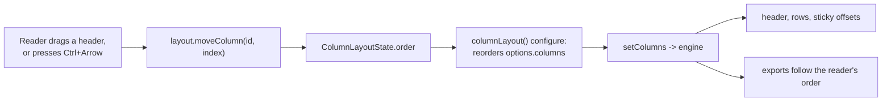

# Specification: column reordering

> **Status**: Implemented (all eight stages)
> **Stage entry**: 1
> **Semver impact**: minor (additions to the existing `columnLayout()` add-on and to
> `ColumnLayoutState`; nothing on `<Gridwright />` or on the core `ColumnDef`; confirmed in
> api-surface.md)

---

## 1. The consumer problem

`columnLayout()` lets a reader change a column's width, freeze it to an edge and hide it. It does
not let them change where a column *is*. That is the one arrangement decision left entirely to the
developer, and it is the one readers most often want, because the order a column set is declared in
is a decision made once, for everyone, by someone who is not doing today's job.

Three concrete consequences today:

1. **A reader cannot bring the column they care about next to the one they are comparing it
   against.** Comparing `Salary` with `Started` means scrolling past `Job title`, `Email`,
   `Department` and `City` every time, or hiding four columns they actually want.
2. **Pinning cannot move a column to the edge.** `layout: { pinned: 'left' }` on the fifth column
   makes it sticky at the correct offset, and it parks there on scroll, but it is still painted
   fifth: the reader cannot put it first. Pinning answers "does this column hold still", not "where
   is it". Verified against the built package in the playground before this spec was written.
3. **A saved layout is incomplete.** `ColumnLayoutState` persists widths, pinning and visibility, so
   a reader who arranges a grid and comes back tomorrow finds three of their four decisions
   restored, and the order reset.

The mechanism already exists and needs nothing new from the contract: an add-on's `configure` may
return the columns in a different order, the grid's own `columnSignature` already changes when the
array order changes, so the engine re-resolves, and the export table is built from the same array.
This was proved with a throwaway test against the public `GridAddon` contract before planning.

---

## 2. User stories

- **US-01 (Pointer).** As an end user, I want to drag a column header and drop it in a new position,
  with a clear indication of where it will land, so I can arrange the table for the task in front of
  me.
- **US-02 (Keyboard).** As a keyboard user, I want to move a column left or right without a pointer,
  and hear where it landed, because a rearrangement I cannot perform is a feature I do not have.
- **US-03 (Picker).** As an end user, I want the column picker to show columns in the order the
  table paints them, so the list I read and the table I see agree after a reorder.
- **US-04 (Locking).** As a developer, I want to keep a column where I put it
  (`layout: { movable: false }`), because an identity column that can be buried in the middle is a
  grid that can be made unreadable.
- **US-05 (Persistence).** As a developer, I want the order to travel with the rest of the layout
  through the `onChange` and `initial` I already wired, not through a second channel.
- **US-06 (Export).** As an end user, I want a file I export to have the columns in the order I
  arranged them, because I arranged them for a reason.
- **US-07 (Programmatic).** As a developer, I want to move a column from my own UI
  (`useColumnLayout().moveColumn`), the same way I can already pin one.

---

## 3. Acceptance criteria

- [x] **AC-01** Dragging a header:
      - Enabled by `columnLayout()`; the add-on-wide switch is `columnLayout({ reorderable: false })`
        and the per-column opt-out is `layout: { movable: false }`.
      - A header cell is a drag source through the native HTML drag-and-drop API — `draggable`,
        which is already on the contributable attribute allowlist — not through pointer events, so
        the browser supplies the drag image and the drop cursor.
      - The column under the pointer shows where the drop will land; the dragged header is marked
        while the drag is in flight.
      - Dropping commits the new order; dropping outside the header row changes nothing.
      - A drag that starts on the resize handle resizes and does not reorder.
- [x] **AC-02** Keyboard reordering:
      - The header's existing control (the sort button) gains `Ctrl`/`Cmd` + `ArrowLeft` /
        `ArrowRight`, moving the column one position and keeping focus on it.
      - Mirrored in a right-to-left page, so "towards the end of the row" is the same physical key
        as it is for resizing.
      - No new tab stop: the header is already reachable, and a second focusable control per header
        would be a third Tab press per column for every keyboard user, reordering or not.
- [x] **AC-03** What a move may not do:
      - A column with `layout: { movable: false }` cannot be moved, and nothing may be moved across
        it: a locked first column stays first.
      - Another add-on's extra column (the `selection()` checkbox) is not reorderable and is not a
        drop target. It is not a data column and has no position in `order`.
- [x] **AC-04** Pinning and order together:
      - Pinned columns keep their pin through a move.
      - Moving a column into the run of columns pinned to an edge pins it to that edge; moving it
        out unpins it. The reader is arranging what they see, and a column painted between two
        frozen ones that scrolls away is not something they can have asked for.
      - Sticky offsets recompute from the new painting order.
- [x] **AC-05** State and persistence:
      - `ColumnLayoutState` gains `order: readonly string[]`, so `onChange` reports it and `initial`
        restores it, through the channel that already exists.
      - A saved order naming a column that no longer exists ignores it; a column the saved order
        does not name keeps its declared position relative to the other unnamed ones, after the
        named ones. Documented, because it is what a reader meets when a developer adds a column.
      - `reset()` restores the declared order along with the widths and pinning.
- [x] **AC-06** The order reaches the engine, so global search reads columns in it, an export writes
      its columns in it, and `api.getColumns()` reports it.
- [x] **AC-07** The column picker lists columns in painting order, which it already does; after a
      reorder the list and the table agree.
- [x] **AC-08** Accessibility:
      - A header that can be moved advertises the shortcut through `aria-keyshortcuts`, and a move
        is announced by name and position: "{column} moved to position {n} of {total}".
      - The drag uses the native API, so a screen reader's own drag support applies; the keyboard
        path is the supported one and is what the tests assert.
      - `aria-sort` and the sort button's own behaviour are unchanged: `Ctrl`+arrow moves,
        a plain click still sorts.
- [x] **AC-09** Every new string is in the `gridwright:column-layout` add-on's messages, in `en`,
      `de`, `es`, `fr`, `pl`.
- [x] **AC-10** Zero runtime dependencies: the native drag-and-drop API and React state. No
      `dnd-kit`, no `react-dnd`.

---

## 4. Non-goals

- **A drag-and-drop library.** `dnd-kit`, `react-dnd` and `interactjs` each solve a much larger
  problem than moving one element within one row, and each is a runtime dependency this package
  does not take.
- **Dragging a column out of the grid, or between two grids.** A different feature with a different
  contract.
- **Reordering rows.** Row order belongs to the query and to the sort, not to a header gesture.
- **Moving a column into a group, or reordering header tiers.** Nested header groups do not exist;
  see `specs/column-layout` §4.
- **An `order` field on the core `ColumnDef`.** The declared array *is* the declared order. A second
  way to say the same thing is a second thing to disagree with.
- **A drag handle of its own in the header.** The header is the handle. An extra control would be a
  third thing in a cell that already holds a sort button, a filter button and a resize handle.

---

## 5. Behaviour across the capability seam

Column order is an adapter and presentation concern, and it never enters `GridQuery`:

| Source resolves | Expected behaviour |
| :--- | :--- |
| nothing (local array) | Identical. The pipeline reads columns for search and sorting; both see the reordered array, which changes which column search reads *first* and nothing else. |
| everything (server) | Identical. No request changes: no source receives a column order, and `DataSourceRequest.columns` carrying them in a new order changes no parameter any built-in source sends. |
| pagination only | Identical. Order is not a facet of the query, so there is nothing to negotiate and no `capabilities` entry is involved. |

A source that reads `request.columns` to build its own projection will receive them in the reader's
order. That is a fact worth documenting rather than hiding: a server that echoes the column order
back into a CSV will produce the order the reader arranged, which is what they want.

---

## 6. Accessibility and interface copy

**The keyboard model**, on the header's existing sort button:

| Key | Does |
| :--- | :--- |
| `Ctrl` / `Cmd` + `ArrowLeft` | Move the column one position towards the start |
| `Ctrl` / `Cmd` + `ArrowRight` | Move it one position towards the end |

`Ctrl` rather than a bare arrow, because a bare arrow inside a grid belongs to cell navigation
(`specs/cell-navigation-and-clipboard`), and taking it now would have to be given back.

**A movable header** carries `aria-keyshortcuts="Control+ArrowLeft Control+ArrowRight"` and
`data-movable`, so a stylesheet and a test can both find it. Not `aria-roledescription`
(clarification C-8).

**Announcements**, through the add-on's announcement contributor, not `announce`: a move changes
which columns exist in which order, which settles new engine state, and a sentence said any other
way would be spoken over by the row range that follows. This is the same reasoning that put the
visibility sentence there (`specs/column-layout` §6).

**Messages** added under `gridwright:column-layout`:

- `moved`: "{column} moved to position {position} of {total}"

Only one. The draft also had `move`, "Move {column}", as a label for the drag source; with
`aria-roledescription` gone (C-8) it had nowhere left to go, and a `title` tooltip was the wrong
home for it because a `title` on a `<th>` joins that header's accessible name. What a pointer user
needs there is a cursor, which is CSS and needs no string (C-10).

`position` is one-based and counts the visible data columns, not the extra columns: a reader
counting headers does not count the checkbox column as one.

---

## 7. Delivery as a plugin

**Engine.** None. No pipeline stage, no plugin, no change to `src/core`. The declared array is the
order; reordering it is something an add-on already may do.

**React add-on.** No new add-on. `columnLayout()` gains the behaviour, as
`specs/column-reordering` §1 argues and the decision recorded in C-1 below settles.

| Slot | Use |
| :--- | :--- |
| `setup` (hooks) | `order` in the layout state; the in-flight drag |
| `configure` | returns `options.columns` in the reader's order |
| `headerAttributes` | `draggable`, the drag handlers, `aria-roledescription`, `data-movable`, the drop-target class |
| `headerLabel` or `headerAfter` | nothing new drawn; the `Ctrl`+arrow handler rides the existing sort button |
| `announce` | the move sentence |
| `messages` | the strings in §6 |
| column option | `movable` joins `layout` on `GridwrightColumn` |

**What cannot be an add-on.** Nothing. `draggable` is already on the contributable attribute
allowlist (`CONTRIBUTABLE_ATTRIBUTES`), and `onDragStart`, `onDragOver`, `onDrop` and `onDragEnd`
are `on*` handlers, which the allowlist already permits. A third-party add-on could implement this
feature today with no change to the contract; the only reason it ships here is that it shares state
with pinning.

---

## 8. Clarifications

- **C-1. Why this extends `columnLayout()` rather than being its own add-on.** Order and pinning
  cannot be resolved separately: sticky offsets are a running sum over the painting order, so the
  add-on that computes them has to know the order, and the add-on that changes the order has to know
  the pins (AC-04). Two add-ons would mean two states to merge, two `onChange` channels to persist,
  and both wanting the same header gestures. The cost is accepted and recorded: an application that
  wants only resizing now also ships the reordering code, because `columnLayout()` is one module.
- **C-2. Native drag-and-drop, not pointer events.** Resizing uses pointer capture because it needs
  a continuous stream of positions. A reorder needs a source, a target and a drop; the native API
  supplies the drag image, the drop cursor, the escape-to-cancel and the platform's own
  accessibility affordances for free, and `draggable` is already allowlisted. Pointer events would
  mean re-implementing all of it.
- **C-3. Why the keyboard path is on the sort button and not a new control.** Every header already
  costs a keyboard user one Tab stop for sorting and, under `columnLayout()`, a second for the
  resize handle. A third would make Tab through a ten-column header thirty presses. `Ctrl`+arrow on
  the control that is already focused costs nothing and is the pattern a reader meets elsewhere.
- **C-4. Moving into a pinned run pins the column.** The alternative — keeping a column unpinned
  while painting it between two frozen columns — produces a column that scrolls away from between
  two that do not, leaving a hole. There is no reading of "the reader dragged it there" under which
  that is what they meant.
- **C-5. A saved order that no longer matches the columns.** Ids it names that do not exist are
  ignored; columns it does not name go after the ones it does, keeping their declared order among
  themselves. So a column a developer adds later appears at the end for a reader with a saved
  layout, and at its declared position for everyone else. Stated in `docs/column-layout.md`, because
  the alternative is a reader reporting a missing column that is merely last.
- **C-6. The extra columns do not take part.** The `selection()` checkbox column is contributed by
  another add-on, has no entry in the consumer's `columns` array and no id in `order`. It stays at
  the end its `placement` puts it and is not a drop target.
- **C-7. `position` in the announcement counts data columns only.** A reader counting headers on
  screen counts what they can read, and the checkbox column is not one of them.
- **C-8. `aria-keyshortcuts`, not `aria-roledescription`.** The draft of this spec said a movable
  header should carry `aria-roledescription` naming it as movable. Caught at stage 5, before any
  code: `aria-roledescription` *replaces* the role name a screen reader announces, so a reader would
  hear "movable column" where they used to hear "column header", and the structural fact — that this
  is a column header in a grid — would be gone. Trading a structure announcement for an affordance
  announcement is a bad trade, and it is the kind that looks conscientious. `aria-keyshortcuts` is
  the purpose-built attribute: it says what the shortcut is and changes nothing about what the
  element is.
- **C-10. No `move` string.** The draft's second message had no use left once the affordance stopped
  being `aria-roledescription`: a keyboard user learns the shortcut from `aria-keyshortcuts`, and a
  pointer user learns it from a `grab` cursor. A string nothing renders is a string four translators
  have to write and nobody reads.
- **C-9. The `Ctrl` keydown arrives first.** Proved with a throwaway probe at stage 5: a handler
  guarded only by `event.ctrlKey` fires on the `Control` keypress itself, before any arrow. The
  guard has to test the key as well as the modifier. Written down because the symptom — a move that
  happens twice, or an announcement with no move — would be read as a bug in the move.

## Artifacts not written

- `events.md`: the feature emits no event, adds no pipeline stage, and holds no listener,
  timer or subscription beyond the in-flight drag, whose whole lifecycle is one `dragend`. The one
  thing a consumer is told is `columnLayout({ onChange })`, whose contract and ordering guarantees
  are already stated in `specs/column-layout/events.md` and are unchanged by this feature: `order`
  simply becomes one more field of the state it already reports.
