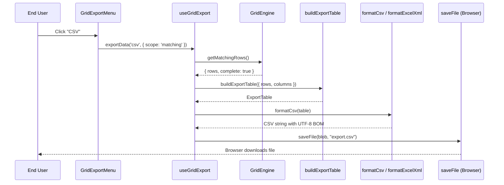

# Plan: data export

## Modules touched

| File | Change |
| :--- | :--- |
| `src/core/types.ts` | `ColumnDef.exportable`, `ColumnDef.exportValue`, `DataSource.fetchAll`, `GridApi.getMatchingRows`, `GridApi.fetchAllRows`, `MatchingRows` |
| `src/core/engine.ts` | Implements both new api methods over the retained source rows and the registered stages |
| `src/core/export/` | New. `table.ts`, `csv.ts`, `markdown.ts`, `excel.ts`, `print.ts`, `types.ts`, `index.ts` |
| `src/index.ts` | Re-exports the serializers and their types |
| `src/i18n/messages.ts`, `src/locales/*.ts` | Seven message keys, five locales |
| `src/react/types.ts` | Seven labels, `GridExportOptions`, `Gridwright` prop |
| `src/react/export/` | New. `download.ts`, `printDocument.ts`, `useGridExport.ts`, `GridExportMenu.tsx` |
| `src/react/Gridwright.tsx` | Renders the menu in the toolbar when `export` is set |
| `src/styles/styles.css` | `.gw-export*` rules |

## Where the behaviour lives

Serialization is pure text assembly over resolved columns, so it is core: it has no DOM, runs in
Node and is the half worth unit testing. Resolving *which* rows to serialize is engine business,
because the engine owns the retained source rows, the registered stages and the source's declared
capabilities, and nothing else can answer the question honestly. Everything that touches a file,
an object URL, a print window or a menu is adapter.

Export is not a pipeline stage. A stage transforms the rows the grid renders; an export changes
nothing on screen. Registering it as a stage would also put the browser's download machinery under
`src/core`, which the lint gate rejects.

## Trade-offs taken

- **`getMatchingRows()` returns rows *and* a completeness flag rather than rows alone.** A source
  that paginates for itself leaves only one page in memory, and a bare array would be page one
  presented as the whole result. The cost is a two-field return for the local case where it is
  always complete.
- **`fetchAllRows()` is on the engine, not in the exporter.** It needs the stages and the source,
  both private. The cost is two new methods on `GridApi` instead of none.
- **Print builds its own document instead of printing the live table.** A virtualized grid has
  forty rows in the DOM, and the page around the grid is not part of the export. The cost is that
  the printed table is not styled by the consumer's own CSS, which is why the print stylesheet is
  an option.
- **XML Spreadsheet 2003 rather than a binary workbook.** Zero dependencies, at the cost of an
  extension-mismatch warning in Excel, which is why the comma-separated format is the default.

## Risks

| Risk | Mitigation |
| :--- | :--- |
| A paginating source silently exports one page | `isComplete` on the result, and `fetchAllRows` throws rather than truncating |
| A cell value executed as a formula in a spreadsheet | Leading `=`, `+`, `-`, `@`, tab and carriage return are prefixed with an apostrophe by default |
| Row data injected into XML or HTML markup | One escaper per format, applied to every cell and header |
| A second live region competing with the grid's own | The export region carries only export sentences, and is silent otherwise |

## Out of scope for this change

Binary `.xlsx`, bundled PDF engines, server-side batch export, column-level number formats in the
spreadsheet, and exporting a tree's hierarchy as anything other than the flattened rows on screen.
