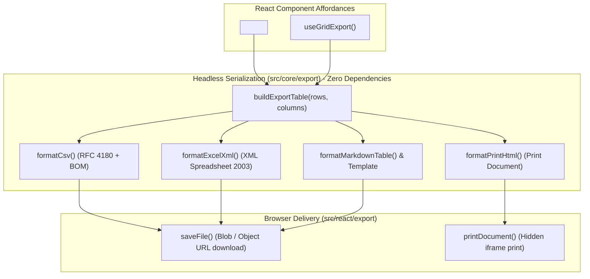

# Specification: data export (CSV, Excel, Markdown and PDF)

> **Status**: Clarified (Stage 1 & 2 complete)
> **Stage entry**: 2
> **Semver impact**: minor (new exports, core helper, and optional props; confirmed in api-surface.md)

---

## 1. The consumer problem

Consumers building administrative screens, analytics dashboards, and data tables frequently
require the ability to export the grid's data:
- **Spreadsheet analysts** demand CSV or Excel files to run pivot tables, formulas, and reporting.
- **Developers and documentation authors** need Markdown representations (either GitHub-flavored
  markdown tables or custom row templates) to paste directly into tickets, PRs, or release notes.
- **End users** need printable, paginated PDF reports to share with stakeholders or archive.

Today, every team using a data grid is forced to roll their own export logic:
1. They manually extract values from the row array or DOM, frequently breaking column formats,
   extracting React elements as `[object Object]`, or ignoring active filters, search queries, and
   sort orders.
2. Generating CSV requires adherence to RFC 4180 escaping (commas, quotes, newlines) and prepending
   a UTF-8 Byte Order Mark (BOM) so Microsoft Excel does not mangle non-ASCII characters.
3. Generating Excel or PDF typically tempts developers to introduce massive third-party packages
   (such as `xlsx` at ~800KB or `jspdf`/`pdfmake` at ~500KB) into their client bundle, bloating the
   application and creating supply-chain liabilities for what should be a clean, native export.
4. When a grid is connected to a remote or windowed data source, developers frequently make the
   silent mistake of exporting only the single loaded page while presenting it as the entire dataset.

A first-class export capability must provide zero-dependency, headless serialization for CSV,
Excel-compatible formats, Markdown, and print/PDF, while respecting column formatting, active
queries, selection, and the capability seam.

---

## 2. User stories

- **US-01.** As a developer, I want to export the grid's data to CSV with a single call, with
  RFC 4180 compliance and UTF-8 BOM so non-ASCII characters display properly in Microsoft Excel
  without warnings.
- **US-02.** As a developer, I want to export data directly to an Excel-compatible spreadsheet format
  (XML Spreadsheet 2003) with typed cells (numbers, dates, strings) and column widths without adding
  any external runtime dependency.
- **US-03.** As a developer, I want to export the grid as a GitHub Flavored Markdown (GFM) table, or
  via a custom row template, to copy or download for documentation and issue trackers.
- **US-04.** As a developer or end-user, I want to export the grid to a clean, paginated PDF via a
  dedicated, self-styled printable view with repeating table headers and clean page breaks, or via a
  pluggable custom PDF handler.
- **US-05.** As a developer, I want to control the export scope: all rows matching the active query,
  only the currently visible page, or only the currently selected rows.
- **US-06.** As a developer, I want cell formatting preserved: exports should automatically use
  `column.exportValue` or fall back to `column.getText` (which already applies `formatValue`), rather
  than discarding formatting and falling back to raw values.
- **US-07.** As a developer, I want non-data columns (such as consumer action columns) excludable from
  exports via `exportable: false`.
- **US-08.** As a person using a screen reader, I want export actions to announce their progress and
  completion to an accessible live region without stealing focus.
- **US-09.** As a developer with existing corporate libraries (such as a backend PDF generator or a
  full binary `.xlsx` engine), I want a pluggable serializer contract to reuse Gridwright's export
  UI and data resolution while plugging in my own file generator.

---

## 3. Acceptance criteria

- [ ] **AC-01** Headless export engine: Pure serialization functions (`formatCsv`, `formatMarkdownTable`,
      `formatMarkdownTemplate`, `formatExcelXml`) live under `src/core/export/` with **zero DOM,
      zero window, and zero React dependencies**, usable in Node, workers, or tests.
- [ ] **AC-02** RFC 4180 CSV formatting: Fields containing delimiters, double quotes, or newlines are
      quoted, internal quotes are escaped (`""`), and CRLF/LF line endings are configurable.
- [ ] **AC-03** UTF-8 BOM support: CSV export includes a leading Byte Order Mark (`\uFEFF`) by default
      to ensure clean, warning-free multi-language encoding in Microsoft Excel.
- [ ] **AC-04** Excel XML Spreadsheet 2003: XML spreadsheet formatting (`.xml`/`.xls`) produces
      properly typed cells (`Number`, `String`, `DateTime`) and preserved column widths with zero external
      dependencies. The documentation must clearly note that Excel displays an extension mismatch
      warning when opening XML with an `.xls` extension, positioning CSV with BOM as the default.
- [ ] **AC-05** GitHub Flavored Markdown: Table export produces valid GFM markdown with column alignment
      markers (`:---`, `---:`, `:---:`) and properly escaped pipe (`|`) characters.
- [ ] **AC-06** Markdown template formatting: Accepts a template string (e.g. `### {name}\n- Score: {score}`)
      or a custom formatting callback `(row: T, index: number) => string`.
- [ ] **AC-07** Print / PDF export: Renders a dedicated un-virtualized, self-styled printable table
      document (with `@media print`, `page-break-inside: avoid`, repeating `thead`), opening the
      browser's native print dialog. Printing a virtualized grid renders all matching rows, never a
      fragment of the mounted DOM window.
- [ ] **AC-08** Scope selection: All formats support `scope: 'all' | 'page' | 'selected'`.
- [ ] **AC-09** Column filtering: Only consumer columns defined in `columns` are exported. Columns
      marked `exportable: false` are excluded. (Note: built-in checkboxes, tree toggles, and row
      actions are rendered directly in `GridBody.tsx` and are already not in `ColumnDef`s).
- [ ] **AC-10** Value resolution: Cell text is resolved via `column.exportValue(row, col)`, falling
      back to `column.getText(row)` (honoring `formatValue`), and finally raw property access.
- [ ] **AC-11** Core entry point for un-sliced rows: `createGridEngine` exposes a method
      `getFilteredRows(): readonly TRow[]` that executes pipeline stages up to (but not including)
      `STAGE_ORDER.PAGINATE`, providing the full settled matching dataset for `scope: 'all'`.
- [ ] **AC-12** Browser file downloader: An adapter utility triggers a client-side file download with
      the appropriate MIME type and filename, cleanly revoking the temporary Object URL.
- [ ] **AC-13** Component prop: `<Gridwright export={{ formats: ['csv', 'excel', 'markdown', 'pdf'], filename?: string }} />`
      renders an accessible export trigger menu in the toolbar.
- [ ] **AC-14** Screen reader announcements: Export generation and completion announce through the
      `role="status"` visually hidden live region.
- [ ] **AC-15** Message catalog localization: Seven new message keys are added to `MessageCatalog` in
      `src/i18n/messages.ts` and translated across all five bundled locales (`en`, `de`, `es`, `fr`,
      `pl`), from which `defaultLabels` is automatically derived.
- [ ] **AC-16** Zero runtime dependencies: The package continues to declare **zero** entries in
      `package.json` `dependencies`.

---

## 4. Non-goals

- **Bundling binary XLSX generators (e.g. `exceljs`, `xlsx`) or heavy PDF libraries (e.g. `jspdf`, `pdfmake`).**
  Bundling these adds megabytes to consumer builds and brings supply-chain risk. The built-in CSV with
  BOM, XML Spreadsheet 2003, and browser print-to-PDF provide zero-dependency alternatives. A custom
  serializer hook allows consumers who already bundle those libraries to plug them in.
- **Server-side asynchronous batch processing for multi-gigabyte datasets.**
  Client-side grid export operates on datasets held in memory or queryable by the client. Multi-million-row
  database dumps belong in backend job queues.
- **Interactive spreadsheet designer features (formulas, cell styling, charts).**
  The exporter's purpose is data fidelity, tabular structure, and clean presentation, not replacing
  a spreadsheet calculation engine.
- **Silent truncation of remote datasets.**
  When connected to a server-side paginating source where only page 1 is in memory, requesting
  `scope: 'all'` without an explicit full-fetch provider must throw or warn rather than silently
  emitting only page 1 as if it were the whole dataset.

---

## 5. Behaviour across the capability seam

The real challenge for `scope: 'all'` is that `GridState.rows` publishes only the sliced page. The
engine keeps source rows privately.

| Source resolves | Expected behaviour |
| :--- | :--- |
| **nothing (local array)** | `scope: 'all'` executes `engine.getFilteredRows()`, returning all rows passing active filters and search in sorted order, without pagination slicing. `scope: 'page'` exports `state.rows`. `scope: 'selected'` exports selected rows via `engine.getSelectedRows()`. |
| **everything (server)** | `scope: 'page'` and `scope: 'selected'` (on loaded rows) export immediately from settled state. `scope: 'all'` cannot be resolved from client memory. To preserve the rule against branching on data origin, `scope: 'all'` delegates to an optional `fetchAll` on the source or query contract; if absent, an explicit error is thrown explaining that un-fetched rows reside on the server. |
| **windowed source** | `scope: 'page'` exports the visible data window. `scope: 'all'` requires an explicit range query or source fetcher, never inventing rows that were not loaded. |

---

## 6. Accessibility and interface copy

- **Keyboard navigation**: Export controls render as a standard native `<button>` triggering a
  `role="menu"` with `menuitem` elements navigable with ArrowUp, ArrowDown, Enter, and Escape.
- **Live region announcements**:
  - Start: `Announce "Exporting data to CSV..."` via visually hidden `role="status"`.
  - Complete: `Announce "Export complete."`
- **Focus retention**: Focus returns to the export trigger button when a format is chosen or the menu
  is dismissed; triggering a download does not bounce focus to the `<body>`.
- **Seven keys added to `MessageCatalog`** (`src/i18n/messages.ts`):
  - `export.action`: "Export"
  - `export.csv`: "Export as CSV"
  - `export.excel`: "Export as Excel"
  - `export.markdown`: "Export as Markdown"
  - `export.pdf`: "Print / Export as PDF"
  - `export.inProgress`: "Preparing {format} export…"
  - `export.complete`: "{format} export complete"
  *These keys are translated in `en`, `de`, `es`, `fr`, and `pl`, and automatically reflected in `defaultLabels`.*

---

## 7. Clarifications

- **What is the default filename?**
  Default filename is `export-{YYYY-MM-DD}` (e.g. `export-2026-09-11.csv`) if none is provided.
- **Why is CSV with BOM preferred over XML Spreadsheet 2003 as default?**
  Excel opens XML Spreadsheet 2003 with a warning dialog ("The file format and extension of 'export.xls'
  don't match..."). CSV with UTF-8 BOM opens completely silently in Excel across Windows and Mac,
  preserving special characters, making it the most robust zero-dependency spreadsheet format.
- **How does Markdown export handle newlines inside cell data?**
  Newlines in cell values are replaced with ` ` tags so the markdown table row structure remains
  valid.
- **Which columns are excluded by default?**
  Only consumer columns in `ColumnDef` with `exportable: false` are excluded. (Built-in selection
  checkboxes, tree expansion toggles, and row-action menus are rendered directly as `<td>` elements in
  `GridBody.tsx` and do not exist as `ColumnDef`s).
- **How does PDF print handle virtualized grids?**
  Calling `window.print()` on a live virtualized grid prints only the ~40 mounted rows with spacer
  elements. The PDF/print exporter instead builds a dedicated, unvirtualized, clean HTML table
  document containing all scoped rows, styles it with self-contained `@media print` rules, and prints
  that document.
- **How does the engine provide all rows for `scope: 'all'`?**
  `createGridEngine` will expose `getFilteredRows(): readonly TRow[]`. It runs `runPipeline` with
  stages having `order < STAGE_ORDER.PAGINATE`, returning all matching rows in memory.
- **Can third-party serializers be registered?**
  Yes. An export definition accepts a custom serializer function:
  `(context: ExportContext<T>) => Blob | Promise<Blob> | string`, enabling seamless integration
  with libraries like `exceljs` or custom REST export endpoints.
