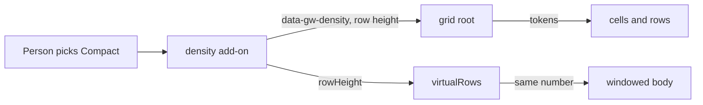

# Specification: density

> **Status**: Implemented and verified (2026-10-06); see review.md.
> **Stage entry**: 1
> **Semver impact**: minor (a new add-on and two optional fields on the add-on contract; no default changes; see api-surface.md)

---

## 1. The consumer problem

A grid has one spacing. Rows are 40 px high with 8 px of vertical padding inside each cell, and the only way to
change that is to override CSS variables on an ancestor. That leaves a consumer three gaps:

1. **There is no control.** People who read a lot of rows want them tight; people on a touch laptop or reading
   long text want them loose. A developer who wants to offer the choice builds the switch, the state, the
   persistence and the three sets of variable values every time.
2. **Virtualization breaks the CSS-only route.** `virtualRows()` places rows by a fixed pixel height that "must
   match `--gw-row-height`". Changing the variable alone makes the rows drift from the scrollbar, so a
   developer has to change two numbers in two places, from one switch, in step.
3. **The variables are not named for the idea.** `--gw-row-height` and `--gw-cell-padding-y` are the right
   knobs, but nothing says which values make a "compact" grid, so every consumer picks different ones.

## 2. User stories

- **US-01.** As a person reading a grid, I want to choose between compact, comfortable and spacious rows, so
  I can see more rows at once or read each one more easily.
- **US-02.** As a developer, I want one add-on that provides the control, the state and the styles, so I do not
  write them myself.
- **US-03.** As a developer, I want to remember the person's choice in my own storage, and start from it
  next time, without the package touching `localStorage`.
- **US-04.** As a developer using `virtualRows()`, I want the windowed body to follow the density, so rows
  and scrollbar stay in step.
- **US-05.** As a developer, I want the current grid to look exactly as it does today unless I add the add-on.
- **US-06.** As a person using a keyboard or a screen reader, I want the control to be a labelled native control
  and I want a tighter grid not to shrink anything I have to hit below a usable size on a touch screen.

## 3. Acceptance criteria

**The add-on and its state**

- **AC-01.** `density()` adds a labelled control to the toolbar offering the configured levels, and puts
  `data-gw-density="<level>"` on the grid root. Without the add-on the root has no such attribute and nothing
  about the grid changes.
- **AC-02.** The levels are `compact`, `comfortable` and `spacious`. `comfortable` is today's look exactly: with
  the add-on listed and `comfortable` active, the computed row height and cell padding equal what the grid
  renders without the add-on.
- **AC-03.** `initial` sets the starting level (default `comfortable`). `levels` limits what is offered (default
  all three, in that order). An `initial` that is not among the levels starts on the first level.
- **AC-04.** Choosing a level in the control changes the grid at once and calls `onChange(level)`. `onChange` is
  not called for the initial level, so a handler that writes to storage does not write on mount.
- **AC-05.** `control: false` renders no control, and the add-on is then driven by `useDensity()` alone.
- **AC-06.** With one level only, no control is rendered and the add-on still sets the attribute and the row height.
- **AC-07.** `useDensity()` returns `{ level, levels, setLevel }` from inside a grid that lists `density()`, and
  throws a message naming the add-on in one that does not. `useOptionalDensity()` returns `null` there instead.
  `setLevel` with a level that is not offered is ignored.
- **AC-08.** A changed `initial` after mount does not move the level: the person's choice stands. A consumer who
  wants to reset gives the grid a new `key`, as for any add-on option.

**What changes visually**

- **AC-09.** Each non-default level sets the cell padding through tokens declared on `.gw-root`
  (`--gw-density-compact-padding-y` and `-x`, `--gw-density-spacious-padding-y` and `-x`), and the row height
  through `--gw-row-height` set on the root by the add-on. Every part that already uses `--gw-cell-padding-*`
  or `--gw-row-height` (cells, group rows, tree rows, row detail, the loading and empty rows) follows without a
  change of its own.
- **AC-10.** `rowHeights` overrides the pixel height of any level. The defaults are `compact` 32, `spacious` 52,
  and none for `comfortable`: that level leaves `--gw-row-height` to the stylesheet and the consumer's own
  value, so an existing grid that adds the add-on and stays comfortable changes in no way.
- **AC-11.** Font size, colours and the touch-target minimum are not changed by any level. On a coarse pointer,
  interactive controls keep at least `--gw-touch-target` high whatever the level.

**Virtualization**

- **AC-12.** When `virtualRows()` is listed too, the windowed body uses the active level's row height, and
  scrolling to an index lands on the right row at every level. A level that publishes no height (comfortable
  by default) leaves `virtualRows({ rowHeight })` in charge, then `40`.
- **AC-13.** The order the two are listed in does not matter.

**Honest, accessible, translated**

- **AC-14.** The control is a native `<select>` with a visible-to-assistive-technology label, reachable by Tab,
  changed with the keyboard, and named from `gridwright:density` messages. All four strings exist in all
  five locale packs (`auditAddonMessages` finds none missing).
- **AC-15.** Changing density announces nothing: no rows changed, and the focused select already reports its
  value. The grid's live region is untouched.
- **AC-16.** Server and client render the same markup: the level comes from the option, never from a media
  query or a measurement.

**Documentation and proof**

- **AC-17.** `docs/density.md` is written; `docs/api.md`, `docs/addons.md`, `docs/virtualization.md` and `README.md`
  carry the new surface; the playground has a density switch that has been operated in a browser.
- **AC-18.** The shell still carries no feature code: naming `density()` bundles it, importing the grid does not.

## 4. Non-goals

- **No built-in persistence.** The package never touches `localStorage` or cookies. `initial` and `onChange`
  are the whole contract, as for `columnLayout()`.
- **No automatic density.** Not from the container width, the pointer type, `prefers-contrast` or the row count.
  A grid that picks for the person is a grid that changes under their hands.
- **No per-column or per-row density.** One level for the whole grid.
- **No font-size change.** Text scale is the consumer's, and a person's own browser setting must keep working.
- **No change to the stacked card layout.** Cards are spaced by `--gw-card-gap`, which a density level leaves
  alone; `responsive()` owns that layout.
- **No variable-height rows under `virtualRows()`.** Each level is one fixed height.
- **No new default look.** `comfortable` is today's grid. A different default is a major.
- **No MUI view.** The control is a native select like the responsive sort control; `apsw-gridwright-mui`
  does not re-skin feature add-ons.

## 5. Behaviour across the capability seam

Density does not touch the query, the pipeline or the data source. It is presentation only.

| Source resolves | Expected behaviour |
| :--- | :--- |
| nothing (local array) | Same as any source: level in the root attribute, tokens in CSS. |
| everything (server) | The same. No request is made or cancelled by a level change. |
| pagination only | The same. |

## 6. Accessibility and interface copy

- The control is a `<label>` and a native `<select>`, in the toolbar, reached in its tab order and operated with
  the arrow keys, Home and End as any select is.
- The select is named by the label "Density"; its options are "Compact", "Comfortable" and "Spacious". Four
  strings, added to `gridwright:density` in `en`, `de`, `es`, `fr` and `pl`.
- A tighter level lowers the space around content, not the size of any control: the stylesheet's coarse-pointer
  rule that keeps interactive controls at `--gw-touch-target` still applies, and a test reads the rule.
- No live-region message: choosing a level changes no row, and the select reports its own value (AC-15).
- Reduced motion: no transition is added.

## 7. Delivery as a plugin

A React add-on only, `density()` (`gridwright:density`), using public slots: `toolbar` for the control,
`rootAttributes` for `data-gw-density` and the row-height custom property, `provide` for the controller,
`messages`, and `before: ['gridwright:virtual']`. No engine plugin: nothing in the pipeline changes.

One seam did not exist and is added to the public contract for every add-on, as the architecture rule requires:
an add-on can **publish a row height** (`AddonContribution.rowHeight`) and a later add-on can **read what earlier
ones published** (`AddonSetupContext.rowHeight`). `virtualRows()` reads it; so could a third party's windowed body.
It follows the pattern `containerWidth` already set.

## 8. Clarifications

| # | Question | Resolution |
| :--- | :--- | :--- |
| C-1 | Add-on, or a prop on `<Gridwright />`? | Add-on. Every feature is one, and props on the shell are refused in earlier specs. |
| C-2 | Which levels, and which is the default? | `compact`, `comfortable`, `spacious`; default `comfortable`, which is the current look, so nothing changes by default. |
| C-3 | Who owns the row height: CSS or JavaScript? | JavaScript, through `rowHeights`, written to `--gw-row-height` on the root. `virtualRows()` needs the number, and one source keeps the two equal by construction. Cell padding stays in CSS tokens. |
| C-4 | What does `comfortable` publish? | Nothing, unless `rowHeights.comfortable` is given. This is what keeps an existing grid, its CSS overrides and its `virtualRows({ rowHeight })` working when the add-on is added and left at the default. |
| C-5 | A consumer's own `--gw-row-height` on an ancestor? | The inline value on the root wins for `compact` and `spacious`, because it must equal the virtual body's number. Documented; `rowHeights` is the way to change it. |
| C-6 | Persistence? | `initial` plus `onChange`, written by the consumer. Same shape as `columnLayout()`; no storage in the package (security and server rendering). |
| C-7 | Controlled or uncontrolled? | Uncontrolled after mount (AC-08). A controlled prop would need a second source of truth for what is a preference. |
| C-8 | Is the control optional? | Yes: `control: false` and `useDensity()` let a consumer put it anywhere, as `useColumnLayout()` does. |
| C-9 | How does `virtualRows()` learn the height? | Through the published value (section 7), not by importing the density module, so the shell stays free of feature code and a third-party add-on can use the same seam. |
| C-10 | `initial` that is not offered? | The first offered level. No throw: it is a preference, not a contract. |

## Artifacts not written

- `research.md`: there are no measurements and no alternatives beyond those in plan.md's trade-offs.
- `data-model.md`: the state is one string; the types are in api-surface.md.
- `events.md`: no event is emitted and no pipeline stage is added.
