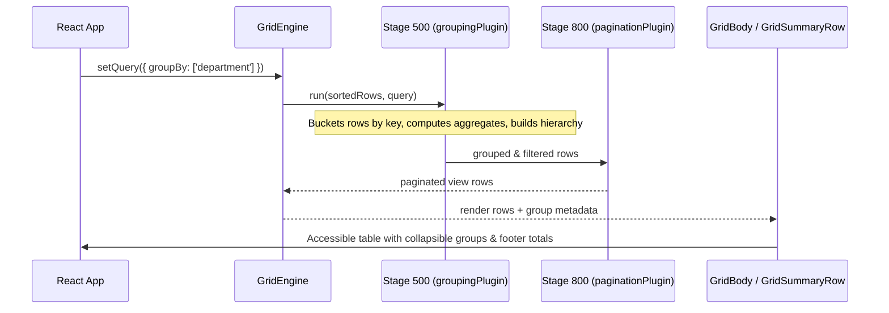

# Plan: row grouping and aggregation

## 1. Modules touched

| File | Change |
| :--- | :--- |
| `src/core/types.ts` | Add `GroupAggregateFn`, `GroupRowMeta`, and `groupBy` to query options |
| `src/plugins/grouping/index.ts` | Headless grouping plugin registering at `STAGE_ORDER.TRANSFORM = 500` |
| `src/plugins/grouping/aggregates.ts` | Built-in aggregate calculators (`sum`, `avg`, `min`, `max`, `count`) |
| `src/react/Gridwright.tsx` | Prop forwarding for `groupBy`, `aggregate`, and `summaryRow` |
| `src/react/parts/GridBody.tsx` | Render collapsible group rows with `aria-expanded` and indent levels |
| `src/react/parts/GridSummaryRow.tsx` | Render grand total footer summary row in `<tfoot>` |
| `src/styles/styles.css` | Styles for group toggle, group badges, and summary row |
| `src/i18n/messages.ts` | Add `group.expand`, `group.collapse`, and `summary.total` catalog keys |

## 2. Architecture and Data Flow

## 3. Where the behaviour lives

- **Grouping calculation**: Lives strictly in `src/plugins/grouping/` at `STAGE_ORDER.TRANSFORM: 500`.
- **Query options**: `groupBy: ColumnId[]` lives in `GridQuery` under `src/core/types.ts`.
- **Expanded state**: Kept in plugin/adapter state so collapses and expansions are instant without triggering data fetches.
- **Rendering**: Group header row rendering lives in `GridBody.tsx` and grand total summary lives in `GridSummaryRow.tsx` (`<tfoot>`).

## 4. Trade-offs taken

- **In-memory grouping requires all matching rows**: Grouping cannot run locally over a windowed or paginated slice. If a remote source paginates before sending rows, grouping must be declared in `capabilities.group: true` and handled server-side.
- **Transformed rows carry metadata**: Group header rows are injected into the row stream with a discriminator (`_type: 'group'`), keeping virtual scrolling and ARIA row positions linear.

## 5. Risks & Mitigation

| Risk | Mitigation |
| :--- | :--- |
| Performance degradation on large in-memory row sets (e.g. 50k rows) | Grouping runs in $O(N)$ single pass; aggregates accumulate incrementally during bucketing. |
| Virtualization jumps when groups expand/collapse | GridVirtualBody handles variable row count smoothly via virtual offset adjustments. |

