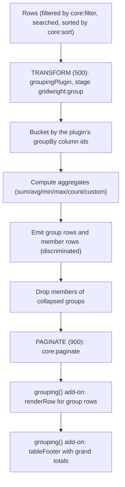

# Specification: row grouping and aggregation

> **Status**: Draft (corrected 2026-09-14 against the code and `specs/addon-architecture`)
> **Stage entry**: 1 & 2
> **Semver impact**: minor (a new engine plugin, a new `grouping()` add-on and a column option; no change
> to `GridQuery` or `DataSourceCapabilities`; to be confirmed in api-surface.md)

---

## 1. The consumer problem

Business dashboards and analytical grids frequently display thousands of rows that belong to logical
categories (e.g. sales by region, transactions by account, employees by department).
1. **Flat tables obscure aggregate insights**:
   - A reader looking at 5,000 invoices cannot easily determine the total spend per vendor or the
     average order value without exporting to a spreadsheet.
   - Users need group header rows that summarize subgroup totals and can be collapsed to review
     high-level numbers or expanded to inspect line items.
2. **Aggregates must respect active filters and queries**:
   - Calculating totals outside the grid breaks when the user applies search, column filters, or
     sorting. Grouping and aggregation must live inside the pipeline.
3. **The pipeline slot exists but is unused for this**:
   - `STAGE_ORDER.TRANSFORM = 500` is reserved for grouping, aggregation and injected summary rows. It
     sits after `SORT` (300, so group members keep sort order) and before `PAGINATE` (900, so group
     header rows count toward page totals). The tree stage already uses the same slot, which is
     evidence that a transform plugin can reshape rows without engine changes.

A grouping plugin plus a grouping add-on will provide headless row grouping, built-in aggregate
functions (`sum`, `avg`, `min`, `max`, `count`, and custom accumulators), collapsible group rows, and an
optional grand total row in the table footer.



---

## 2. User stories

- **US-01.** As a developer, I want to group rows by one or more columns with
  `addons={[grouping({ groupBy: ['department'] })]}`, generating collapsible group headers with zero
  external dependencies.
- **US-02.** As a developer, I want to declare `aggregate: 'sum' | 'avg' | 'min' | 'max' | 'count'` (or a
  function) on columns so group headers and the summary row compute statistics over matching rows.
- **US-03.** As an end user, I want to expand and collapse group rows by clicking or pressing Enter/Space,
  with expansion state preserved across sorting and filtering.
- **US-04.** As an end user, I want a grand total row at the bottom of the table
  (`grouping({ summaryRow: true })`) showing totals across all matching rows.
- **US-05.** As a person using a screen reader, I want group header rows to announce their expansion
  state, group title, and item count.
- **US-06.** As a developer whose server already groups, I want the local grouping stage skipped and the
  server's group rows and aggregates rendered.

---

## 3. Acceptance criteria

- [ ] **AC-01** Engine plugin: `groupingPlugin<TRow>(options)` registers one stage, `gridwright:group`,
      at `STAGE_ORDER.TRANSFORM`. Its options (`groupBy`, `aggregates`, the expanded group ids) belong to
      the plugin, not to `GridQuery`. It emits a discriminated row stream:
      `{ kind: 'group', key, depth, count, aggregates } | { kind: 'row', row }`.
- [ ] **AC-02** Aggregate computation:
      - Built-in functions: `sum`, `avg`, `min`, `max`, `count`.
      - Custom accumulator: `(values: unknown[], rows: TRow[]) => unknown`.
      - Aggregates compute over the matching rows in each group, in one pass.
- [ ] **AC-03** Total count accuracy: group rows count as rows, so `totalRows` and `pageCount` stay
      accurate and never leave empty pages.
- [ ] **AC-04** Grand total summary: `grouping({ summaryRow: true })` renders a `<tfoot>` row through the
      `tableFooter` slot, with aggregates across all matching rows (published by the plugin on
      `state.meta`).
- [ ] **AC-05** Collapsible state: group rows carry a toggle `<button>` with `aria-expanded` and the item
      count. Expanding or collapsing calls `api.invalidatePipeline()`, so it never refetches.
- [ ] **AC-06** Accessibility:
      - Group header rows carry `aria-expanded` and `aria-level`; the table stays `role="grid"` unless a
        treegrid is decided at stage 2 (C-2).
      - The toggle has an accessible name ("Collapse Engineering group").
- [ ] **AC-07** Virtualization parity: group rows render through `renderRow` in both bodies, so they work
      under `virtualRows()` with its fixed row height.
- [ ] **AC-08** Capability seam: the stage declares `skip`, driven by the plugin option
      `serverGrouped: boolean | ((context) => boolean)`. When it skips, the source is expected to
      return the discriminated rows itself. No new `DataSourceCapabilities` flag.
- [ ] **AC-09** Every string is in the `gridwright:grouping` add-on's messages, in five languages.
- [ ] **AC-10** Zero runtime dependencies: all bucketing and aggregate math in pure TypeScript.

---

## 4. Non-goals

- **Multi-dimensional pivot tables (cross-tabs).** A specialized OLAP tool.
- **Client-side grouping over windowed or paginating sources.** Grouping needs every matching row in
  memory; over a source that paginates, the stage refuses (skips and reports on `plugin:error`) unless
  `serverGrouped` says the server did it.
- **`groupBy` in `GridQuery`, a `capabilities.group` flag, or `groupBy` / `summaryRow` props on
  `<Gridwright />`.** The query and the capability set are the contract with every data source; one
  plugin does not widen them.

---

## 5. Behaviour across the capability seam

| Source resolves | Expected behaviour |
| :--- | :--- |
| **nothing (local array)** | The stage groups the filtered, searched, sorted rows, computes aggregates, updates `totalRows`, and hands the stream to `core:paginate`. |
| **server groups** (`serverGrouped` true) | The stage skips. The source returns group rows and aggregates in the discriminated shape; the add-on renders them the same way. The grouping options reach such a source through the consumer's own closure, and a change calls `api.refresh()`. |
| **pagination only, not grouped by the server** | Refused, as in §4. |

---

## 6. Accessibility and interface copy

- **Group row markup** (rendered by the add-on's `renderRow`):
  ```html
  <tr class="gw-row gw-row--group" aria-expanded="true" aria-level="1">
    <td colspan="...">
      <button type="button" aria-label="Collapse Sales group">...</button>
      <span class="gw-group-title">Sales</span>
      <span class="gw-group-count">42 items</span>
    </td>
  </tr>
  ```
- **Messages** under `gridwright:grouping`:
  - `expand`: "Expand {group} group"
  - `collapse`: "Collapse {group} group"
  - `itemsCount`: "{count} items" (plural)
  - `summaryTotal`: "Total"
  - `summaryAverage`: "Average"

---

## 7. Delivery as a plugin

**Engine plugin.** `groupingPlugin(options)` at `STAGE_ORDER.TRANSFORM`, using only public plugin API:
`registerStage` with `skip`, `setMeta` for the grand totals, `api.invalidatePipeline()` when expansion
changes. It does not suppress any core stage: filtering, search and sorting run before it on flat rows,
which is what grouping wants (unlike the tree, which suppresses them).

**React add-on.** `grouping(options)`, named `gridwright:grouping`. Not in `coreAddons()`.

| Slot | Use |
| :--- | :--- |
| `setup` (hooks) | expansion state shared with the plugin, stable for the grid's life |
| `plugins` | the memoised `groupingPlugin` |
| `configure` | a `getRowId` that gives group rows their own ids; columns wrapped so member cells read the member row |
| `columnSignature` | the `aggregate` column option |
| `renderRow` | group rows (first-wins; returns `undefined` for member rows, which the shell renders) |
| `rowAttributes` | `aria-level` on member rows under a group |
| `tableFooter` | the grand total row |
| `messages` | the strings in §6 |
| column option | `aggregate` by augmentation of `GridwrightColumn` |

**What cannot be an add-on.** Nothing. Two consequences are recorded rather than hidden: the engine's
row type becomes the discriminated union while grouping is listed (as a tree's becomes `TreeNode`), so
switching `grouping()` on or off remounts the grid; and `getMatchingRows()` runs every stage below
`PAGINATE`, so an export of a grouped grid receives group rows too (C-3).

---

## 8. Clarifications

- **Where do group aggregates display?** Inside the group header cell beside the title, and optionally
  aligned under their respective column cells.
- **Does sorting sort groups or items inside groups?** `core:sort` orders the flat rows before grouping,
  so members keep that order; groups are ordered by key, then optionally by an aggregate (plugin option).
- **C-1. Mixing with `treeData()`.** Both transform at `TRANSFORM` and both change the row type. Listing
  both is refused (`grouping()` checks for `gridwright:tree` and throws, naming both) until a combined
  design exists.
- **C-2. `grid` or `treegrid`?** Open for stage 2. A grouped table with `aria-level` rows is closest to a
  treegrid; the tree add-on already sets that role, and two add-ons setting `role` would be last-wins.
- **C-3. Exports of a grouped grid.** Open for stage 3: `exportMenu()` receives group rows from
  `getMatchingRows()`. Either the grouping add-on contributes a custom export format that renders groups,
  or the export resolves member rows through a documented unwrapping helper.
