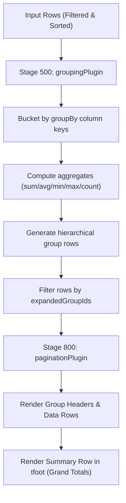

# Specification: row grouping and aggregation

> **Status**: Draft
> **Stage entry**: 1 & 2
> **Semver impact**: minor (new core plugin, transform stage slot utilization, and optional props; confirmed in api-surface.md)

---

## 1. The consumer problem

Business dashboards and analytical grids frequently display thousands of rows that belong to logical
categories (e.g. sales by region, transactions by account, employees by department).
1. **Flat tables obscure aggregate insights**:
   - A reader looking at 5,000 invoices cannot easily determine the total spend per vendor or the
     average order value without exporting to a spreadsheet.
   - Users need hierarchical group headers that summarize subgroup totals and can be collapsed to
     review high-level numbers or expanded to inspect line items.
2. **Aggregates must respect active filters and queries**:
   - Manually calculating totals outside the grid usually breaks when the user applies search, column
     filters, or sorting. Grouping and aggregation must live directly inside the query pipeline.
3. **Pipeline slot was pre-allocated but unimplemented**:
   - Gridwright's core engine already defines `STAGE_ORDER.TRANSFORM = 500` explicitly for grouping,
     aggregation, and injected summary rows. It sits after `SORT` (so group members maintain sort order)
     and before `PAGINATE` (so group headers count toward page totals accurately).

A first-class grouping plugin will provide headless row grouping, built-in aggregate functions
(`sum`, `avg`, `min`, `max`, `count`, and custom accumulators), collapsible group rows, and an
optional grand total summary footer row.



---

## 2. User stories

- **US-01.** As a developer, I want to group rows by one or more columns via `groupBy={['department']}`,
  generating collapsible group headers with zero external dependencies.
- **US-02.** As a developer, I want to declare `aggregate: 'sum' | 'avg' | 'min' | 'max' | 'count'` on
  columns so group headers and summary rows compute statistics over matching rows automatically.
- **US-03.** As an end user, I want to expand and collapse group rows by clicking or pressing Enter/Space,
  with expansion state preserved across sorting and filtering.
- **US-04.** As an end user, I want to see a grand total summary row at the bottom of the table
  (`summaryRow={true}`) showing totals across all matching rows.
- **US-05.** As a person using a screen reader, I want group header rows to announce their expansion
  state (`aria-expanded="true" | "false"`), group title, and item count.
- **US-06.** As a developer using server-side grouping, I want the pipeline to skip local grouping when
  `capabilities.group: true` and render the pre-grouped rows and aggregates returned by the server.

---

## 3. Acceptance criteria

- [ ] **AC-01** Core grouping plugin: `groupingPlugin<TRow>()` registered at `STAGE_ORDER.TRANSFORM = 500`.
      Transforms matching rows into grouped structures before pagination is applied.
- [ ] **AC-02** Aggregate computation:
      - Built-in functions: `sum`, `avg`, `min`, `max`, `count`.
      - Custom accumulator: `(values: unknown[], rows: TRow[]) => unknown`.
      - Aggregates compute over the matching rows in each group.
- [ ] **AC-03** Total count accuracy: Group headers count as rows in the pipeline, ensuring `totalRows`
      and `pageCount` remain accurate and never leave empty pages.
- [ ] **AC-04** Grand total summary:
      - Optional grand total row (`<GridSummaryRow />` or `summaryRow={true}`) rendered in the table
        footer (`<tfoot>`), calculating aggregates across all filtered rows.
- [ ] **AC-05** Collapsible state:
      - Group rows carry toggle buttons with `aria-expanded` and item counts (`({count})`).
      - Expanding/collapsing updates visible pipeline rows in memory without triggering network fetches.
- [ ] **AC-06** Accessibility:
      - Group header rows use `role="row"` with `aria-expanded` and `aria-level`.
      - Toggle button has an accessible name (e.g. `aria-label="Expand Engineering group"`).
- [ ] **AC-07** Virtualization parity:
      - `GridVirtualBody` renders group rows and summary rows with proper height calculations.
- [ ] **AC-08** Capability seam:
      - When `capabilities.group: true`, in-memory grouping is skipped and server aggregates are displayed.
- [ ] **AC-09** Zero runtime dependencies:
      - All group index and aggregate math implemented in pure TypeScript.

---

## 4. Non-goals

- **Multi-dimensional Pivot Tables (Cross-tabs):**
  Pivoting column fields into dynamic row/column matrix dimensions is a specialized OLAP tool and out of
  scope for standard data grid row grouping.
- **Client-side grouping over windowed sources:**
  A windowed source only holds a window of rows in memory. Grouping requires all matching rows to be
  present; client grouping over un-fetched data is refused.

---

## 5. Behaviour across the capability seam

| Source resolves | Expected behaviour |
| :--- | :--- |
| **nothing (local array)** | `groupingPlugin` groups rows by specified column values in sorted order, computes group aggregates, updates `totalRows`, and passes to `paginationPlugin`. |
| **everything (server)** | When `capabilities.group: true`, pipeline skips grouping. Group rows and server-computed aggregates are passed directly to the renderer. |

---

## 6. Accessibility and interface copy

- **Group Row Markup**:
  ```html
  <tr class="gw-row gw-row--group" aria-expanded="true" aria-level="1">
    <td colspan="...">
      <button type="button" aria-expanded="true" aria-label="Collapse Sales group">...</button>
      <span class="gw-group-title">Sales</span>
      <span class="gw-group-count">(42 items)</span>
    </td>
  </tr>
  ```
- **Labels in Message Catalog**:
  - `group.expand`: "Expand {group}"
  - `group.collapse`: "Collapse {group}"
  - `group.itemsCount`: "{count} items"
  - `summary.total`: "Total"
  - `summary.average`: "Average"

---

## 7. Clarifications

- **Where do group aggregates display?**
  Inside the group header cell beside the title, and optionally aligned under their respective column cells.
- **Does sorting sort groups or items inside groups?**
  Sorting sorts groups by group key/aggregate, and sorts member rows within each group.
