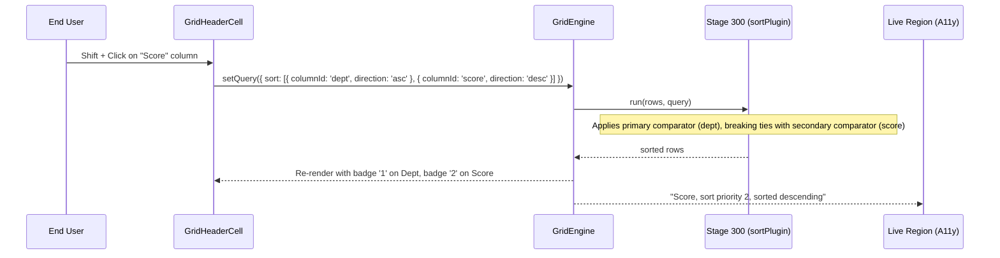

# Plan: multi-column sorting

## 1. Modules touched

| File | Change |
| :--- | :--- |
| `src/core/query.ts` | Tri-state cycling logic helper `cycleSort(current: SortSpec[], columnId: string, multi: boolean): SortSpec[]` |
| `src/plugins/sort/index.ts` | Multi-comparator execution chain iterating through `SortSpec[]` |
| `src/react/parts/GridHeaderCell.tsx` | Shift key detection, priority badge rendering (`1`, `2`), and tri-state icon |
| `src/react/a11y/announcement.ts` | Screen reader announcements for multi-sort priority and direction |
| `src/styles/styles.css` | Styling for `.gw-sort-badge` priority pill |
| `src/i18n/messages.ts` | Translation keys for multi-sort announcement (`sort.priorityAnnounce`) |

## 2. Architecture and Data Flow

## 3. Where the behaviour lives

- **Sort cycling calculation**: Pure function in `src/core/query.ts` (`cycleSort`).
- **Data ordering**: `src/plugins/sort/index.ts` at `STAGE_ORDER.SORT: 300`.
- **Keyboard & Mouse interaction**: Handled in `GridHeaderCell.tsx` via `event.shiftKey`.
- **Announcements**: Handled in `src/react/a11y/announcement.ts` via the ARIA live region.

## 4. Trade-offs taken

- **Tri-state default**: Moving from 2-state (`asc` -> `desc`) to 3-state (`asc` -> `desc` -> `none`) allows users to restore original natural order without reloading.
- **Header click ergonomics**: Normal click replaces the sort with a single column; Shift+Click modifies the compound sort. This matches Excel, Google Sheets, and ag-Grid conventions.

## 5. Risks & Mitigation

| Risk | Mitigation |
| :--- | :--- |
| Remote data sources unable to handle compound sort arrays | Data sources declare `capabilities.sort`. If remote source only supports single sort, the query normalizer collapses `sort` to the primary criterion. |
| In-memory sort performance on 50k rows with 4 sort criteria | Comparators are chained with short-circuit evaluation (`if (diff !== 0) return diff`). |

