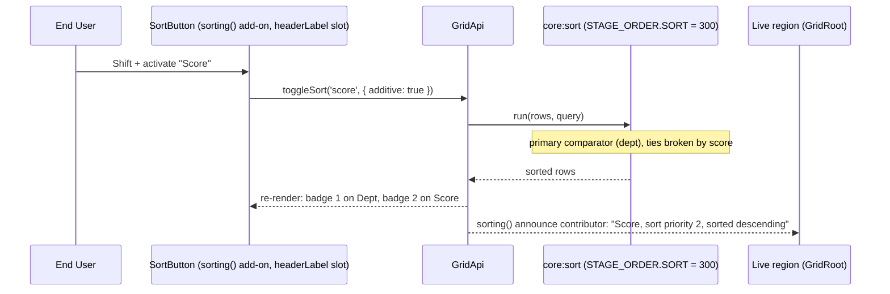

# Plan: multi-column sorting

## 1. Modules touched

| File | Change |
| :--- | :--- |
| `src/react/core-addons/sorting.tsx` | `SortButton` renders the priority badge and the Shift hint; `describeSort` uses the priority sentences while more than one column is sorted |
| `src/react/core-addons/messages.ts` | `sortingMessages`: `sortedAscendingPriority`, `sortedDescendingPriority`, `addHint` |
| `src/locales/{de,es,fr,pl}.ts` | the same keys under `addons['gridwright:sorting']` |
| `src/styles/styles.css` | `.gw-sort-priority` badge |
| `tests/react/*` | badge rendering, announcement with priority, `multiSort: false` |

| `src/core/engine.ts` | `toggleSort` reverses an additive column in place instead of appending it (found at stage 6; see api-surface.md, Behaviour fixed) |

Not touched: `src/plugins/sorting.ts`, which already chains comparators.

## 2. Architecture and Data Flow

## 3. Where the behaviour lives

- **Sort cycling**: `GridApi.toggleSort` in `src/core/engine.ts` (existing).
- **Data ordering**: `sortingPlugin` in `src/plugins/sorting.ts`, stage `core:sort` (existing).
- **Header interaction and badge**: the `sorting()` add-on's `headerLabel` contribution.
- **Announcement**: the `sorting()` add-on's `announce` contribution, rendered by the shell's single
  live region.

## 4. Trade-offs taken

- **Header activation ergonomics**: plain activation replaces the sort; Shift-activation modifies the
  compound sort. This matches Excel, Google Sheets and ag-Grid conventions, and is already built.
- **Badge inside the button, hidden from assistive technology**: the announcement carries the priority
  instead, so the button's accessible name does not change on every sort.

## 5. Risks & Mitigation

| Risk | Mitigation |
| :--- | :--- |
| A remote source that can sort by one column only | It declares `capabilities.sort: false`, or the consumer uses `sorting({ multiSort: false })`. The grid does not rewrite `query.sort` for it. |
| In-memory sort performance on 50k rows with 4 criteria | Comparators already short-circuit (`if (result !== 0) return result * direction`). Measure before changing. |
