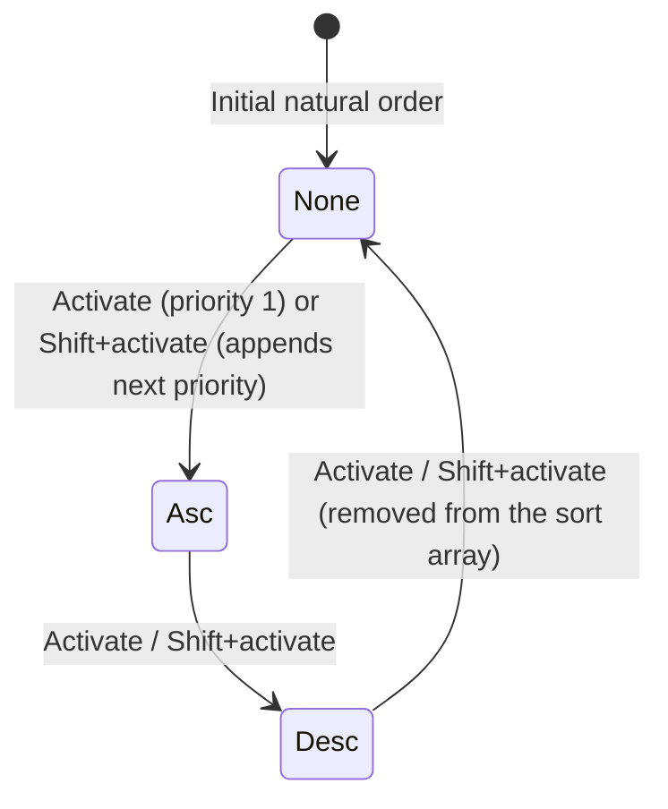

# Specification: multi-column sorting and tri-state cycling

> **Status**: Implemented 2026-09-25 (contract in api-surface.md, review in review.md)
> **Stage entry**: 1 & 2
> **Semver impact**: minor (new optional options and messages on the `sorting()` add-on; nothing on
> `<Gridwright />`; to be confirmed in api-surface.md)

---

## 1. The consumer problem

In `apsw-gridwright`, the query contract already defines sort order as an array
(`query.sort: readonly SortSpec[]`), and most of this feature already exists below the view:

- `GridApi.toggleSort(columnId, { additive })` cycles `asc` -> `desc` -> off, and with `additive`
  keeps the other entries, appending the column or changing it in place.
- `sortingPlugin` (`src/plugins/sorting.ts`, stage `core:sort`) already evaluates every `SortSpec` in
  order, breaking ties on column N with column N+1.
- The engine already returns to the first page when the sort changes.
- The `sorting()` add-on already calls `toggleSort(column.id, { additive: multiSort && event.shiftKey })`,
  so Shift-activating a header adds a column (`sorting({ multiSort: false })` switches that off).

What is missing is everything that tells the reader a multi-column sort is in effect:

1. **No visual priority indicator.** When several columns are sorted, nothing shows which has primary
   precedence (`1`), secondary (`2`) or tertiary (`3`). The chevrons look identical.
2. **The announcement ignores priority.** The live region says "Score, sorted descending" whether
   Score is the only sort or the second of three, so a screen reader user cannot tell a replaced sort
   from an added one.
3. **The control does not say it can be extended.** Nothing on the button tells a keyboard or screen
   reader user that Shift-activation adds a column rather than replacing the sort.

---

## 2. User stories

- **US-01.** As an end user, activating a column header sorts by that column, clearing other sorts
  when Shift is not held. *(Exists.)*
- **US-02.** As an end user, Shift-activating another header adds it as a secondary or tertiary sort
  criterion without clearing existing sorts. *(Exists.)*
- **US-03.** As an end user, activating or Shift-activating a header cycles `asc` -> `desc` -> none.
  *(Exists.)*
- **US-04.** As an end user, when several columns are sorted, I want a small numeric badge (`1`, `2`)
  beside the sort chevron showing the sort priority.
- **US-05.** As a person using a screen reader, I want multi-sort changes announced with the priority:
  "Score, sort priority 2, sorted descending".
- **US-06.** As a developer connecting a server-side endpoint, I want the multi-column sort array passed
  directly in `query.sort` when `capabilities.sort: true`. *(Exists.)*

---

## 3. Acceptance criteria

- [x] **AC-01** Tri-state cycling: activating an unsorted column sets `asc`; an `asc` column becomes
      `desc`; a `desc` column is removed from `query.sort`. *(Holds today through `api.toggleSort`.)*
- [x] **AC-02** Shift multi-sort:
      - Plain activation replaces `query.sort` with the one column.
      - Shift-activation preserves the other entries and appends or changes the activated column.
      - Disabled with `sorting({ multiSort: false })` in `coreAddons`. *(Holds today.)*
- [x] **AC-03** Visual priority badges: when `query.sort.length > 1`, each sorted header's sort button
      renders a `.gw-sort-priority` badge with its 1-based index in the sort array. The badge is
      `aria-hidden`; the priority reaches assistive technology through AC-06.
- [x] **AC-04** Cascading comparator: `sortingPlugin` evaluates `query.sort` entries in index order.
      *(Holds today.)*
- [x] **AC-05** Page reset: changing any sort criterion resets `query.pagination.pageIndex` to `0`.
      *(Holds today, in the engine's `commitQuery`.)*
- [x] **AC-06** Accessibility and live region:
      - The header cell keeps `aria-sort="ascending" | "descending" | "none"` (`headerAttributes`).
      - While more than one column is sorted, the announcement names the column, its priority and its
        direction; with one column it stays as today.
      - The sort button's title says Shift keeps the other sorted columns, when `multiSort` is on.
- [x] **AC-07** Every new string is in the `gridwright:sorting` add-on's messages in `en`, `de`, `es`,
      `fr`, `pl`, and in each locale pack's `addons['gridwright:sorting']`; `auditAddonMessages` passes.
- [x] **AC-08** Zero runtime dependencies: pure React event modifiers and CSS. *(Holds.)*

---

## 4. Non-goals

- **Interactive drag-and-drop sort builder.** In-table Shift-activation is the standard across
  spreadsheet and desktop data grids.
- **A `multiSort` prop on `<Gridwright />`.** Sorting options belong to the `sorting()` add-on.
- **A second sort-cycling helper.** `toggleSort` is the one implementation; nothing duplicates it.

---

## 5. Behaviour across the capability seam

| Source resolves | Expected behaviour |
| :--- | :--- |
| **nothing (local array)** | `sortingPlugin` compares across all entries of `query.sort`. |
| **everything (server)** | With `capabilities.sort: true`, `query.sort` is forwarded to the source unchanged and `core:sort` is skipped. |
| **tree** | The tree stage sorts siblings by every entry in order; `core:sort` is suppressed. Badges and announcements are identical. |

---

## 6. Accessibility and interface copy

- **Header button** (rendered by `sorting()`'s `headerLabel`), with the badge inside the button and
  hidden from assistive technology:
  `<button class="gw-sort-button">Score 2</button>`
- **Messages** under `gridwright:sorting` (final names in api-surface.md):
  - `sortedAscendingPriority`: "{column}, sort priority {priority}, sorted ascending"
  - `sortedDescendingPriority`: "{column}, sort priority {priority}, sorted descending"
  - `actionWithShift`: "{action} (Shift: keep other columns sorted)"

  Two sentences rather than one with a `{direction}` word, because a direction word spliced into a
  sentence does not decline in Polish or German.

---

## 7. Delivery as a plugin

**Engine.** No change. `sortingPlugin` (stage `core:sort` at `STAGE_ORDER.SORT`) already chains
comparators and honours `capabilities.sort`; `toggleSort` already cycles and composes.

**React add-on.** The existing `sorting()` add-on (`gridwright:sorting`), which is in `coreAddons()`,
gains the badge and the priority-aware sentence. Slots:

| Slot | Change |
| :--- | :--- |
| `headerLabel` (one owner) | the sort button renders the `.gw-sort-priority` badge and the Shift hint |
| `headerAttributes` | unchanged (`aria-sort`) |
| `announce` | `describeSort` uses the priority sentences while `query.sort.length > 1`; priority stays 20 |
| `messages` | the new keys, in five languages |

A consumer who wants a different multi-sort presentation (badges in `headerAfter`, a sort summary in
the toolbar) can instead write an add-on that `suppresses: ['gridwright:sorting']` and owns
`headerLabel` itself, using the same public `toggleSort`, `getSort` and `headerContentOf`; the
suppressed add-on's messages still resolve.

**What cannot be an add-on.** Nothing. The feature is presentation over engine behaviour that already
exists.

---

## 8. Clarifications

- **Where do the badges live, in the button or beside it?** Inside the button, `aria-hidden`, because
  the priority is part of what the button shows and add-on content beside the label is reserved for
  other features (filters). The priority reaches assistive technology through the announcement and
  `aria-sort`, which has no priority value of its own.
- **What about a source that can sort by only one column?** It declares `capabilities.sort: false`
  (the pipeline then sorts the page it received), or the consumer lists `sorting({ multiSort: false })`.
  The grid does not collapse `query.sort` on the source's behalf.
- **Why does the hint say "keep other columns sorted" rather than "add to the sort"?** Shift adds an
  unsorted column, but it flips an ascending one and removes a descending one. What is true in all
  three states is that the other sorted columns stay. The hint wraps the action (`{action}`) so a
  translation chooses its own punctuation instead of the grid concatenating two strings.
- **When is a priority spoken?** Whenever the sort has more than one column after the change. Going
  back to a single column speaks the existing sentence, because "priority 1" of one is noise.
