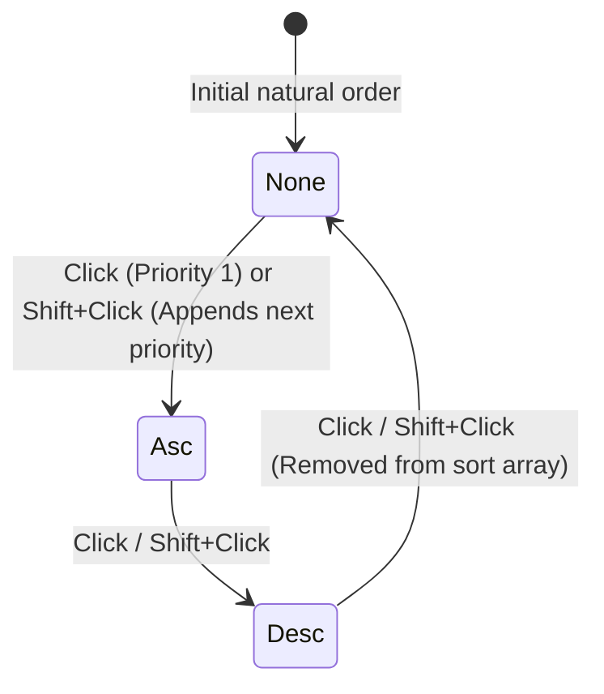

# Specification: multi-column sorting and tri-state cycling

> **Status**: Draft
> **Stage entry**: 1 & 2
> **Semver impact**: minor (new optional props on Gridwright and header parts; confirmed in api-surface.md)

---

## 1. The consumer problem

In `apsw-gridwright`, the core engine's query contract already defines sort order as an array:
`query.sort: readonly SortSpec[]`. However, the React adapter only exposes single-column sorting:
1. **Clicking a column header replaces the entire sort**:
   - Clicking `Score` replaces any existing sort on `Department`, making it impossible for users to
     view records sorted by *Department ASC, then Score DESC*.
   - Users evaluating complex lists require cascading multi-tier sort precedence.
2. **Missing tri-state sort cycle**:
   - Headers currently toggle between `asc` and `desc`. To clear sorting on a column and return to the
     natural data order, users must refresh the page or use a custom toolbar button.
   - Users expect standard tri-state cycling: `asc` -> `desc` -> `clear` (unsorted).
3. **No visual priority indicator**:
   - When multiple columns are sorted, users need clear visual feedback showing which column has primary
     precedence (`1`), secondary precedence (`2`), and tertiary precedence (`3`).

A first-class multi-column sorting feature will add Shift+Click multi-sort composition, tri-state cycling,
and accessible priority indicators, directly leveraging the engine's existing `SortSpec[]` capability.

---

## 2. User stories

- **US-01.** As an end user, clicking a column header sorts by that column (clearing previous sorts if Shift
  is not held).
- **US-02.** As an end user, Shift+Clicking an additional column header adds that column as a secondary/tertiary
  sort criterion without clearing existing sorts.
- **US-03.** As an end user, clicking or Shift+clicking a column header cycles through: `asc` -> `desc` -> `none`
  (cleared from the sort array).
- **US-04.** As an end user, when multiple columns are sorted, I want to see a small numeric badge (`1`, `2`)
  beside the sort chevron indicating sort priority order.
- **US-05.** As a person using a screen reader, I want multi-sort changes announced clearly:
  `"Score, sort priority 2, sorted descending"`.
- **US-06.** As a developer connecting a server-side endpoint, I want the multi-column sort array passed
  directly in `query.sort` when `capabilities.sort: true`.

---

## 3. Acceptance criteria

- [ ] **AC-01** Tri-state sort cycling: Clicking an unsorted column sets `asc`; clicking an `asc` column
      sets `desc`; clicking a `desc` column removes it from `query.sort` (returning to natural order).
- [ ] **AC-02** Shift+Click multi-sort:
      - Plain click replaces `query.sort` with a single entry `[{ columnId, direction: 'asc' }]`.
      - Shift+Click preserves preceding sort entries and appends or toggles the clicked column in
        `query.sort`.
      - Option to disable multi-sort: `<Gridwright multiSort={false} />`.
- [ ] **AC-03** Visual priority badges:
      - When `query.sort.length > 1`, sorted headers render a `.gw-sort-priority` badge displaying its
        1-based index in the sort array (`1`, `2`, `3`).
- [ ] **AC-04** Cascading comparator:
      - `sortingPlugin` evaluates `query.sort` entries in index order, breaking ties on column N using
        column N+1.
- [ ] **AC-05** Page reset:
      - Changing any sort criterion resets `query.pagination.pageIndex` to `0`.
- [ ] **AC-06** Accessibility & Live Region:
      - Header cell maintains `aria-sort="ascending" | "descending" | "none"`.
      - Live region announces column name, sort direction, and priority order when multi-sort is active.
- [ ] **AC-07** Zero runtime dependencies:
      - Pure React event modifiers (`event.shiftKey`) and CSS badges.

---

## 4. Non-goals

- **Interactive drag-and-drop sort modal:**
  Configuring multi-sort via an external drag-and-drop builder dialog is out of scope. In-table Shift+Click
  is standard across spreadsheet and desktop data grids.

---

## 5. Behaviour across the capability seam

| Source resolves | Expected behaviour |
| :--- | :--- |
| **nothing (local array)** | `sortingPlugin` evaluates cascading comparison across all entries in `query.sort`. |
| **everything (server)** | When `capabilities.sort: true`, `query.sort: readonly SortSpec[]` is forwarded directly to the server fetcher. |

---

## 6. Accessibility and interface copy

- **Header button**:
  `<button aria-label="Score, sort priority 2, sorted descending">`
- **Labels in Message Catalog**:
  - `sort.priority`: "Sort priority {priority}"
  - `a11y.sortedMulti`: "{column}, sort priority {priority}, sorted {direction}"
