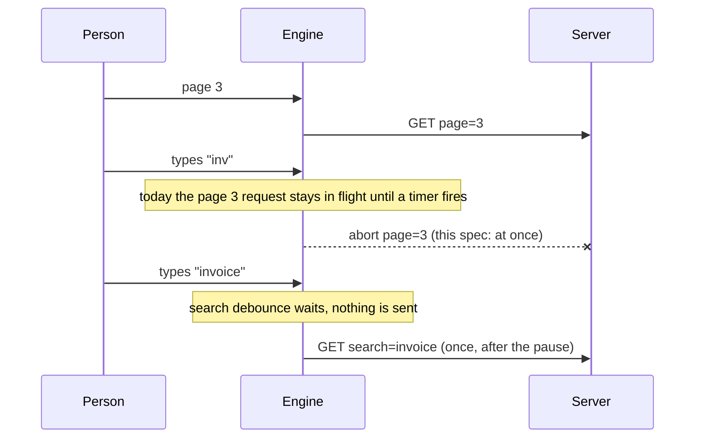

# Specification: request cancellation and search debounce

> **Status**: Implemented and verified (2026-10-06); see review.md.
> **Stage entry**: 1
> **Semver impact**: minor (one new option, `searchDebounceMs`; no default changes; see api-surface.md)

---

## 1. The consumer problem

A person using a grid over a server changes the query in quick succession: they go to page 3, then
type a search term, then click a sort header. The grid already abandons the stale answer, but it
does less than a reader expects about the request itself:

1. **Every keystroke is a request.** `queryDebounceMs` waits after *any* query change, so a grid that
   debounces typing also makes a page click wait. Nobody sets it for fear of a sluggish pager, and
   the default is `0`, so typing "invoice" sends seven requests, six of them aborted mid-flight.
   The server still receives and often still executes them.
2. **A debounced grid keeps a dead request alive.** While the debounce timer runs, the request for the
   *previous* query stays in flight and its rows land on screen for a query the grid no longer holds.
   The request is cancelled only when its replacement starts, not when it becomes stale.
3. **A transport that ignores the signal still wins.** A fetcher that does not pass `signal` to its
   transport keeps running; the engine discards its answer only once a newer request has *started*.
   Between a query change and that start, the stale answer is applied.
4. **None of this is written down as a guarantee.** The behaviour exists (`inFlight?.abort()` and a
   sequence check) but a consumer cannot tell which parts they may rely on.

## 2. User stories

- **US-01.** As an end user typing in the search box, I want one request after I pause, not one per
  keystroke, so the server and my connection are not flooded.
- **US-02.** As an end user, I want a page or sort click to respond at once even when the search box
  is debounced, so the pager never feels slow.
- **US-03.** As an end user, I want rows for a query I have already left never to appear, so the table
  and the search box cannot disagree.
- **US-04.** As a developer, I want to know exactly when the engine aborts a request and what it does
  with an answer that arrives anyway, so I can write a fetcher against a contract.

## 3. Acceptance criteria

**Debouncing the search term**

- **AC-01.** `searchDebounceMs` (engine option, `useGridwright` option and `<Gridwright />` prop)
  delays the fetch caused by a change to the search term and by nothing else. Default `0`: with the
  option unset a search change fetches exactly as it does today.
- **AC-02.** A change that moves any other facet (sort, filters, page, page size) fetches immediately,
  and takes any pending search fetch with it: the one request carries the latest query, and no second
  one follows when the timer would have fired.
- **AC-03.** A change that moves the search term *and* another facet in one call counts as the other
  facet: it is not delayed.
- **AC-04.** The page reset that a new search term causes is part of the search change, not a second
  facet. A search change is therefore delayed even though it also moves the page to 0.
- **AC-05.** `queryDebounceMs` keeps its meaning for every change. When both are set, a search-only
  change waits `searchDebounceMs` and any other change waits `queryDebounceMs`.
- **AC-06.** `refresh()`, `setDataSource()` and a source's invalidation fetch immediately and cancel a
  pending timer, as they do today.

**Cancelling and discarding**

- **AC-07.** The moment a committed query change supersedes a request, that request's `AbortSignal` is
  aborted, whether or not a replacement is scheduled yet. Before this change it was aborted when the
  replacement started.
- **AC-08.** An answer that arrives for a superseded request is discarded even when its fetcher ignored
  the signal: it never reaches `rows`, `totalRows`, `status` or an event.
- **AC-09.** A superseded request ends silently. It never reaches `fetch:error`, `onError` or the
  `error` status, and `fetch:settled` is emitted only for the request that replaces it.
- **AC-10.** Waiting out a debounce does not change `status`. A grid that was `ready` stays `ready` with
  the rows of the last settled query, which is what the announcement logic already relies on; a grid
  whose request was superseded while `loading` or `refreshing` keeps that status until the replacement
  settles. With `keepPreviousData` on, the previous rows stay visible throughout.
- **AC-11.** Requests are cancelled per engine. Two grids sharing one source do not cancel each other.
- **AC-12.** An export through `fetchAllRows` keeps its own controller and is not cancelled by a query
  change; it ends on its own signal, on `destroy()`, or when it finishes.
- **AC-13.** `destroy()` aborts the in-flight request and clears the timer, as today.

**Documentation and proof**

- **AC-14.** `docs/data-sources.md` states the contract in AC-07 to AC-12, and that a fetcher must pass
  `signal` to its transport to save the server the work; the engine's discarding only protects the
  screen.
- **AC-15.** `createRestDataSource` and `createRemoteDataSource` are shown, by test, to hand the
  engine's signal to their transport and to stop a retry delay when it aborts.
- **AC-16.** A React test types into the real search box with `searchDebounceMs` set and counts one
  fetcher call, then types and clicks next page and counts one call for the page and none for the
  search timer.

## 4. Non-goals

- **No default debounce.** Turning it on for remote sources changes a default; a consumer's request
  count would change without their build breaking. A later major may revisit it.
- **No request de-duplication or cache.** Two identical queries in a row are not collapsed here, and a
  response is not remembered. That is a data source's job.
- **No per-endpoint or per-facet cancellation keys.** One engine has one source; every request it makes
  is to that source, so "the previous request" is the previous request of this engine.
- **No cancellation of work already done on the server.** An abort stops the client's wait. Whether
  the server stops is up to the transport and the server.
- **No change to the search input.** `GridSearch` keeps its own text and calls `setSearch` on every
  keystroke; debouncing lives in the engine, where `url-sync` and other callers of `setSearch` also get it.
- **No leading-edge or max-wait options.** One trailing delay only.

## 5. Behaviour across the capability seam

Every query change fetches, whatever the source resolves for itself: a local source answers synchronously
and a remote one asynchronously, and `queryDebounceMs` already delays both. `searchDebounceMs` is the same
delay for a search-only change, so it does not branch on `capabilities` or on where the rows come from;
local and remote data still travel one path. It is meant for a source that resolves search itself, where
each keystroke would cost a request, and a consumer with a local array simply leaves it unset.

## 6. Accessibility and interface copy

No new visible strings and no new markup. The status announcement is unchanged: a debounced query is
published with the status it had and the live region keeps what it last said until the fetch settles
(`useAnnouncement.ts`, "waiting out a debounce"); a superseded request announces nothing.

## 7. Delivery as a plugin

None. The behaviour is the engine's query scheduling (`src/core`), and the option is passed through by the
adapter (`useGridwright`, `<Gridwright />`). It is not a pipeline stage and not an add-on, because it
decides *when* the pipeline runs rather than what it does, and no third-party add-on would need a hook
for it: it sets an option.

## 8. Clarifications

| # | Question | Resolution |
| :--- | :--- | :--- |
| C-1 | Does "cancel the previous request to the same endpoint" need an endpoint key? | No. One engine, one source; supersession is per engine (AC-11). |
| C-2 | New option or change `queryDebounceMs`? | New `searchDebounceMs`. `queryDebounceMs` keeps its meaning, so nothing changes by default. |
| C-3 | Default for `searchDebounceMs`? | `0`. A changed default is a major; a recommended value goes in the docs (`300`). |
| C-4 | Cancel at once or when the replacement starts? | At once (AC-07). It changes the timing for grids that already set `queryDebounceMs` and is recorded in the changelog as a behaviour change of that opt-in. |
| C-5 | Should a page click flush a pending search? | Yes (AC-02): the latest query goes out, once. |
| C-6 | Does an export die with the query? | No (AC-12). A person paging must not lose a running download. |
| C-7 | A source that ignores `signal`? | Its answer is discarded by sequence (AC-08); the docs say to pass the signal. |
| C-8 | Does a changed `searchDebounceMs` apply to a live grid? | No. Like `queryDebounceMs` and `keepPreviousData` it is read when the engine is created; applying it live would need a `GridApi` setter, which is a surface this spec does not add. Found by operating the playground; the docs and the playground (a `key` on the grid) say so. |

## Amendments at stage 6

Found while implementing, and corrected here rather than worked around (returned to Plan, 2026-10-06):

- **AC-10 and section 6** described `loading` during the wait. The engine publishes a debounced query with
  the status it already had, and `useAnnouncement` depends on that; changing it would alter announcements
  for every existing `queryDebounceMs` user. The criterion now states the existing behaviour.
- **Section 5** claimed a source without `search` capability skips the fetch. It does not: every query
  change fetches. The section now says so and the delay does not branch on capability.
- **C-8** (above) was found by operating the playground.

Neither of the first two changes `api-surface.md`: the option, its default and the delay formula are as written.

## Artifacts not written

- `research.md`: the option was chosen from the code's own behaviour with no measurement; the
  alternatives are in plan.md's trade-offs.
- `data-model.md`: no type or state field is added beyond the option in api-surface.md.
- `events.md`: no event, payload or stage slot is added or changed; ordering is stated in AC-07 to AC-09.
