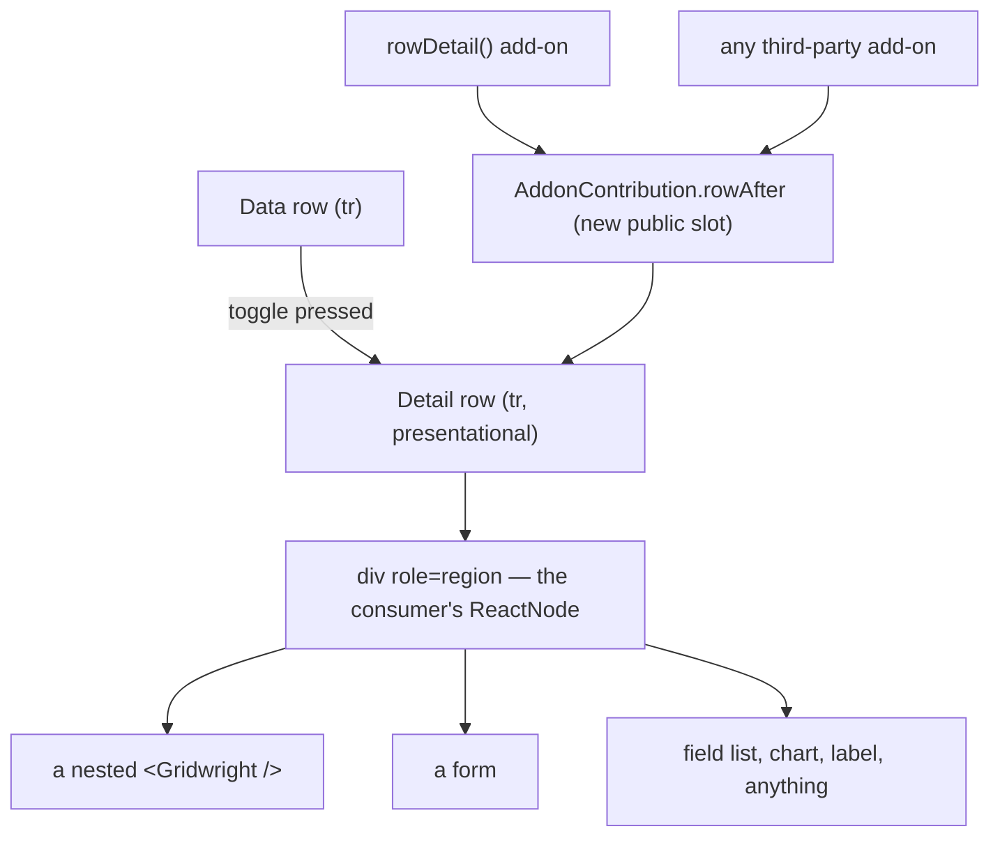

# Specification: expandable rows (row detail panels)

> **Status**: Implemented. All eight stages run. The contract seam (`rowAfter`, `columnCountOf`)
> shipped first and the add-on was written on top of it using nothing but the public exports.
> **Stage entry**: 1
> **Track**: feature. A new `rowDetail()` add-on, one new optional field on the public
> `AddonContribution` contract, and one new exported helper.
> **Semver impact**: minor (provisional; confirmed in api-surface.md)

---

## 1. The consumer problem

A row is one line of a table, and a line is not enough for what a reader needs next. Today the only
places this package gives a consumer to put more are a cell renderer, which is bounded by its
column, and `rowActions()`, which is a menu of commands rather than content. Everything else is
somewhere that is not the grid: a dialog, a drawer, a route.

What a consumer cannot do today, concretely:

1. **Put a second table under a row.** An order row with its line items, an invoice with its
   payments, a customer with their last ten tickets. The parent-child shape is the single most
   common reason a table is not enough, and the natural rendering — the child table under the
   parent row, indented, sharing the parent's horizontal position — is the one this package has no
   seam for.
2. **Put an editing form under a row.** The row is the summary, the form is the record. A dialog
   loses the reader's place in a long list; a route loses the list entirely.
3. **Show the fields that did not earn a column.** A grid with 8 visible columns over a record with
   40 fields hides 32 of them. `columnLayout()`'s picker lets a reader trade one for another, which
   is not the same as reading them all at once.
4. **Render anything at all in row context**: a chart of the row's history, a description too long
   for a cell, an image, a status timeline, a label with three words of explanation.

There is no way to write any of this as an add-on either, which is the sharper problem. The
contract in `src/react/addons/types.ts` lets an add-on style a row (`rowAttributes`), replace a row
(`renderRow`), replace the whole body (`body`), or add a column (`columns`) — but it has no slot
that renders **an additional row after a row**. `renderRow` replaces and the first add-on wins, so
using it for a detail panel would mean the detail add-on owning every row in the grid and
re-rendering the default one itself. A third-party add-on is blocked on exactly the same seam. Per
the architectural rule in `workflow.ai.yml` — *"when a feature needs a seam that does not exist, the
seam is added to the public contract for everyone"* — the seam comes first and `rowDetail()` is its
first consumer.

`treeData()` is not this feature and does not deliver it. A tree expands a row into **more rows of
the same shape**, drawn from the same columns, produced by the engine's nested-set index and
travelling through the pipeline. A detail panel expands a row into **content of a different shape**
that the pipeline never sees and that no column describes. They compose (§7), and a grid may list
both.

---

## 2. User stories

- **US-01 (nested table).** As a developer rendering orders, I pass `rowDetail({ render })` and
  return a second `<Gridwright />` inside it, so each order's line items appear under the order
  without a dialog or a route change.
- **US-02 (form).** As a developer, I return a form from `render`, so a reader can edit the record
  in place and my own submit handler decides when it is saved. The grid does not own the form.
- **US-03 (the rest of the fields).** As a developer with more fields than columns, I return a
  description list of the fields that did not earn a column.
- **US-04 (anything).** As a developer, I return whatever the row needs: a label, a chart, an image,
  a status timeline. The package renders my node in a full-width row and imposes nothing on it.
- **US-05 (only some rows).** As a developer, I return nothing from `render`, or answer `false` from
  `hasDetail`, for a row with nothing to show, and no toggle is drawn for it — rather than a toggle
  that opens an empty panel.
- **US-06 (reading).** As a person reading a grid, I press a control on a row and the detail appears
  directly under it, with the row still on screen and my scroll position kept.
- **US-07 (keyboard).** As a keyboard user, I reach the toggle with Tab, operate it with Enter or
  Space, hear whether it is expanded, and reach the panel's own controls straight after it in the
  tab order.
- **US-08 (assistive technology).** As a person using a screen reader, I hear that the control is
  expanded, I can move into the panel as a named region, and the row numbering of the table I am in
  does not change underneath me because a panel opened.
- **US-09 (several at once).** As a reader comparing two records, I expand both and they both stay
  open — unless the developer chose `single: true`, in which case opening one closes the other.
- **US-10 (persistence).** As a developer, I receive `onExpandedChange` and pass `initialExpanded`
  back, so what a reader opened survives a reload.
- **US-11 (add-on author).** As someone writing a third-party add-on, I contribute `rowAfter` and my
  extra row renders in exactly the same way the built-in one does, with no privileged access.

---

## 3. Acceptance criteria

Each of these becomes at least one test.

### The contract seam

- [x] **AC-01** `AddonContribution` gains one optional field:
      `rowAfter?: (row: GridRow<TRow>, grid: GridContext<TRow>) => ReactNode | undefined`.
- [x] **AC-02** Every add-on contributing `rowAfter` is asked, in add-on order, for every rendered
      row. All non-empty results render after the row, inside the same `<tbody>`, keyed by add-on
      name. It is not a single-owner slot: two add-ons may both add a row after the same row.
- [x] **AC-03** `rowAfter` is asked for a row rendered by `renderRow` too, so an add-on's custom row
      can carry a detail panel.
- [x] **AC-04** A `rowAfter` that throws renders nothing, reports itself through `callSlot`, and
      does not take the row or the grid down — the same rule every other slot follows.
- [x] **AC-05** Both bodies render it: the paged body and `GridVirtualBody` call the same
      `GridRowOrCustom`, so this is one implementation, not two.
- [x] **AC-06** `tests/react/third-party-addon.test.tsx` covers `rowAfter` with an add-on built from
      public exports only, so the seam is proven equal for third-party code.
- [x] **AC-07** `columnCountOf(grid)` is exported from `apsw-gridwright/react`. A full-width row
      cannot be built without it, and computing it by hand in every add-on is how the number drifts
      from the one the status row uses.

### The add-on

- [x] **AC-08** `rowDetail({ render })` draws a toggle column and renders the returned node in a
      full-width row under each expanded row.
- [x] **AC-09** `render` receives `{ row, data, grid, close }`. `data` is the consumer's row,
      unwrapped with `rowDataOf`, so a grid that also lists `treeData()` never hands a `TreeNode` to
      a renderer written against the consumer's own type.
- [x] **AC-10** No toggle is drawn for a row where `hasDetail` returns false. When `hasDetail` is
      not given, the toggle is drawn for every row; a `render` that returns `null` or `undefined`
      for an expanded row renders no detail row (an empty panel is worse than no panel), and this
      is documented as the more expensive of the two routes because it costs a render to discover.
- [x] **AC-11** The toggle column is placed by `toggle: 'start' | 'end' | 'none'`, default `start`.
      `'none'` contributes no column, for a consumer placing `<GridDetailToggle />` in a cell
      renderer of their own.
- [x] **AC-12** `single: true` collapses the previously expanded row when another is expanded.
      Default false.
- [x] **AC-13** Expansion is keyed on `GridRow.id`. Paging away and back restores the panels of rows
      whose ids come back (`persistAcrossPages`, default true); `false` clears expansion whenever the
      query changes.
- [x] **AC-14** `onExpandedChange(expanded)` fires after a change is committed and rendered, never
      for the initial expansion, so a handler writing to storage does not overwrite a saved set on
      the first paint. `initialExpanded` restores it.
- [x] **AC-15** `canToggle(rowId, expanded)` is asked before every change the add-on commits,
      including changes made through the controller, and returning false refuses it. The built-in
      toggle asks `controller.allows` and disables itself when the answer is no, so the control and
      the rule cannot disagree.
- [x] **AC-16** `useRowDetail()` returns the controller from anywhere inside the grid;
      `useOptionalRowDetail()` returns null rather than throwing when the add-on is not listed. A
      toolbar button of a consumer's own uses exactly what the built-in toggle uses.
- [x] **AC-17** `expandAll()` expands every row **currently held by the grid** that has detail, and
      is documented as such. It does not claim to have expanded rows on pages that have not been
      fetched, and nothing reports a count of expanded rows across the whole result set.
- [x] **AC-18** Every visible string is in `rowDetailMessages` under `gridwright:row-detail`, with
      entries added to all five locale packs in `src/locales/`.

### Accessibility

- [x] **AC-19** The toggle is a real `<button type="button">` with `aria-expanded`, reachable by Tab
      and operable with Enter and Space, carrying an accessible name that identifies its row
      (`Show details for {row}`), where `{row}` comes from `rowLabel` or, by default, the text of
      the first visible column.
- [x] **AC-20** While expanded the toggle carries `aria-controls` pointing at the panel's `id`. While
      collapsed the panel is not in the DOM and `aria-controls` is omitted rather than dangling.
- [x] **AC-21** The detail `<tr>` and its `<td>` carry `role="presentation"`; the panel inside is a
      `
` with an accessible name. The table's `aria-rowcount` and every row's
      `aria-rowindex` are unchanged by an expansion — see §6 for why this is the chosen trade-off.
- [x] **AC-22** Expanding and collapsing are announced through `grid.announce`, because expansion is
      not grid state and an `announce` contributor keyed on `GridState` structurally cannot see it.
- [x] **AC-23** Focus stays on the toggle when a panel opens or closes. The panel is not focused and
      focus is not trapped in it: it is content in a table, not a dialog.

### Composition

- [x] **AC-24** Listing `virtualRows()` and `rowDetail()` in the same grid throws a
      `GridwrightError` naming both add-ons and the reason. `useVirtualRows` is fixed-height
      arithmetic with no per-row measurement, and a panel of unknown height silently drifts every
      row below it away from the scrollbar. A named error at setup beats a grid that scrolls wrong.
- [x] **AC-25** With `treeData()`, `rowDetail()` is ordered `after: [TREE_ADDON]`, both toggles work
      independently, and the tree row's `aria-expanded` (children) is not the toggle's
      `aria-expanded` (panel).
- [x] **AC-26** With `selection()`, the toggle column and the checkbox column are both start-placed
      extra columns and neither swallows the other's click.
- [x] **AC-27** A nested `<Gridwright />` inside a panel does not feed its keyboard events to the
      outer grid: `GridTable`'s `onKeyDown` ignores an event whose closest `<table>` is not its own.
      Without this, a `tableKeyDown` add-on on the outer grid (`cellNavigation()`) acts on arrow keys
      pressed inside the inner one.
- [x] **AC-28** An export from a grid with expanded panels contains the columns and nothing else.
      `buildExportTable` works from columns and rows; a panel is a ReactNode and has no cells.
      Documented rather than attempted.

---

## 4. Non-goals

- **A nested-grid component.** No `<GridNestedGrid />`, no `detailColumns` option, no
  `detailDataSource`. The panel renders the consumer's node, and a nested grid is a
  `<Gridwright />` they wrote. Owning the nested grid would mean owning its data source, its
  labels, its add-ons and its lifecycle, and every one of those is already a thing this package
  does well one level up.
- **Fetching detail data.** No `loadDetail`, no cache, no in-flight state. The tree has
  `loadChildren` because the *engine* needs those rows to build the nested set; nothing here needs
  anything from the consumer but a ReactNode, and a component that fetches its own data is the one
  thing every React consumer already knows how to write. `render` is called only for an expanded
  row, so the consumer's own effect is the lazy load.
- **Variable-height virtualization.** Out of scope here and out of scope for `virtualRows()`, whose
  own source states the trade-off. Detail panels and windowing are refused together (AC-24) rather
  than half-supported.
- **Expansion as engine state.** No `GridApi.expandRow`, no `expanded` on `GridState`, no
  `row:expand` event. A panel changes no query facet, no row, and nothing the pipeline computes;
  putting it on the engine would put a React rendering concern on an object documented as
  framework-agnostic, and every consumer of it would be a React consumer.
- **Persisting expansion.** `initialExpanded` and `onExpandedChange` are the seam. Where the set is
  stored — `localStorage`, a URL, a preferences endpoint — is `specs/view-state-sync`'s problem and
  the consumer's choice.
- **Detail content in an export or a print.** Stated as a limit (AC-28), not implemented. A CSV has
  no room for a React tree, and a Markdown report that flattened one would be inventing a rendering
  nobody asked for.
- **Animating the panel open.** The stylesheet ships no transition. Height animation needs a
  measured height, and the package's reduced-motion contract is easier to keep by not starting.
- **An inline expand-on-row-click.** `onRowClick` stays the consumer's. A row that expands when
  clicked anywhere cannot also have a clickable cell in it, and the toggle is the accessible route
  regardless.

---

## 5. Behaviour across the capability seam

A detail panel touches no facet of the query: it filters nothing, sorts nothing, paginates nothing
and fetches nothing. The pipeline is unchanged and no feature branches on where the rows came from.
What does differ across sources is **row identity**, because expansion is keyed on `GridRow.id`.

| Source resolves | Expected behaviour |
| :--- | :--- |
| nothing (local array) | Every row is in memory; ids are stable across every query. Expanding, sorting, filtering and paging all keep the panels open on the rows that are still shown. `expandAll()` covers the page the grid is holding, which for an unpaginated local array is every row. |
| everything (server) | Identical. The add-on never inspects `capabilities` and never asks the source for anything. A panel survives a refetch when the row comes back with the same `getRowId` result, and is dropped when it does not — the same rule selection already follows. |
| pagination only | Identical, with one consequence stated rather than hidden: `expandAll()` expands the rows on the current page and nothing else, because the other pages are not in the grid. It reports no count and no "all rows expanded" state. Inventing one would be inventing a number computed from one page, which this package refuses everywhere else. |

`persistAcrossPages: false` exists for the source that recycles ids across pages, where a remembered
expansion would open a panel on a different record.

---

## 6. Accessibility and interface copy

### The toggle

A real `<button type="button">`, in an extra column, per row. `aria-expanded` carries the state.
`aria-controls` carries the panel's `id` while the panel exists and is omitted while it does not,
rather than referring to an element that is not in the document. Enter and Space come from the
button element; nothing is bound by hand.

Its accessible name names its row — `Show details for {row}` / `Hide details for {row}` — because a
column of forty identically named buttons tells a screen reader user nothing about which row each
one belongs to. This is the same reasoning `columnLayout()` applies to its resize handles. `{row}`
comes from `rowLabel(data, grid)`, defaulting to the text of the first visible column, which is the
one piece of the row a reader is already using to identify it.

### The panel, and the row numbering problem

The panel is content inside a table whose `role` is `grid`, and a `grid` owns rows. There are two
ways to put a non-row there, and the choice is load-bearing:

**Rejected — make it a real row.** `<tr role="row">` with a `role="gridcell"` spanning every column.
Structurally clean, and it destroys the row numbering. `src/react/a11y/rows.ts` computes
`aria-rowcount` as `totalRows + 1` and each row's `aria-rowindex` as its position in the whole result
set plus two. Both numbers are about the *result set*, not about what is mounted. Counting detail
rows means the count depends on how many panels are open across every page — a number the grid
cannot know for rows it has not fetched, and could only compute from the page it is holding. That is
precisely the "never invent a total" rule this package enforces in `tests/unit/engine-remote.test.ts`.
The alternative, leaving `aria-rowcount` alone while adding rows to the DOM, makes the count and the
indices disagree, which is the exact defect `rowNumbering` was written to repair.

**Chosen — make it presentational.** The `<tr>` and its single `<td colSpan={columnCountOf(grid)}>`
carry `role="presentation"`, so neither is exposed as a row or a cell and the numbering is untouched.
Inside sits `
`, which is what a screen reader user
moves into, is named after its row, and is what the toggle's `aria-controls` points at.
`role="presentation"` removes an element's own semantics and not its descendants', so everything in
the panel — a nested grid, a form, a set of links — keeps its own.

The cost, recorded in review.md under Known gaps: an element that is neither a row nor a
presentational descendant of one sits inside `role="grid"`, which is a structural liberty. It is
taken deliberately, in exchange for numbering that is correct for every row of the result set. The
condition that would justify revisiting it is a future where `aria-rowindex` may be non-contiguous
by specification and assistive technology honours it.

### Focus and announcements

Focus stays on the toggle across both transitions. The panel is content, not a dialog: nothing is
focused for the reader and nothing is trapped. The panel's own focusable content follows the toggle
in the tab order because it follows it in the DOM.

Expanding and collapsing are said through `grid.announce`. They cannot go through an `announce`
contributor: a contributor's `key` and `describe` are handed `GridState`, and expansion is not in
`GridState` by design (§4), so a contributor structurally cannot see the change. `docs/addons.md`
already names `grid.announce` as the route for something that is not grid state.

### Strings

Every one in `rowDetailMessages`, namespaced `gridwright:row-detail`, and in all five packs under
`src/locales/`:

| Key | English | Where |
| :--- | :--- | :--- |
| `expand` | `Show details for {row}` | the toggle, collapsed |
| `collapse` | `Hide details for {row}` | the toggle, expanded |
| `column` | `Details` | the toggle column's header, visually hidden |
| `panel` | `Details for {row}` | `aria-label` on the region |
| `expanded` | `{row} details shown` | announced |
| `collapsed` | `{row} details hidden` | announced |

---

## 7. Delivery as a plugin

**Engine plugin: none.** Nothing here is a pipeline stage. The panel changes no query facet and
produces no row; the pipeline would have nothing to do with it.

**Core service: none.** The bar in `workflow.ai.yml` is state or an operation *every renderer needs,
with nothing about it a choice*. A detail panel is a ReactNode, which is the definition of a
rendering choice, and `ColumnDef` carries no ReactNode by rule.

**The contract seam: `rowAfter`.** Added to `AddonContribution` for everyone, rendered by
`GridRowOrCustom`, which both bodies already call. This is the part of the work that is not the
add-on, and it is why this is a feature rather than a package of one component.

**React add-on: `rowDetail()`**, in `src/react/detail/`, built from public exports and nothing else.

| What it contributes | Field | Why |
| :--- | :--- | :--- |
| the panel row | `rowAfter` | the new seam |
| the toggle column | `columns` (`placement` from `toggle`) | one extra column, start or end |
| the controller | `provide` | a context, so `useRowDetail()` reaches it from a consumer's own control |
| its strings | `messages` | `gridwright:row-detail` |
| ordering | `after: [TREE_ADDON]` | so it sees the tree's wrapped rows and unwraps with `rowDataOf` |

Nothing is suppressed and no slot is owned, so `rowDetail()` composes with every other add-on:

- **`treeData()`** — both work. The tree's chevron expands children; the detail toggle expands a
  panel. Two distinct `aria-expanded` values on two distinct controls, on a row that carries the
  tree's own on the `<tr>` for its children. `render` receives the unwrapped row.
- **`selection()`** — two start-placed extra columns, ordered by add-on order.
- **`columnLayout()`** — the panel's `<td>` is not a data cell, so no width variable and no sticky
  offset is contributed to it. Pinned columns paint over the panel while the table is scrolled
  horizontally, because they are sticky and it is not; the panel's inner region is `position: sticky;
  left: 0` so its content stays at the reader's left edge. Recorded as a known gap, not as a fix.
- **`virtualRows()`** — refused with a named error (AC-24).
- **`rowActions()`** — both work. The bubble menu attaches through `rowAttributes` on data rows and
  the panel row is not one, so the menu does not follow the pointer into the panel.
- **`exportMenu()`** — unaffected; panels are not exported (AC-28).

---

## 8. Clarifications

Stage 2. Each of these is a default every consumer inherits.

- **Named `rowDetail()`, not `expandableRows()`.** "Expand" is already the tree's word, on the same
  rows, with a different meaning; two features whose docs both say "expand a row" is how a reader
  ends up with the wrong one. `rowDetail()` also reads beside the `rowActions()` that already
  exists.
- **`rowAfter` is a list slot, not an owned one.** `body` and `headerLabel` have single owners
  because two bodies cannot both be the body. Two add-ons adding a row after the same row is a
  coherent thing that composes, so all contributions render, in add-on order, keyed by add-on name.
- **`rowAfter` renders after a custom row too.** An add-on using `renderRow` for a group header is
  not a reason another add-on's panel disappears. The two slots answer different questions.
- **The default toggle column is `start`.** A control that changes what a row shows belongs before
  the row, next to the selection checkbox, which is the other control of that kind.
- **Several panels open by default; `single: true` opts into one.** A reader comparing two records
  is the case that motivated the feature (US-09); a grid that closes one panel to open another
  cannot serve it. `single` exists because a tall panel makes the opposite choice reasonable.
- **Expansion survives paging by default.** A reader who opens a panel, pages forward to check
  something and pages back has not asked for it to be closed. `persistAcrossPages: false` is for the
  source whose ids are not stable across pages.
- **`onExpandedChange` does not fire for `initialExpanded`.** A handler that writes to storage must
  not overwrite a saved set on first paint — the same rule `columnLayout({ onChange })` follows, for
  the same reason.
- **`render` returning nothing collapses to no row.** An empty full-width row under a row is a
  rendering defect that looks like a bug in the consumer's code. `hasDetail` is the cheaper route
  because it is answered before the toggle is drawn; a `render` returning `null` is the honest
  fallback for a row whose emptiness is only discovered by rendering it.
- **Errors inside the panel are the consumer's.** `callSlot` catches a throw from the slot itself so
  one bad panel does not empty the grid; what the consumer's node does after it mounts is ordinary
  React and fails the ordinary way, with the consumer's own error boundary. Documented in
  `docs/addons.md`'s existing Failure section rather than given a second mechanism.
- **The panel is not lazy beyond expansion.** `render` is called only for expanded rows, and a
  collapsed panel is unmounted rather than hidden, so a nested grid stops fetching when its panel
  closes. Keeping it mounted would make a grid of 25 rows into 26 grids.
- **`columnCountOf` becomes public.** Any add-on rendering a full-width row needs the same number
  the status row uses. Exporting it is smaller than exporting nothing and watching every add-on
  recompute it slightly differently.
