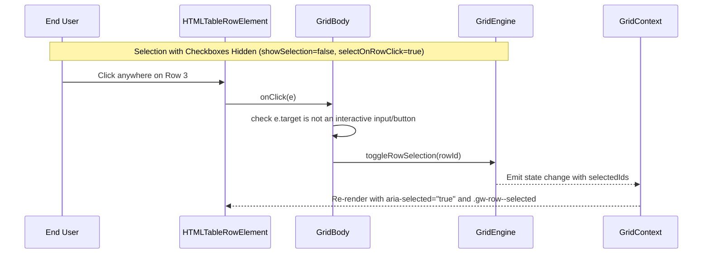

# Plan: selection display controls and checkbox removal

## 1. Modules touched

| File | Change |
| :--- | :--- |
| `src/react/types.ts` | Add optional `showSelection`, `selectOnRowClick`, `showSelectAll` to `GridwrightProps` |
| `src/react/Gridwright.tsx` | Forward `showSelection`, `selectOnRowClick`, `showSelectAll` to parts |
| `src/react/parts/GridHeader.tsx` | Conditionally hide header select-all checkbox when `showSelectAll === false` |
| `src/react/parts/GridBody.tsx` | Forward `selectOnRowClick` to row click handler; hide checkbox cells when `showSelection === false` |
| `src/react/virtual/GridVirtualBody.tsx` | Mirror body selection behavior in virtualized rows |

## 2. Architecture and Data Flow

## 3. Where the behaviour lives

- **Engine State**: Engine already owns `selectedIds: ReadonlySet<string>` and `toggleRowSelection()`.
- **Prop forwarding**: `<Gridwright />` forwards the three display flags down to the context and parts.
- **Rendering**: `GridHeader.tsx`, `GridBody.tsx`, and `GridVirtualBody.tsx`.

## 4. Trade-offs taken

- **Default preservation**: `showSelection` defaults to `selectionMode === 'multiple'`, and `showSelectAll` defaults to `true`. This guarantees 100% backwards compatibility with existing grids.
- **Click interception safety**: Row click selection skips when clicking on buttons, links, inputs, or edit cells, preventing accidental row toggle when clicking interactive cell content.

## 5. Risks & Mitigation

| Risk | Mitigation |
| :--- | :--- |
| Accidental row selection when clicking a link or action button | Click listener checks `e.target.closest('button, a, input, [role="button"]')` and bails out if an interactive element was clicked. |
| Inconsistent behavior between standard and virtual bodies | Both `GridBody.tsx` and `GridVirtualBody.tsx` consume the exact same selection props from context. |

