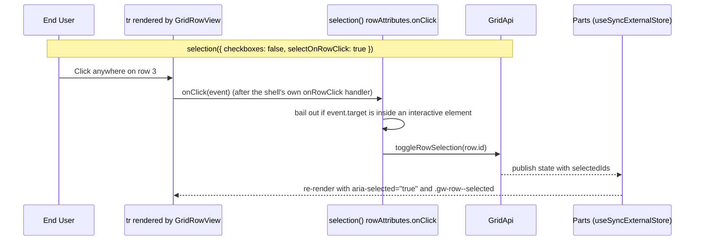

# Plan: selection display controls and checkbox removal

## 1. Modules touched

| File | Change |
| :--- | :--- |
| `src/react/core-addons/selection.tsx` | `SelectionOptions` gains `selectAll` and `selectOnRowClick`; the extra column's header honours `selectAll`; `rowAttributes` adds the click handler; `tableKeyDown` handles `Space` |
| `src/react/core-addons/messages.ts` | `selectionMessages`: `selectColumn` |
| `src/locales/{de,es,fr,pl}.ts` | the same key under `addons['gridwright:selection']` |
| `tests/react/*` | options on and off, paged and windowed bodies, interactive-element guard, keyboard |

Not touched: `src/react/Gridwright.tsx`, `src/react/types.ts` and the parts. The shell imports no
add-on and gains no prop; the parts already render extra columns, row attributes and table keyboard
handling from context, in both bodies.

## 2. Architecture and Data Flow

## 3. Where the behaviour lives

- **Engine state**: `GridState.selectedIds` and `GridApi.toggleRowSelection()` (existing, unchanged).
- **Options**: on the `selection()` add-on, changed by replacing it in `coreAddons`.
- **Rendering and events**: the add-on's `columns`, `rowAttributes`, `tableAttributes`, `tableKeyDown`
  and `toolbarStatus` contributions. The paged and windowed bodies render them through the shared
  `GridRowView`.

## 4. Trade-offs taken

- **Default preservation**: `checkboxes` defaults to `selectionMode === 'multiple'` and `selectAll` to
  `true`, so the default core set renders exactly as today.
- **Click interception safety**: the row handler skips clicks inside interactive elements instead of
  asking every cell renderer to stop propagation.
- **Handlers through `rowAttributes`, not DOM delegation**: the attribute allowlist passes `on*`
  functions, merges them in order, and needs no query for rows in the document.

## 5. Risks & Mitigation

| Risk | Mitigation |
| :--- | :--- |
| Accidental row selection when clicking a link or action button | The handler checks `event.target.closest(...)` against the interactive selector in AC-05 and returns. |
| Keyboard users lose selection when checkboxes are removed | Open clarification C-1 in spec.md; not shipped without a keyboard route. |
| Inconsistent behaviour between paged and windowed bodies | Impossible by construction (one row renderer); a test runs the options under `virtualRows()`. |
