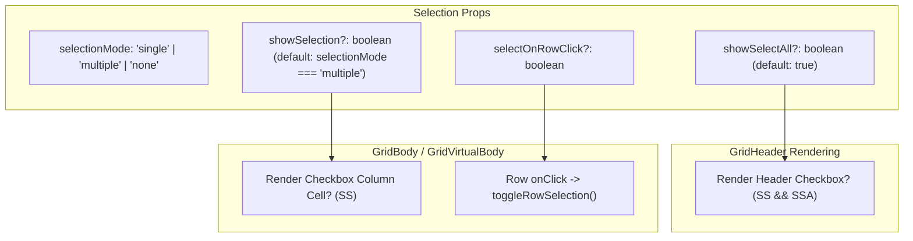

# Specification: configurable selection and checkbox removal

> **Status**: Draft
> **Stage entry**: 1 & 2
> **Semver impact**: minor (new optional props on Gridwright and parts; confirmed in api-surface.md)

---

## 1. The consumer problem

In `apsw-gridwright`, row selection is controlled by `selectionMode?: 'none' | 'single' | 'multiple'`.
While the engine cleanly separates selection state (`selectedIds`) from rendering, the React adapter
hardcodes checkbox column display:

1. **Checkboxes cannot be removed from `<Gridwright />`**:
   - In `<Gridwright />`, `showSelection` is not forwarded to `GridHeader`, `GridBody`, or `GridVirtualBody`.
   - In all three components, the checkbox column is hardcoded to `showSelection ?? selectionMode === 'multiple'`.
   - Consequently, setting `selectionMode="multiple"` on `<Gridwright />` unconditionally renders a leading
     checkbox column in both the header and every body row. There is no prop to hide or remove it.
2. **Row-based selection is blocked without custom composition**:
   - Many applications (e.g. email clients, file explorers, administrative lists) require row selection
     driven by row clicks, Shift+Click, or keyboard navigation, without sacrificing horizontal space to a
     dedicated checkbox column.
   - Currently, a developer who wants multiple selection without a checkbox column is forced to
     completely abandon `<Gridwright />` and reconstruct the grid by hand using lower-level primitives
     (`GridwrightProvider`, `GridTable`, `GridHeader`, `GridBody`, `GridPagination`), contradicting the
     repository's core principle that capabilities should compose as options on `<Gridwright />`.
3. **No independent control over "Select All"**:
   - In large or infinite datasets, a "Select All" checkbox in the header is frequently dangerous or
     undesirable (e.g. selecting 50,000 records accidentally).
   - Currently, there is no way to hide the header select-all checkbox while keeping row checkboxes in
     the table body.

A first-class selection display capability must allow developers to easily remove or show checkboxes,
support row-click selection, and control the header select-all affordance, all via clean props on
`<Gridwright />`.

---

## 2. User stories

- **US-01.** As a developer, I want to set `showSelection={false}` on `<Gridwright selectionMode="multiple" />`
  to enable multi-row selection without rendering a leading checkbox column.
- **US-02.** As a developer, I want to configure whether clicking a row toggles its selection (`selectOnRowClick`),
  allowing clean row-click selection when checkboxes are removed.
- **US-03.** As a developer, I want to hide the header "Select All" checkbox (`showSelectAll={false}`) while
  keeping individual row checkboxes visible.
- **US-04.** As an end user using a table with checkboxes removed, I want to click any row to select or
  deselect it, with immediate visual feedback (`.gw-row--selected`).
- **US-05.** As an end user, clicking a button, link, or edit trigger inside a cell must not trigger row
  selection.
- **US-06.** As a person using assistive technology, I want row selection without checkboxes to be announced
  truthfully via `aria-selected="true" | "false"` and `aria-multiselectable="true"`.
- **US-07.** As a keyboard user on a table without checkboxes, I want to press `Space` on a focused row to
  toggle its selection.

---

## 3. Acceptance criteria

- [ ] **AC-01** `showSelection?: boolean` exposed on `GridwrightProps`:
      - Forwards to `GridHeader`, `GridBody`, and `GridVirtualBody`.
      - Defaults to `selectionMode === 'multiple'` (preserving 100% backwards compatibility).
- [ ] **AC-02** Checkbox column removal:
      - When `showSelection === false`, no checkbox column or leading `<th>`/`<td>` is rendered in the
        header, body, or virtual body.
      - Column alignment and `colSpan` calculations in status/empty/loading rows automatically adjust to
        the true visible column count.
- [ ] **AC-03** `showSelectAll?: boolean` on `GridHeaderProps` and `GridwrightProps`:
      - Allows hiding only the header select-all checkbox while preserving body row checkboxes.
      - When `false`, the header cell remains as an empty alignment cell or the column is suppressed if
        desired.
- [ ] **AC-04** Row-click selection (`selectOnRowClick?: boolean`):
      - When `true` (or when `showSelection === false` and `selectionMode !== 'none'`), clicking a row
        toggles its selection via `api.toggleRowSelection(row.id)`.
      - If a custom `onRowClick` handler is provided, it is invoked alongside selection.
- [ ] **AC-05** Interactive element protection:
      - Clicks originating on interactive elements within cells (`<button>`, `<a>`, `<input>`, `<select>`,
        `<textarea>`, or elements with `role="button"`) do not trigger row selection.
- [ ] **AC-06** Keyboard selection:
      - Pressing `Space` while focus is on a `<tr>` toggles selection for that row when selection is active.
- [ ] **AC-07** Virtualization parity:
      - `GridVirtualBody` respects `showSelection` identically to `GridBody`, rendering or omitting the
        checkbox cell in both normal and skeleton states.
- [ ] **AC-08** Zero regressions in existing selection:
      - Existing code `<Gridwright selectionMode="multiple" />` continues to render checkboxes exactly as
        before.
- [ ] **AC-09** ARIA compliance:
      - Rows continue to report `aria-selected={row.selected}`.
      - The table reports `aria-multiselectable="true"` when `selectionMode === 'multiple'`.

---

## 4. Non-goals

- **Changing engine selection semantics:**
  The core engine's `selectedIds`, `toggleRowSelection`, `selectPage`, and `clearSelection` already work
  independent of rendering. No core engine changes are required.
- **Breaking changes to default behavior:**
  `showSelection` must default to `true` when `selectionMode === 'multiple'` so existing consumers
  experience zero behavioral change.
- **Complex lasso / drag-box selection:**
  Drag-to-select rectangular bounding boxes across cells is a desktop spreadsheet feature and out of
  scope for standard data grid row selection.

---

## 5. Behaviour across the capability seam

| Source resolves | Expected behaviour |
| :--- | :--- |
| **nothing (local array)** | Row selection toggles immediately in state. `showSelection={false}` removes the column without affecting selection state. |
| **everything (server)** | Unchanged. Selection operates over loaded row IDs in client memory. |
| **tree data** | Selecting a row without checkboxes marks the row selected. Tree toggle buttons do not trigger row selection due to the interactive element guard. |
| **virtualized grid** | Checkboxes are removed from rendered rows and spacer calculations adjust accordingly. |

---

## 6. Accessibility and interface copy

- **ARIA states**:
  - `<table role="grid" aria-multiselectable="true">` when `selectionMode === 'multiple'`.
  - `<tr aria-selected="true">` on selected rows; `<tr aria-selected="false">` on unselected rows when
    selection is active.
- **Keyboard navigation**:
  - Focusable rows respond to `Space` keydown to toggle selection.
- **Screen reader announcements**:
  - The live region continues to report selection count changes via `labels.selectedCount` when selection
    occurs.

---

## 7. Clarifications

- **What is the default value of `showSelection`?**
  `showSelection ?? selectionMode === 'multiple'`. If `selectionMode="none"`, it is `false`. If
  `selectionMode="single"`, it is `false`. If `selectionMode="multiple"`, it is `true`.
- **How does a developer remove checkboxes?**
  `<Gridwright selectionMode="multiple" showSelection={false} />`.
- **Can a single-selection grid show radio buttons?**
  Yes, if `showSelection={true}` is explicitly passed on a `single` selection grid, it renders selection
  indicators (e.g. radio buttons or single checkboxes).
- **Does clicking a cell button select the row?**
  No. Any click inside a `<button>`, `<a>`, `<input>`, or clickable menu item stops propagation to the
  row selection handler.
