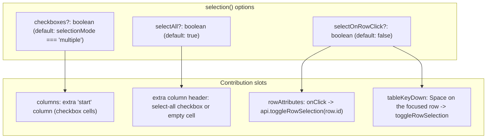

# Specification: configurable selection and checkbox removal

> **Status**: Draft (corrected 2026-09-14 against the code and `specs/addon-architecture`)
> **Stage entry**: 1 & 2
> **Semver impact**: minor (new optional options on the `selection()` add-on; nothing on
> `<Gridwright />`; to be confirmed in api-surface.md)

---

## 1. The consumer problem

Row selection is engine state: `selectionMode?: 'none' | 'single' | 'multiple'`, `selectedIds`, and
public `GridApi` operations (`toggleRowSelection`, `setSelectedIds`, `selectPage`, `clearSelection`).
Its view is the `selection()` add-on in `coreAddons()`, which contributes a leading checkbox column
with a select-all checkbox in its header, `aria-selected` and the selected class on rows,
`aria-multiselectable` on the table, and the selected count in the toolbar.

Some of what this spec first asked for already exists there: `selection({ checkboxes: false })`
removes the checkbox column from the header and from both bodies, and the status rows' `colSpan`
already counts contributed columns. Since 2026-09-17 it is also reachable in one prop --
`coreAddons({ selection: { checkboxes: false } })` -- rather than by spreading `coreAddons()`,
filtering it by name and appending a replacement (AC-11). What is still missing:

1. **No independent control over "Select all".** In large or remote datasets a select-all checkbox is
   frequently undesirable (it selects the page, and readers expect it to select everything). There is
   no way to hide it while keeping row checkboxes.
2. **No row-click selection.** Email clients, file explorers and administrative lists select by
   clicking a row, without spending horizontal space on a checkbox column. With `checkboxes: false`,
   nothing a pointer user can do selects a row.
3. **No keyboard route without checkboxes.** Rows are not focusable and the grid has no cell
   navigation yet, so removing the checkboxes removes the only keyboard-operable selection control. A
   grid nobody can operate by keyboard is a broken grid.

A developer should get all of this as options on `selection()`, without abandoning `<Gridwright />`
for a hand-composed layout, and without any new prop on the component.

---

## 2. User stories

- **US-01.** As a developer, I want `selection({ checkboxes: false })` on a `multiple` grid to keep
  multi-row selection without a checkbox column. *(Exists.)*
- **US-02.** As a developer, I want `selection({ selectOnRowClick: true })` so clicking a row toggles
  its selection.
- **US-03.** As a developer, I want `selection({ selectAll: false })` to hide the header select-all
  checkbox while keeping row checkboxes.
- **US-04.** As an end user on a table without checkboxes, I want to click any row to select or deselect
  it, with immediate visual feedback (`.gw-row--selected`).
- **US-05.** As an end user, clicking a button, link, input or editor inside a cell must not select the
  row.
- **US-06.** As a person using assistive technology, I want row selection without checkboxes announced
  truthfully through `aria-selected` and `aria-multiselectable`. *(Exists.)*
- **US-07.** As a keyboard user on a table without checkboxes, I want to press `Space` on the focused
  row to toggle its selection.

---

## 3. Acceptance criteria

- [x] **AC-01** `selection({ checkboxes })` defaults to `selectionMode === 'multiple'`. *(Holds today.)*
- [x] **AC-02** Checkbox column removal: with `checkboxes: false` no checkbox `<th>` or `<td>` is
      rendered in the header, the paged body or the windowed body, and status rows span the true column
      count. *(Holds today: the column is an `ExtraColumn` contribution counted by the shell.)*
- [ ] **AC-03** `selection({ selectAll: false })` renders the checkbox column's header as an empty
      header cell (still a `<th scope="col">`, with a visually hidden column name from the add-on's
      messages) instead of the select-all checkbox. Row checkboxes are unchanged.
- [ ] **AC-04** Row-click selection: with `selectOnRowClick: true` and a selection mode other than
      `none`, the add-on's `rowAttributes` contributes an `onClick` that calls
      `api.toggleRowSelection(row.id)`. The grid's own `onRowClick` still runs (the shell's handler first,
      as `mergeAttributes` orders handlers).
- [ ] **AC-05** Interactive element protection: a click whose target is inside `button`, `a`, `input`,
      `select`, `textarea`, `[role="button"]`, `[role="menuitem"]` or `[contenteditable]` within the row
      does not toggle selection.
- [ ] **AC-06** Keyboard selection: with `selectOnRowClick: true`, `Space` toggles the selection of the
      row that contains the focused element, through the add-on's `tableKeyDown` contribution, which
      returns `true` only when it handled the key. It does nothing when focus is in an interactive
      element listed in AC-05. How a row without checkboxes receives focus is clarification C-1.
- [x] **AC-07** Virtualization parity: both bodies render rows through `GridRowView`, so every
      option above applies identically under `virtualRows()`. *(Holds by construction; asserted by a
      test once the options exist.)*
- [x] **AC-08** No regression: a `multiple` grid with the default `coreAddons()` renders checkboxes
      exactly as today. *(Holds.)*
- [x] **AC-09** ARIA: rows report `aria-selected` while selection is active, and the table reports
      `aria-multiselectable="true"` in `multiple` mode. *(Holds today.)*
- [ ] **AC-10** New strings are in the `gridwright:selection` add-on's messages, in five languages and in
      each locale pack's `addons['gridwright:selection']`.
- [x] **AC-11** Reaching the option costs one prop: `coreAddons(options)` passes `options.selection`
      to `selection()`, `options.sorting` to `sorting()` and `options.pagination` to `pagination()`,
      keeping the other core add-ons and their order. Replacing or dropping an add-on outright stays
      a list operation, and `coreAddons={false}` still renders none. *(Done: `CoreAddonOptions` in
      `src/react/core-addons/index.tsx`, covered in `tests/react/gridwright.test.tsx` under
      "configuring a core add-on".)*

> **Delivered so far: AC-01, AC-02, AC-07, AC-08, AC-09 and AC-11.** The checkbox column can be
> removed and reaching that is now ergonomic -- but AC-04 to AC-06 are not written, so a grid with
> `checkboxes: false` has **no built-in control that selects a row**. Until they are, a consumer
> removing the checkboxes drives selection themselves through `onRowClick` and
> `api.toggleRowSelection`. That is the honest state and it is documented in `docs/api.md`.

---

## 4. Non-goals

- **Changing engine selection semantics.** `selectedIds`, `toggleRowSelection`, `selectPage` and
  `clearSelection` already work independently of rendering. No core change.
- **Props on `<Gridwright />`** (`showSelection`, `showSelectAll`, `selectOnRowClick`). Selection's view
  is configured on its add-on.
- **Lasso or drag-box selection** across cells.
- **Shift-click range selection.** A natural follow-up on the same `rowAttributes` handler, but it needs
  an anchor row and a decision about ranges across pages; left for its own spec.

---

## 5. Behaviour across the capability seam

| Source resolves | Expected behaviour |
| :--- | :--- |
| **nothing (local array)** | Selection toggles immediately in state. Removing checkboxes does not affect selection state. |
| **everything (server)** | Unchanged. Selection operates over loaded row ids. |
| **tree data** | Selecting a row without checkboxes selects that placement's node. The tree toggle is a button, so AC-05 keeps it from selecting. |
| **virtualized grid** | Identical, because both bodies share the row renderer. |

---

## 6. Accessibility and interface copy

- **ARIA states** (existing, from `selection()`): `aria-multiselectable="true"` on the table in
  `multiple` mode; `aria-selected` on each row while selection is active.
- **Keyboard**: `Space` on the focused row toggles selection (AC-06).
- **Announcements**: the selected count stays in the toolbar status (`toolbarStatus`); selection does
  not speak through the live region, because selecting changes no sentence the region carries.
- **Copy**: `selectColumn` ("Selection"), the visually hidden header name when `selectAll` is off.

---

## 7. Delivery as a plugin

**Engine.** None. Selection state and operations are a core service: `selectionMode`, `selectedIds`
and `GridRow.selected` are part of `GridState`, and every operation is public `GridApi`. Moving the
state into a plugin would give `GridRow.selected` a second source of truth.

**React add-on.** The existing `selection()` add-on (`gridwright:selection`), in `coreAddons()`, gains
options. A consumer changes them by replacing it in the core set:
`coreAddons={[...coreAddons().filter((a) => a.name !== 'gridwright:selection'), selection({ checkboxes: false, selectOnRowClick: true })]}`.

| Slot | Use |
| :--- | :--- |
| `columns` | the checkbox `ExtraColumn` at `start`, omitted with `checkboxes: false`; its `header` renders the select-all checkbox or the empty header |
| `rowAttributes` | `aria-selected`, the selected class, and with `selectOnRowClick` the `onClick` handler |
| `tableAttributes` | `aria-multiselectable` |
| `tableKeyDown` | `Space` handling (AC-06) |
| `toolbarStatus` | the selected count |
| `messages` | the add-on's strings |

**What cannot be an add-on.** The selection state, for the reason above. Everything a person sees or
operates is already the add-on.

---

## 8. Clarifications

- **C-1. How does a row receive focus when there are no checkboxes?** Open for stage 2. Rows are not
  focusable today, and making every `<tr>` a tab stop is not acceptable. Two candidates: (a) with
  `selectOnRowClick` and no checkboxes, the add-on contributes a roving `tabIndex` through
  `rowAttributes` (one row `0`, the rest `-1`) and moves it with ArrowUp/ArrowDown in `tableKeyDown`;
  (b) keyboard selection without checkboxes requires `cellNavigation()` (see
  `specs/cell-navigation-and-clipboard`), which owns focus, and `selection()` only handles `Space`
  after it in add-on order. Option (b) avoids two focus models in one table; option (a) works without
  another add-on. Until this is decided, `checkboxes: false` without a keyboard route must be
  documented as not keyboard-operable.
- **What is the default of `checkboxes`?** `selectionMode === 'multiple'`: `false` for `none` and
  `single`.
- **Can a single-selection grid show indicators?** Yes: `selection({ checkboxes: true })` on a `single`
  grid renders the checkbox column; radio semantics are out of scope for this spec.
- **Does clicking a cell button select the row?** No (AC-05). The checkbox itself already stops
  propagation so selecting through it does not also fire `onRowClick`.
