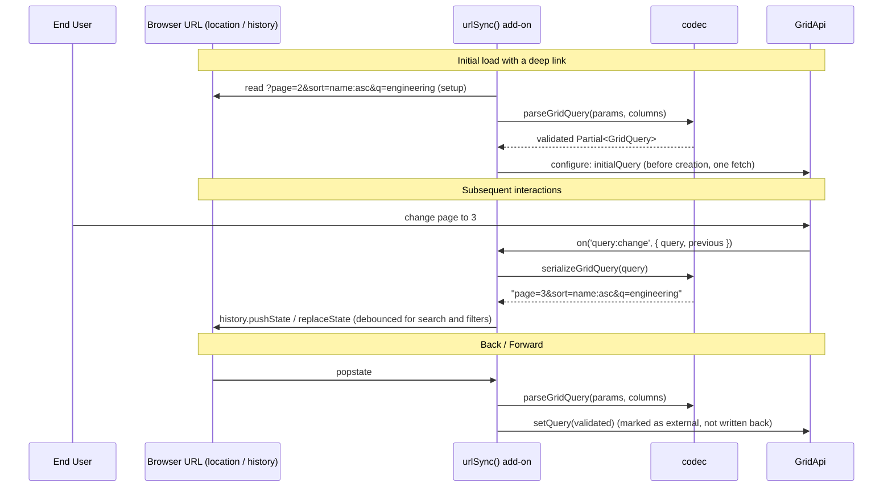

# Plan: view state and URL sync

## 1. Modules touched

| File | Change |
| :--- | :--- |
| `src/react/url-sync/types.ts` | New. `UrlSyncAdapter`, `UrlSyncOptions`, `UrlSyncFacet` and the codec options |
| `src/react/url-sync/codec.ts` | New. Pure `serializeGridQuery` / `parseGridQuery` between `GridQuery` and `URLSearchParams`, validated against columns, and `formatSearchParams` |
| `src/react/url-sync/addon.tsx` | New. `urlSync()`: `setup`, `configure` (initial query), `provide` (lifecycle component) |
| `src/react/url-sync/adapter.ts` | New. The default `location` / `history` / `popstate` adapter (internal) |
| `src/react/url-sync/index.ts`, `src/react/index.ts` | Exports |

Not touched: `src/react/Gridwright.tsx` (no `syncWith` prop) and the engine. The engine already exposes
`initialQuery`, `getState().query`, `on('query:change')` and `setQuery()`.

## 2. Architecture and Data Flow

## 3. Where the behaviour lives

- **Codec (parse and serialize)**: `src/react/url-sync/codec.ts` (pure, zero dependencies).
- **Browser history and router binding**: `src/react/url-sync/adapter.ts` and the lifecycle component in
  `addon.tsx` (adapter code; the headless core is untouched).
- **Engine integration**: public `initialQuery`, `api.getState().query`, `api.on('query:change')` and
  `api.setQuery()`.

## 4. Trade-offs taken

- **Replace vs. push history**: every change but a page change uses `history.replaceState` (debounced
  300ms) to avoid filling history with intermediate states; a change of the page alone uses `pushState`
  so Back steps through pages. The engine's own page correction is a replace.
- **Parameter prefixes**: an optional `prefix` (e.g. `gw_page=2`) so several grids on one page do not
  collide.
- **Initial query through `configure`**: one fetch for a shared link, at the cost of reading the URL
  during render (it is read once, in `setup`).

## 5. Risks & Mitigation

| Risk | Mitigation |
| :--- | :--- |
| Stale or malicious column ids and values in parameters | The codec checks ids against the grid's columns and operators against the core `FilterOperator` set; unknown entries are dropped. Parsed values go into objects built from known keys only (no prototype writes). |
| Endless update loops between URL sync and the engine | A change applied from the URL is tagged, and its `query:change` is not written back. A write whose parameters equal the last seen ones is skipped. |
| Back into a page past the end | The engine's clamp is recognised (the previous page is past the new page count) and written as a replace. |
| A debounced write landing after Back | An external change cancels the pending write. |
| History filling while a windowed grid scrolls | `page` is not synced under windowed navigation. |
| A router that owns the URL | The adapter contract (`getParams`, `setParams`, `subscribe`) replaces `location` and `history`. |
