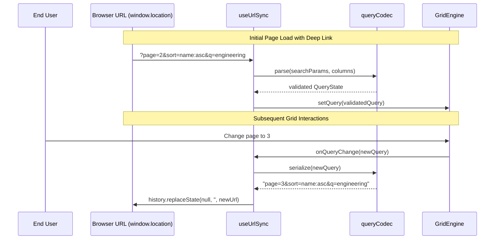

# Plan: view state and URL sync

## 1. Modules touched

| File | Change |
| :--- | :--- |
| `src/react/sync/types.ts` | `UrlSyncAdapter`, `UrlSyncOptions` contract definitions |
| `src/react/sync/codec.ts` | Pure serialization/deserialization between `GridQuery` and `URLSearchParams` |
| `src/react/sync/useUrlSync.ts` | Hook listening to `engine.subscribeQuery()` and browser `popstate` |
| `src/react/Gridwright.tsx` | Prop option `syncWith?: 'url' | UrlSyncAdapter` |

## 2. Architecture and Data Flow

## 3. Where the behaviour lives

- **Codec (parse & serialize)**: `src/react/sync/codec.ts` (pure functions, zero dependencies).
- **Browser History & Router binding**: `src/react/sync/useUrlSync.ts` (adapter level, respects headless core).
- **Engine integration**: Uses existing `engine.getQuery()` and `engine.setQuery()` public methods.

## 4. Trade-offs taken

- **Replace vs. Push history**: Typing search or continuous pagination uses `history.replaceState` (with 300ms debounce) to avoid filling the browser history with thousands of intermediate keystroke states. Discrete actions (like major filter resets) can use `pushState`.
- **Param prefixes**: Supports optional `prefix` (e.g. `gw_page=2`) so multiple grids on the same page do not collide in the query string.

## 5. Risks & Mitigation

| Risk | Mitigation |
| :--- | :--- |
| Stale or malicious column IDs in URL parameters | Codec checks column IDs against `engine.getColumns()`; unknown columns and invalid operators are stripped silently. |
| Endless update loops between URL sync and GridEngine query emitter | Sync hook tracks a generation ref to distinguish internal query changes from external `popstate` events. |

