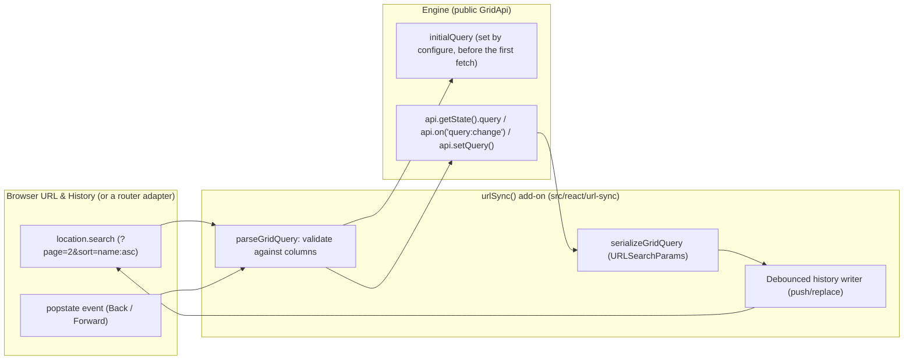

# Specification: view state and URL synchronization

> **Status**: Implemented (reviewed 2026-09-18 against the code; the review's findings are in §9 and
> are folded into the criteria below)
> **Stage entry**: 1
> **Semver impact**: minor (a new `urlSync()` add-on and pure codec functions; nothing on
> `<Gridwright />`, no changed default; see api-surface.md)

---

## 1. The consumer problem

When users interact with a data table, they customize their view: sorting specific columns, applying
multi-criteria filters, typing search terms, and navigating to specific pages.
1. **Views are lost on page refresh**:
   - Refreshing the browser or navigating away resets the grid to its initial query. The user must
     re-apply every sort, filter, and page from memory.
2. **Cannot share grid states via links**:
   - A support agent or team lead cannot send a direct link saying "review these 15 open priority
     tickets". Copying the browser URL only sends the blank view.
3. **Browser History (Back / Forward) breaks**:
   - Users expect the browser's Back button to return to the previous page or filter state they were
     looking at, rather than exiting the application entirely.

A view state synchronization add-on provides compact, URL-safe serialization of the grid query
(`sort`, `filters`, `search`, `pagination`), browser history integration (`history.replaceState` /
`pushState`), and an adapter contract for applications with their own router.

---

## 2. User stories

- **US-01.** As an end user, I want my search, column filters, sort order, and page number mirrored in
  the browser URL so I can bookmark or copy the link to share with colleagues.
- **US-02.** As an end user opening a shared grid link, I want the table to load immediately with the
  exact filters, sorting, and page configured in the URL, without first loading the default view.
- **US-03.** As an end user, clicking the browser's Back and Forward buttons steps through the pages
  I visited in the grid.
- **US-04.** As a developer using a framework router (Next.js, Remix, React Router, TanStack Router), I
  want a router-agnostic adapter so the grid integrates with my existing navigation stack.
- **US-05.** As a developer, I want malformed, tampered, or obsolete parameters (e.g. a column id that no
  longer exists) validated and dropped safely without throwing errors or blanking the grid.

---

## 3. Acceptance criteria

- [x] **AC-01** Compact URL serialization (`serializeGridQuery` / `parseGridQuery`, pure functions):
      - Search: `q=search_term`
      - Sort: `sort=score:asc,name:desc`
      - Pagination: `page=2` (1-based for human URLs), `size=25`
      - Filters: `f=status:eq:active,score:gt:50,score:between:10:50,status:in:open:pending`. A
        multi-valued operator (`between`, `in`, `notIn`) lists its values as further `:` pieces;
        `isEmpty` and `isNotEmpty` take none.
      - **Types survive the round trip.** A value piece is a bare string unless it would read as JSON,
        in which case it is written as JSON: `score:gt:50` is the number 50, `code:eq:"50"` the string
        "50", `flag:eq:true` the boolean. `select` choices compared with `Object.is` therefore still
        match after a reload. A filter whose value is not a string, finite number, boolean or null (an
        object, a `Date`, a nested array) cannot be written and is left out of the URL.
      - `%`, `:` and `,` inside a column id or value are escaped (`%25`, `%3A`, `%2C`), so a separator
        inside a value cannot split it.
      - **Only what differs from the grid's own starting query is written.** A facet equal to it is
        omitted; a facet cleared from a non-empty start is written empty (`sort=`), so reloading does
        not bring the start back.
- [x] **AC-02** Add-on integration:
      - `addons={[urlSync(options)]}` on `<Gridwright />` or `useGridwright`.
      - The URL's query is applied through `configure` as `initialQuery` (and as `pageSize` when the
        URL names a size, because the `pageSize` option overrides `initialQuery`), before the engine
        is created, so a shared link causes exactly one fetch.
      - A change that moves the page, and only the page, is written with `pushState`; every other
        change with `replaceState`. `push` configures which facets push. A page change that is the
        engine's own correction (a linked page past the end, clamped after the fetch) is a replace, or
        Back would lead straight into the same correction.
- [x] **AC-03** Input validation and sanitization:
      - Sort and filter column ids must name a column of the grid that is `sortable` / `filterable`;
        operators must be in the core `FilterOperator` set with the right number of values; `page` and
        `size` must be positive integers, and `size` at most `maxPageSize` (default the larger of 100
        and the grid's own page size), so a link cannot make the grid render or request a million rows.
      - An invalid entry is dropped and the rest of the facet kept; a facet with nothing valid left
        falls back to the grid's starting value.
      - Parsing writes into fresh objects keyed only by known names, never by a parameter name, so a
        crafted `__proto__` parameter cannot reach a prototype. JSON is parsed only for single value
        pieces and anything but a scalar is rejected. No user-controlled regular expression.
- [x] **AC-04** Router abstraction: `urlSync({ adapter })` with a `UrlSyncAdapter` of `getParams`,
      `setParams(params, mode)` and an optional `subscribe`. `getParams` is read on every render of
      the grid, so a hook-based router that re-renders with new parameters needs no subscription. The
      default adapter uses `location`, `history` and `popstate`, and reads nothing on the server.
- [x] **AC-05** Debounce: replace writes are debounced by `debounceMs` (default 300) to avoid a write
      per keystroke; push writes are immediate. A pending write is cancelled on unmount and when the
      URL changes from outside.
- [x] **AC-06** Back and Forward: a `popstate` (or the adapter's `subscribe`, or new parameters on a
      render) parses the URL and applies the whole query through `api.setQuery`: facets absent from
      the URL return to the grid's starting value. That change is not written back.
- [x] **AC-07** `prefix` option (e.g. `gw_page=2`) so several grids on one page do not collide.
      Parameters that are not the grid's own are kept as they are.
- [x] **AC-08** Zero runtime dependencies: standard `URLSearchParams` and the History API.
- [x] **AC-09** Under windowed navigation (`virtualRows()`), the page follows the scroll position, so
      `page` is neither written nor pushed.

---

## 4. Non-goals

- **Bundling framework router libraries (e.g. `next/navigation`, `react-router`).** The adapter contract
  lets a consumer bridge to any router in a few lines.
- **A `syncWith` / `syncWithUrl` prop on `<Gridwright />`, or a separate `useGridUrlSync` hook.** The
  add-on works on both `<Gridwright />` and `useGridwright`.
- **Persisting non-query view state** (column layout, expanded tree nodes). Those belong to their own
  add-ons' `initial` / `onChange` options, which an application can store wherever it likes.
- **Removing the parameters when the grid unmounts.** The URL still describes the view the reader
  left; a route change is the application's to make.

---

## 5. Behaviour across the capability seam

An adapter and query serialization capability:
- Reads the URL into `initialQuery` at creation, and follows `query:change` afterwards.
- `onQueryChange` on the grid keeps working beside it.
- Works identically over local arrays and remote endpoints, because it serializes `GridQuery`, which is
  the same object either way. A remote source receives exactly the values a click would have sent,
  which is why the types round-trip (AC-01).

---

## 6. Accessibility and interface copy

- **Announcements**: when a shared URL loads with filters applied, the live region announces the settled
  summary as for any first load; the shell asks no contributor about the first settled state
  (`useGridAnnouncement`), so `columnFilters()` and `sorting()` do not announce the linked sort or
  filters. A Back or Forward that changes the sort is announced like any other sort change.
- **No visible strings.** The add-on renders nothing, so it ships no messages.

---

## 7. Delivery as a plugin

**Engine.** None. Everything needed is public: `initialQuery`, `api.getState().query`,
`api.on('query:change')` and `api.setQuery()`.

**React add-on.** `urlSync(options)`, named `gridwright:url-sync`. Not in `coreAddons()`.

| Slot | Use |
| :--- | :--- |
| `setup` (hooks) | reads the adapter's parameters once, for `configure`, and the grid's starting query |
| `configure` | merges the parsed query into `initialQuery` and `pageSize`, validated against the columns it sees |
| `provide` | renders a lifecycle component (no markup) that subscribes to `query:change` and to the adapter, debounces writes, and calls `api.setQuery` on Back and Forward |

**What cannot be an add-on.** Nothing. The one ordering constraint is served by the contract:
`configure` runs before the engine is created, which is what makes a shared link a single fetch. The
lifecycle component lives in `provide` because `setup` runs before the engine exists and slot functions
may not use hooks. An add-on listed after `urlSync()` that replaces `initialQuery` outright would
overwrite the linked query; none of the built-in add-ons does.

---

## 8. Clarifications

- **Why not wait for the engine and call `setQuery` on mount?** That fetches the default query first and
  the linked one second, which is a visible flash and a wasted request on every shared link.
- **What if the URL names a column the grid no longer has?** It is dropped (AC-03); the rest of the query
  still applies.
- **Where do the codec functions live?** `src/react/url-sync/codec.ts`, pure and testable without a DOM.
  They could move to the core entry later if a non-React consumer needs them; nothing in them depends on
  React.
- **What is written on mount?** Nothing, when the URL already describes the grid's query. It is
  rewritten, as a replace, when it does not: a parameter was dropped as invalid, or a source that
  answers synchronously had its page corrected while the engine was being created, before any
  listener existed (found by the tests during stage 6). The link the reader copies is then the view
  they see.
- **Server rendering.** The default adapter reads no parameters on the server, so the server renders
  the starting query and the client the linked one. Pass an adapter over the request's parameters
  (Next.js `useSearchParams` works on both sides) to render the same query on both.

---

## 9. Review (2026-09-18)

The draft was reviewed against the engine, the add-on contract and the built-in add-ons before any
code was written. What it got wrong or left open, and what was decided:

1. **Filter values lost their type.** `score:gt:50` parsed back as the string `"50"`. The local
   pipeline coerces, but a remote source would receive a different value after a reload than after a
   click, and a `select` choice (matched with `Object.is`) would show no box ticked. Decided: the
   bare-string-unless-JSON rule in AC-01, and multi-valued operators as extra pieces rather than a
   JSON array, which keeps the common URL readable.
2. **`URLSearchParams.toString()` defeats the compact form.** It percent-encodes `:` and `,`, so
   `sort=score:asc` becomes `sort=score%3Aasc`. Decided: an exported `formatSearchParams` that leaves
   `:` and `,` readable (both are legal in a query), used by the default adapter and available to a
   router adapter.
3. **Defaults were undefined.** "Omit when default" against the package default would lose a grid's
   own `pageSize={50}` and could not express "the reader cleared the default sort". Decided: the
   baseline is the grid's own starting query, and a cleared facet is written empty (AC-01).
4. **`pageSize` overrides `initialQuery`.** `useGridwright` applies the `pageSize` option over
   `initialQuery.pagination.pageSize`, so a linked `size` would have been ignored. Decided: `configure`
   also sets `pageSize` when the URL names one.
5. **An unbounded `size` was a link-shaped denial of service.** Decided: `maxPageSize` (AC-03).
6. **Windowed grids page on scroll.** Pushing every page would fill history as the reader scrolls.
   Decided: AC-09.
7. **The engine resets the page on a filter or sort change.** Applying a history entry whose page
   equals the current one, with a different filter, would land on page 1 and rewrite that entry.
   Decided: the page is applied again after the query when the engine reset it.
8. **The engine clamps a page past the end.** Pushing that correction traps Back in a loop.
   Decided: a correction is a replace (AC-02).
9. **A pending debounced write can overwrite the entry Back just moved to.** Decided: an external
   change cancels it (AC-05).
10. **`subscribe` does not fit hook-based routers**, which deliver new parameters by re-rendering.
    Decided: `getParams` is read on every render and `subscribe` is optional (AC-04).
    `createUrlSyncAdapter` was an identity function that added an export and no behaviour; it is
    dropped in favour of the `UrlSyncAdapter` type.
11. **The spec and the dependency map disagreed on the directory** (`react/url-sync` against
    `react/sync`). Decided: `src/react/url-sync`, named after the add-on; the map is corrected.
12. **"pushState for page changes" was ambiguous for a filter change**, which moves the page too.
    Decided: the page counts only when nothing else changed.
13. The api-surface, data-model, events, research, tasks and review artifacts were unfilled
    templates. They are written.
