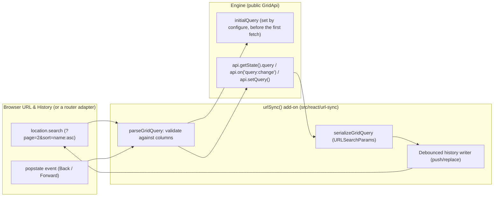

# Specification: view state and URL synchronization

> **Status**: Draft (corrected 2026-09-14 against the code and `specs/addon-architecture`)
> **Stage entry**: 1 & 2
> **Semver impact**: minor (a new `urlSync()` add-on and pure codec functions; nothing on
> `<Gridwright />`; to be confirmed in api-surface.md)

---

## 1. The consumer problem

When users interact with a data table, they customize their view: sorting specific columns, applying
multi-criteria filters, typing search terms, and navigating to specific pages.
1. **Views are lost on page refresh**:
   - Refreshing the browser or navigating away resets the grid to its initial query. The user must
     re-apply every sort, filter, and page from memory.
2. **Cannot share grid states via links**:
   - A support agent or team lead cannot send a direct link saying "review these 15 open priority
     tickets". Copying the browser URL only sends the blank view.
3. **Browser History (Back / Forward) breaks**:
   - Users expect the browser's Back button to return to the previous page or filter state they were
     looking at, rather than exiting the application entirely.

A view state synchronization add-on will provide compact, URL-safe serialization of the grid query
(`sort`, `filters`, `search`, `pagination`), browser history integration (`history.replaceState` /
`pushState`), and a router adapter for applications with their own router.

---

## 2. User stories

- **US-01.** As an end user, I want my search, column filters, sort order, and page number mirrored in
  the browser URL so I can bookmark or copy the link to share with colleagues.
- **US-02.** As an end user opening a shared grid link, I want the table to load immediately with the
  exact filters, sorting, and page configured in the URL, without first loading the default view.
- **US-03.** As an end user, clicking the browser's Back and Forward buttons steps through my previous
  grid queries.
- **US-04.** As a developer using a framework router (Next.js, Remix, React Router, TanStack Router), I
  want a router-agnostic adapter so the grid integrates with my existing navigation stack.
- **US-05.** As a developer, I want malformed, tampered, or obsolete parameters (e.g. a column id that no
  longer exists) validated and dropped safely without throwing errors or blanking the grid.

---

## 3. Acceptance criteria

- [ ] **AC-01** Compact URL serialization (`serializeGridQuery` / `parseGridQuery`, pure functions):
      - Search: `q=search_term`
      - Sort: `sort=score:asc,name:desc`
      - Pagination: `page=2` (1-based for human URLs), `size=25`
      - Filters: `f=status:eq:active,score:gt:50`, with every column id and value percent-encoded so a
        separator inside a value cannot split it.
- [ ] **AC-02** Add-on integration:
      - `addons={[urlSync(options)]}` on `<Gridwright />` or `useGridwright`.
      - The URL's query is applied through `configure` as `initialQuery`, before the engine is created,
        so a shared link causes exactly one fetch.
      - Query changes are written with `history.replaceState` by default, and `pushState` for page
        changes (configurable), without reloading the page.
- [ ] **AC-03** Input validation and sanitization:
      - Values are validated against the grid's columns (`sortable`, `filterable`), the core
        `FilterOperator` set, and valid ranges (positive integers for page and size).
      - Unrecognized or corrupted parameters are omitted and fall back to defaults.
      - Parsing writes into fresh objects keyed only by known names, never by a parameter name, so a
        crafted `__proto__` parameter cannot reach a prototype; no user-controlled regular expression.
- [ ] **AC-04** Router abstraction: `urlSync({ adapter: createUrlSyncAdapter({ getParams, setParams,
      subscribe }) })` binds to a framework router; the default adapter uses `location` and `history`.
- [ ] **AC-05** Debounce: search and filter changes debounce URL writes by 300ms to avoid flooding
      history; the debounce is cleared on unmount.
- [ ] **AC-06** Back and Forward: a `popstate` (or the adapter's `subscribe`) parses the new parameters
      and calls `api.setQuery`, and that change is not written back to the URL.
- [ ] **AC-07** `prefix` option (e.g. `gw_page=2`) so several grids on one page do not collide.
- [ ] **AC-08** Zero runtime dependencies: standard `URLSearchParams` and the History API.

---

## 4. Non-goals

- **Bundling framework router libraries (e.g. `next/navigation`, `react-router`).** The adapter contract
  lets a consumer bridge to any router in a few lines.
- **A `syncWith` / `syncWithUrl` prop on `<Gridwright />`, or a separate `useGridUrlSync` hook.** The
  add-on works on both `<Gridwright />` and `useGridwright`.
- **Persisting non-query view state** (column layout, expanded tree nodes). Those belong to their own
  add-ons' `initial` / `onChange` options, which an application can store wherever it likes.

---

## 5. Behaviour across the capability seam

An adapter and query serialization capability:
- Reads the URL into `initialQuery` at creation, and follows `query:change` afterwards.
- `onQueryChange` on the grid keeps working beside it.
- Works identically over local arrays and remote endpoints, because it serializes `GridQuery`, which is
  the same object either way.

---

## 6. Accessibility and interface copy

- **Announcements**: when a shared URL loads with filters applied, the live region announces the settled
  summary as for any first load; `columnFilters()` and `sorting()` do not announce a change on the first
  settled state, because nothing changed under the reader's hand.
- **No visible strings.** The add-on renders nothing, so it ships no messages.

---

## 7. Delivery as a plugin

**Engine.** None. Everything needed is public: `initialQuery`, `api.getState().query`,
`api.on('query:change')` and `api.setQuery()`.

**React add-on.** `urlSync(options)`, named `gridwright:url-sync`. Not in `coreAddons()`.

| Slot | Use |
| :--- | :--- |
| `setup` (hooks) | reads the adapter's parameters once, for `configure` |
| `configure` | merges the parsed query into `initialQuery`, validated against `options.columns` |
| `provide` | renders a lifecycle component (no markup) that subscribes to `query:change` and to `popstate` / the adapter, debounces writes, and calls `api.setQuery` on Back and Forward |

**What cannot be an add-on.** Nothing. The one ordering constraint is served by the contract:
`configure` runs before the engine is created, which is what makes a shared link a single fetch. The
lifecycle component lives in `provide` because `setup` runs before the engine exists and slot functions
may not use hooks.

---

## 8. Clarifications

- **Why not wait for the engine and call `setQuery` on mount?** That fetches the default query first and
  the linked one second, which is a visible flash and a wasted request on every shared link.
- **What if the URL names a column the grid no longer has?** It is dropped (AC-03); the rest of the query
  still applies.
- **Where do the codec functions live?** `src/react/url-sync/codec.ts`, pure and testable without a DOM.
  They could move to the core entry later if a non-React consumer needs them; nothing in them depends on
  React.
