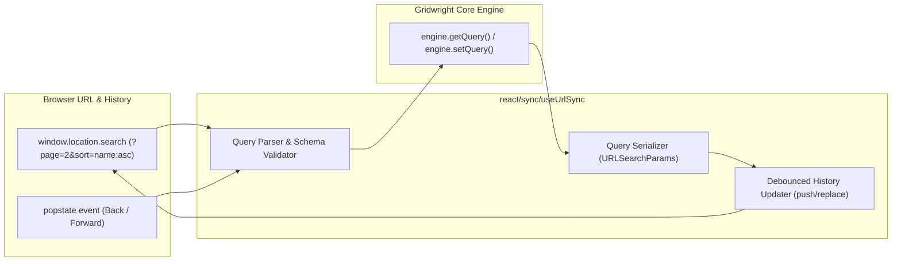

# Specification: view state and URL synchronization

> **Status**: Draft
> **Stage entry**: 1 & 2
> **Semver impact**: minor (new hook, adapter utility, and optional Gridwright prop; confirmed in api-surface.md)

---

## 1. The consumer problem

When users interact with a data table, they customize their view: sorting specific columns, applying
multi-criteria filters, typing search terms, and navigating to specific pages.
1. **Views are lost on page refresh**:
   - In most web applications, refreshing the browser or navigating away immediately resets the grid to
     its blank initial query. The user must re-apply every sort, filter, and page from memory.
2. **Cannot share grid states via links**:
   - A support agent or team lead reviewing data cannot send a direct link to a colleague saying "review
     these 15 open priority tickets". Copying the browser URL only sends the blank dashboard view.
3. **Browser History (Back / Forward) breaks**:
   - Users expect the browser's Back button to return to the previous page or filter state they were
     looking at, rather than exiting the application entirely.

A first-class view state synchronization capability will provide compact, URL-safe serialization of
the grid query (`sort`, `filters`, `search`, `pagination`), clean browser history integration
(`history.replaceState` / `pushState`), and custom router adapter support.

---

## 2. User stories

- **US-01.** As an end user, I want my active search query, column filters, sort order, and page number
  mirrored in the browser URL so I can bookmark or copy the link to share with colleagues.
- **US-02.** As an end user opening a shared grid link, I want the table to load immediately with the
  exact filters, sorting, and page configured in the URL.
- **US-03.** As an end user, clicking the browser's Back and Forward buttons steps through my previous
  grid queries.
- **US-04.** As a developer using modern frameworks (Next.js, Remix, React Router, TanStack Router), I
  want a router-agnostic sync adapter so Gridwright integrates with my existing navigation stack.
- **US-05.** As a developer, I want malformed, tampered, or obsolete query parameters (e.g. a column id
  that no longer exists) validated and dropped safely without throwing errors or blanking the grid.

---

## 3. Acceptance criteria

- [ ] **AC-01** Compact URL serialization:
      - Encodes grid query state into clean `URLSearchParams`:
        - Search: `q=search_term`
        - Sort: `sort=score:asc,name:desc`
        - Pagination: `page=2` (1-based for human URLs), `size=25`
        - Filters: `f=status:eq:active,score:gt:50`
- [ ] **AC-02** Component integration:
      - `<Gridwright syncWithUrl />` or hook `useGridUrlSync({ ... })`.
      - Updates URL using `history.replaceState` by default (or `pushState` on page changes) without
        triggering full page reloads.
- [ ] **AC-03** Input validation & sanitization:
      - Parameter values are validated against known columns and valid ranges.
      - Corrupted or unrecognized parameters are silently omitted and fall back to defaults.
- [ ] **AC-04** Router abstraction:
      - Exposes `createUrlSyncAdapter({ getParams, setParams })` to easily bind to Next.js (`useSearchParams`,
        `useRouter`), React Router, or standard Web APIs.
- [ ] **AC-05** Debounce timing:
      - Search and filter keystrokes debounce URL writing by 300ms to avoid flooding browser history.
- [ ] **AC-06** Zero runtime dependencies:
      - Uses standard `URLSearchParams` and Web History API.

---

## 4. Non-goals

- **Bundling specific framework router libraries (e.g. `next/navigation`, `react-router`):**
  Gridwright remains framework-free in core and pure React in adapter. The router adapter contract
  allows consumers to bridge to any router in 3 lines of code.

---

## 5. Behaviour across the capability seam

Purely an **adapter and query serialization** capability:
- Synchronizes with `initialQuery` on initialization.
- Changes in `query` emit through `onQueryChange`, updating the URL state.
- Works identically over local arrays and remote endpoints.

---

## 6. Accessibility and interface copy

- **Announcements**:
  - When loading from a shared URL with pre-applied filters, the live region announces the settled
    summary on initial paint.
